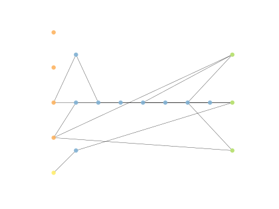
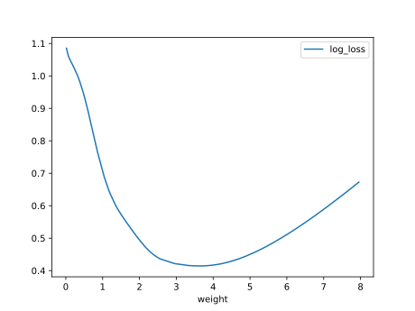
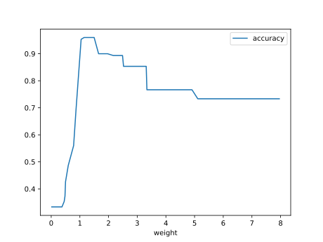

# Report Iris Uniform Distribution [0, 8] run 0

## Best results in hall of fame

| measure       |    value |   individual |
|:--------------|---------:|-------------:|
| mean accuracy | 0.768067 |        16151 |
| max accuracy  | 0.966667 |        15566 |
| mean kappa    | 0.6521   |        16151 |
| max kappa     | 0.95     |        15566 |

## Individuals in hall of fame

### Individual 16151

| key                    |      value |
|:-----------------------|-----------:|
| mean log_loss:         |   0.519471 |
| mean accuracy:         |   0.768067 |
| mean kappa:            |   0.6521   |
| number of edges        |  44        |
| number of hidden nodes |  11        |
| number of layers       |   7        |
| birth                  | 180        |

#### Network

### Individual 13727

| key                    |      value |
|:-----------------------|-----------:|
| mean log_loss:         |   0.548237 |
| mean accuracy:         |   0.748267 |
| mean kappa:            |   0.6224   |
| number of edges        |  40        |
| number of hidden nodes |   9        |
| number of layers       |   7        |
| birth                  | 153        |

#### Network

### Individual 13731

| key                    |      value |
|:-----------------------|-----------:|
| mean log_loss:         |   0.550051 |
| mean accuracy:         |   0.748933 |
| mean kappa:            |   0.6234   |
| number of edges        |  39        |
| number of hidden nodes |   9        |
| number of layers       |   7        |
| birth                  | 153        |

#### Network

### Individual 15988

| key                    |      value |
|:-----------------------|-----------:|
| mean log_loss:         |   0.526923 |
| mean accuracy:         |   0.755933 |
| mean kappa:            |   0.6339   |
| number of edges        |  42        |
| number of hidden nodes |  10        |
| number of layers       |   7        |
| birth                  | 178        |

#### Network

### Individual 14639

| key                    |      value |
|:-----------------------|-----------:|
| mean log_loss:         |   0.534179 |
| mean accuracy:         |   0.7552   |
| mean kappa:            |   0.6328   |
| number of edges        |  40        |
| number of hidden nodes |   9        |
| number of layers       |   7        |
| birth                  | 163        |

#### Network

### Individual 13441

| key                    |     value |
|:-----------------------|----------:|
| mean log_loss:         |   0.56548 |
| mean accuracy:         |   0.7474  |
| mean kappa:            |   0.6211  |
| number of edges        |  39       |
| number of hidden nodes |   9       |
| number of layers       |   7       |
| birth                  | 150       |

#### Network

### Individual 15566

| key                    |      value |
|:-----------------------|-----------:|
| mean log_loss:         |   0.536962 |
| mean accuracy:         |   0.7578   |
| mean kappa:            |   0.6367   |
| number of edges        |  42        |
| number of hidden nodes |  10        |
| number of layers       |   7        |
| birth                  | 173        |

#### Network

### Individual 13233

| key                    |      value |
|:-----------------------|-----------:|
| mean log_loss:         |   0.573091 |
| mean accuracy:         |   0.7442   |
| mean kappa:            |   0.6163   |
| number of edges        |  37        |
| number of hidden nodes |   8        |
| number of layers       |   7        |
| birth                  | 148        |

#### Network

### Individual 13628

| key                    |      value |
|:-----------------------|-----------:|
| mean log_loss:         |   0.549394 |
| mean accuracy:         |   0.747    |
| mean kappa:            |   0.6205   |
| number of edges        |  41        |
| number of hidden nodes |  10        |
| number of layers       |   7        |
| birth                  | 152        |

#### Network

### Individual 13540

| key                    |      value |
|:-----------------------|-----------:|
| mean log_loss:         |   0.549394 |
| mean accuracy:         |   0.747    |
| mean kappa:            |   0.6205   |
| number of edges        |  39        |
| number of hidden nodes |   9        |
| number of layers       |   7        |
| birth                  | 151        |

#### Network

