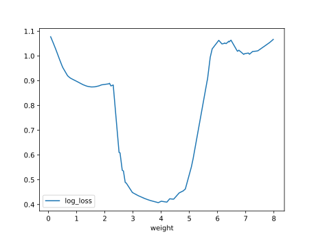

# Report Iris Uniform Distribution [0, 8] run 1

## Best results in hall of fame

| measure       |    value |   individual |
|:--------------|---------:|-------------:|
| mean accuracy | 0.694333 |        17048 |
| max accuracy  | 0.86     |        17345 |
| mean kappa    | 0.5415   |        17048 |
| max kappa     | 0.79     |        17345 |

## Individuals in hall of fame

### Individual 17345

| key                    |      value |
|:-----------------------|-----------:|
| mean log_loss:         |   0.773756 |
| mean accuracy:         |   0.6942   |
| mean kappa:            |   0.5413   |
| number of edges        |  47        |
| number of hidden nodes |  15        |
| number of layers       |  14        |
| birth                  | 193        |

#### Network

### Individual 17048

| key                    |      value |
|:-----------------------|-----------:|
| mean log_loss:         |   0.773737 |
| mean accuracy:         |   0.694333 |
| mean kappa:            |   0.5415   |
| number of edges        |  45        |
| number of hidden nodes |  14        |
| number of layers       |  13        |
| birth                  | 190        |

#### Network

### Individual 17128

| key                    |      value |
|:-----------------------|-----------:|
| mean log_loss:         |   0.773751 |
| mean accuracy:         |   0.6942   |
| mean kappa:            |   0.5413   |
| number of edges        |  47        |
| number of hidden nodes |  15        |
| number of layers       |  14        |
| birth                  | 191        |

#### Network

### Individual 16887

| key                    |      value |
|:-----------------------|-----------:|
| mean log_loss:         |   0.626084 |
| mean accuracy:         |   0.666    |
| mean kappa:            |   0.499    |
| number of edges        |  33        |
| number of hidden nodes |   7        |
| number of layers       |   6        |
| birth                  | 188        |

#### Network

### Individual 16503

| key                    |      value |
|:-----------------------|-----------:|
| mean log_loss:         |   0.619257 |
| mean accuracy:         |   0.6666   |
| mean kappa:            |   0.4999   |
| number of edges        |  40        |
| number of hidden nodes |  11        |
| number of layers       |   9        |
| birth                  | 184        |

#### Network

### Individual 13203

| key                    |      value |
|:-----------------------|-----------:|
| mean log_loss:         |   0.626233 |
| mean accuracy:         |   0.6666   |
| mean kappa:            |   0.4999   |
| number of edges        |  29        |
| number of hidden nodes |   6        |
| number of layers       |   6        |
| birth                  | 147        |

#### Network

### Individual 11604

| key                    |      value |
|:-----------------------|-----------:|
| mean log_loss:         |   0.622839 |
| mean accuracy:         |   0.666667 |
| mean kappa:            |   0.5      |
| number of edges        |  26        |
| number of hidden nodes |   4        |
| number of layers       |   2        |
| birth                  | 129        |

#### Network

### Individual 13748

| key                    |      value |
|:-----------------------|-----------:|
| mean log_loss:         |   0.626013 |
| mean accuracy:         |   0.6666   |
| mean kappa:            |   0.4999   |
| number of edges        |  30        |
| number of hidden nodes |   6        |
| number of layers       |   5        |
| birth                  | 153        |

#### Network

### Individual 10310

| key                    |      value |
|:-----------------------|-----------:|
| mean log_loss:         |   0.626157 |
| mean accuracy:         |   0.6666   |
| mean kappa:            |   0.4999   |
| number of edges        |  25        |
| number of hidden nodes |   4        |
| number of layers       |   2        |
| birth                  | 115        |

#### Network

### Individual 10343

| key                    |      value |
|:-----------------------|-----------:|
| mean log_loss:         |   0.624329 |
| mean accuracy:         |   0.6666   |
| mean kappa:            |   0.4999   |
| number of edges        |  22        |
| number of hidden nodes |   2        |
| number of layers       |   1        |
| birth                  | 115        |

#### Network

