# Report Iris Uniform Distribution [0, 8] run 2

## Best results in hall of fame

| measure       |   value |   individual |
|:--------------|--------:|-------------:|
| mean accuracy |  0.6276 |        16645 |
| max accuracy  |  0.9    |        16645 |
| mean kappa    |  0.4414 |        16645 |
| max kappa     |  0.85   |        16645 |

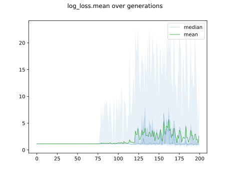

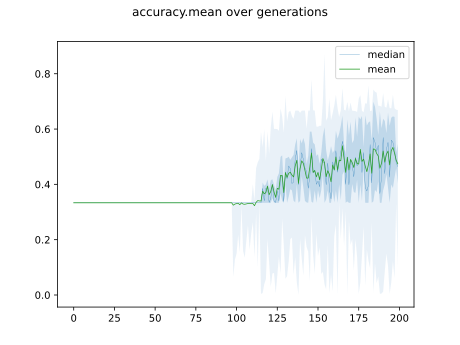

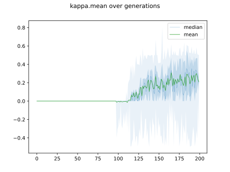

## Individuals in hall of fame

### Individual 16645

| key                    |      value |
|:-----------------------|-----------:|
| mean log_loss:         |   0.925311 |
| mean accuracy:         |   0.6276   |
| mean kappa:            |   0.4414   |
| number of edges        |  42        |
| number of hidden nodes |  11        |
| number of layers       |   6        |
| birth                  | 185        |

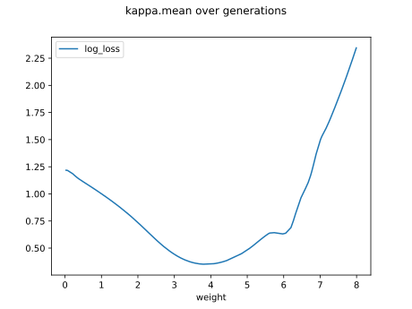

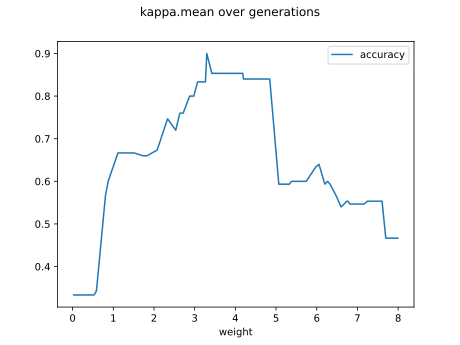

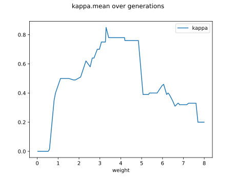

#### Network

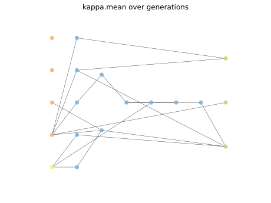

### Individual 16579

| key                    |      value |
|:-----------------------|-----------:|
| mean log_loss:         |   0.989903 |
| mean accuracy:         |   0.616867 |
| mean kappa:            |   0.4253   |
| number of edges        |  32        |
| number of hidden nodes |   6        |
| number of layers       |   2        |
| birth                  | 185        |

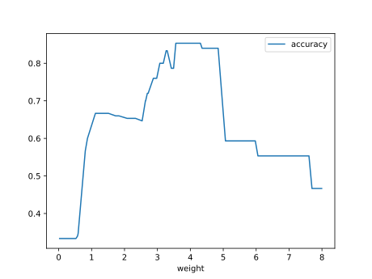

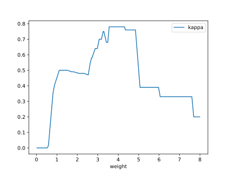

#### Network

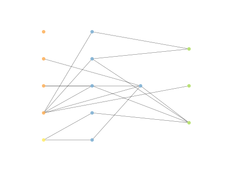

### Individual 16648

| key                    |      value |
|:-----------------------|-----------:|
| mean log_loss:         |   0.989903 |
| mean accuracy:         |   0.616867 |
| mean kappa:            |   0.4253   |
| number of edges        |  31        |
| number of hidden nodes |   5        |
| number of layers       |   2        |
| birth                  | 185        |

#### Network

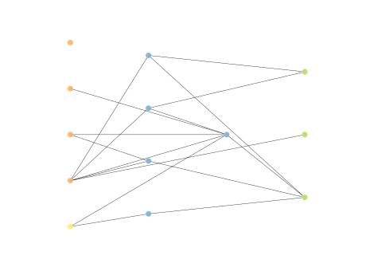

### Individual 16763

| key                    |      value |
|:-----------------------|-----------:|
| mean log_loss:         |   0.925439 |
| mean accuracy:         |   0.6276   |
| mean kappa:            |   0.4414   |
| number of edges        |  44        |
| number of hidden nodes |  12        |
| number of layers       |   7        |
| birth                  | 187        |

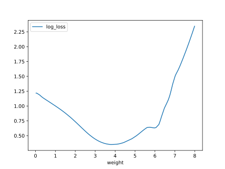

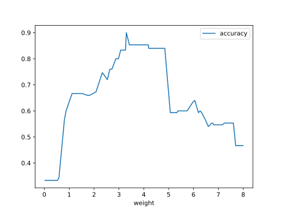

#### Network

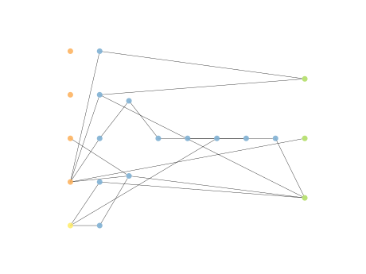

### Individual 16793

| key                    |      value |
|:-----------------------|-----------:|
| mean log_loss:         |   0.926358 |
| mean accuracy:         |   0.6276   |
| mean kappa:            |   0.4414   |
| number of edges        |  45        |
| number of hidden nodes |  12        |
| number of layers       |   7        |
| birth                  | 187        |

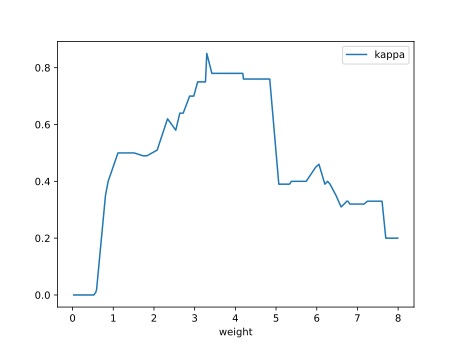

#### Network

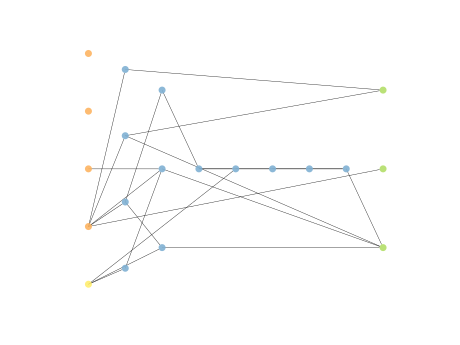

### Individual 16596

| key                    |      value |
|:-----------------------|-----------:|
| mean log_loss:         |   0.990735 |
| mean accuracy:         |   0.616867 |
| mean kappa:            |   0.4253   |
| number of edges        |  31        |
| number of hidden nodes |   5        |
| number of layers       |   1        |
| birth                  | 185        |

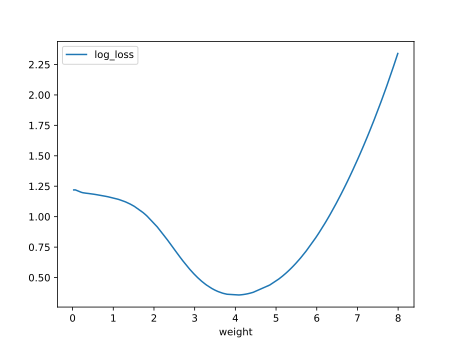

#### Network

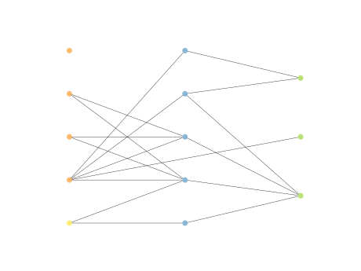

### Individual 16747

| key                    |      value |
|:-----------------------|-----------:|
| mean log_loss:         |   0.947044 |
| mean accuracy:         |   0.6248   |
| mean kappa:            |   0.4372   |
| number of edges        |  46        |
| number of hidden nodes |  13        |
| number of layers       |   7        |
| birth                  | 187        |

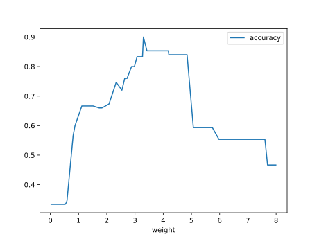

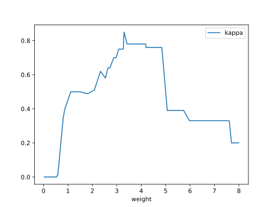

#### Network

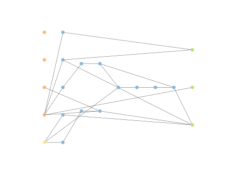

### Individual 16815

| key                    |      value |
|:-----------------------|-----------:|
| mean log_loss:         |   0.926269 |
| mean accuracy:         |   0.6276   |
| mean kappa:            |   0.4414   |
| number of edges        |  44        |
| number of hidden nodes |  12        |
| number of layers       |   7        |
| birth                  | 187        |

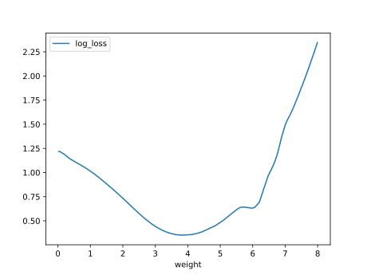

#### Network

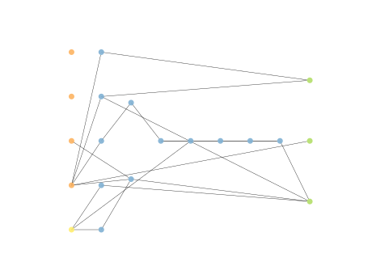

### Individual 16625

| key                    |      value |
|:-----------------------|-----------:|
| mean log_loss:         |   0.925637 |
| mean accuracy:         |   0.6276   |
| mean kappa:            |   0.4414   |
| number of edges        |  44        |
| number of hidden nodes |  12        |
| number of layers       |   7        |
| birth                  | 185        |

#### Network

### Individual 16811

| key                    |      value |
|:-----------------------|-----------:|
| mean log_loss:         |   0.925424 |
| mean accuracy:         |   0.6276   |
| mean kappa:            |   0.4414   |
| number of edges        |  44        |
| number of hidden nodes |  12        |
| number of layers       |   6        |
| birth                  | 187        |

#### Network

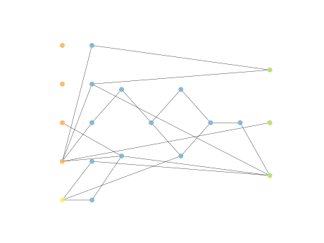

