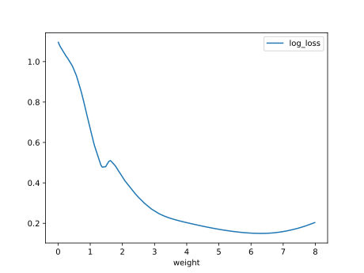

# Report Iris Uniform Distribution [0, 8] run 3

## Best results in hall of fame

| measure       |    value |   individual |
|:--------------|---------:|-------------:|
| mean accuracy | 0.891133 |        16177 |
| max accuracy  | 0.96     |        16018 |
| mean kappa    | 0.8367   |        16177 |
| max kappa     | 0.94     |        16018 |

## Individuals in hall of fame

### Individual 16018

| key                    |      value |
|:-----------------------|-----------:|
| mean log_loss:         |   0.335294 |
| mean accuracy:         |   0.876333 |
| mean kappa:            |   0.8145   |
| number of edges        |  73        |
| number of hidden nodes |  26        |
| number of layers       |  24        |
| birth                  | 178        |

#### Network

### Individual 15790

| key                    |      value |
|:-----------------------|-----------:|
| mean log_loss:         |   0.340099 |
| mean accuracy:         |   0.877333 |
| mean kappa:            |   0.816    |
| number of edges        |  71        |
| number of hidden nodes |  25        |
| number of layers       |  23        |
| birth                  | 176        |

#### Network

### Individual 15879

| key                    |      value |
|:-----------------------|-----------:|
| mean log_loss:         |   0.340094 |
| mean accuracy:         |   0.877333 |
| mean kappa:            |   0.816    |
| number of edges        |  71        |
| number of hidden nodes |  25        |
| number of layers       |  23        |
| birth                  | 177        |

#### Network

### Individual 16177

| key                    |      value |
|:-----------------------|-----------:|
| mean log_loss:         |   0.333592 |
| mean accuracy:         |   0.891133 |
| mean kappa:            |   0.8367   |
| number of edges        |  74        |
| number of hidden nodes |  26        |
| number of layers       |  24        |
| birth                  | 180        |

#### Network

### Individual 15821

| key                    |      value |
|:-----------------------|-----------:|
| mean log_loss:         |   0.36555  |
| mean accuracy:         |   0.867267 |
| mean kappa:            |   0.8009   |
| number of edges        |  69        |
| number of hidden nodes |  24        |
| number of layers       |  22        |
| birth                  | 176        |

#### Network

### Individual 15960

| key                    |      value |
|:-----------------------|-----------:|
| mean log_loss:         |   0.366434 |
| mean accuracy:         |   0.8654   |
| mean kappa:            |   0.7981   |
| number of edges        |  71        |
| number of hidden nodes |  25        |
| number of layers       |  23        |
| birth                  | 178        |

#### Network

### Individual 16038

| key                    |      value |
|:-----------------------|-----------:|
| mean log_loss:         |   0.347907 |
| mean accuracy:         |   0.862333 |
| mean kappa:            |   0.7935   |
| number of edges        |  71        |
| number of hidden nodes |  25        |
| number of layers       |  23        |
| birth                  | 179        |

#### Network

### Individual 15745

| key                    |      value |
|:-----------------------|-----------:|
| mean log_loss:         |   0.341251 |
| mean accuracy:         |   0.878733 |
| mean kappa:            |   0.8181   |
| number of edges        |  69        |
| number of hidden nodes |  24        |
| number of layers       |  22        |
| birth                  | 175        |

#### Network

### Individual 16174

| key                    |      value |
|:-----------------------|-----------:|
| mean log_loss:         |   0.336691 |
| mean accuracy:         |   0.875867 |
| mean kappa:            |   0.8138   |
| number of edges        |  74        |
| number of hidden nodes |  26        |
| number of layers       |  24        |
| birth                  | 180        |

#### Network

### Individual 17879

| key                    |      value |
|:-----------------------|-----------:|
| mean log_loss:         |   0.364555 |
| mean accuracy:         |   0.8564   |
| mean kappa:            |   0.7846   |
| number of edges        |  78        |
| number of hidden nodes |  28        |
| number of layers       |  25        |
| birth                  | 199        |

#### Network

