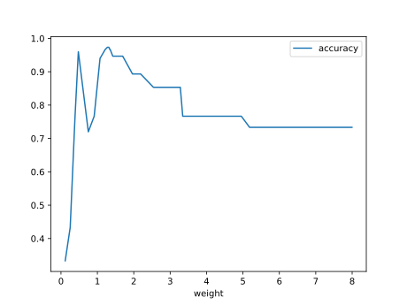
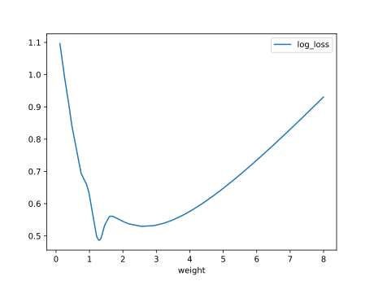
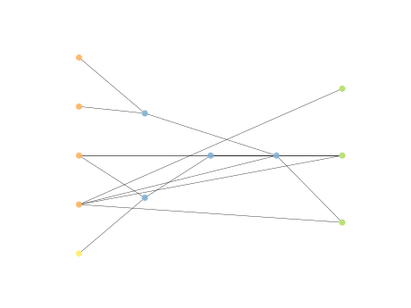

# Report Iris Uniform Distribution [0, 8] run 4

## Best results in hall of fame

| measure       |    value |   individual |
|:--------------|---------:|-------------:|
| mean accuracy | 0.781733 |        17328 |
| max accuracy  | 0.973333 |        16613 |
| mean kappa    | 0.6726   |        17328 |
| max kappa     | 0.96     |        16613 |

## Individuals in hall of fame

### Individual 16613

| key                    |      value |
|:-----------------------|-----------:|
| mean log_loss:         |   0.667376 |
| mean accuracy:         |   0.778867 |
| mean kappa:            |   0.6683   |
| number of edges        |  35        |
| number of hidden nodes |   6        |
| number of layers       |   4        |
| birth                  | 185        |

#### Network

### Individual 17328

| key                    |      value |
|:-----------------------|-----------:|
| mean log_loss:         |   0.672735 |
| mean accuracy:         |   0.781733 |
| mean kappa:            |   0.6726   |
| number of edges        |  37        |
| number of hidden nodes |   7        |
| number of layers       |   5        |
| birth                  | 193        |

#### Network

### Individual 17033

| key                    |      value |
|:-----------------------|-----------:|
| mean log_loss:         |   0.667891 |
| mean accuracy:         |   0.776867 |
| mean kappa:            |   0.6653   |
| number of edges        |  37        |
| number of hidden nodes |   7        |
| number of layers       |   5        |
| birth                  | 190        |

#### Network

### Individual 16431

| key                    |      value |
|:-----------------------|-----------:|
| mean log_loss:         |   0.679497 |
| mean accuracy:         |   0.776267 |
| mean kappa:            |   0.6644   |
| number of edges        |  35        |
| number of hidden nodes |   6        |
| number of layers       |   4        |
| birth                  | 183        |

#### Network

### Individual 16582

| key                    |      value |
|:-----------------------|-----------:|
| mean log_loss:         |   0.673693 |
| mean accuracy:         |   0.7632   |
| mean kappa:            |   0.6448   |
| number of edges        |  36        |
| number of hidden nodes |   7        |
| number of layers       |   5        |
| birth                  | 185        |

#### Network

### Individual 16099

| key                    |      value |
|:-----------------------|-----------:|
| mean log_loss:         |   0.699585 |
| mean accuracy:         |   0.762533 |
| mean kappa:            |   0.6438   |
| number of edges        |  29        |
| number of hidden nodes |   4        |
| number of layers       |   3        |
| birth                  | 179        |

#### Network

### Individual 16728

| key                    |      value |
|:-----------------------|-----------:|
| mean log_loss:         |   0.672642 |
| mean accuracy:         |   0.765133 |
| mean kappa:            |   0.6477   |
| number of edges        |  36        |
| number of hidden nodes |   6        |
| number of layers       |   4        |
| birth                  | 186        |

#### Network

### Individual 15839

| key                    |      value |
|:-----------------------|-----------:|
| mean log_loss:         |   0.67236  |
| mean accuracy:         |   0.764733 |
| mean kappa:            |   0.6471   |
| number of edges        |  34        |
| number of hidden nodes |   6        |
| number of layers       |   4        |
| birth                  | 176        |

#### Network

### Individual 16701

| key                    |      value |
|:-----------------------|-----------:|
| mean log_loss:         |   0.677623 |
| mean accuracy:         |   0.7594   |
| mean kappa:            |   0.6391   |
| number of edges        |  36        |
| number of hidden nodes |   7        |
| number of layers       |   5        |
| birth                  | 186        |

#### Network

### Individual 16938

| key                    |      value |
|:-----------------------|-----------:|
| mean log_loss:         |   0.672205 |
| mean accuracy:         |   0.776267 |
| mean kappa:            |   0.6644   |
| number of edges        |  38        |
| number of hidden nodes |   8        |
| number of layers       |   5        |
| birth                  | 189        |

#### Network

