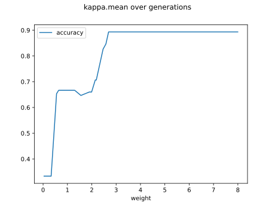
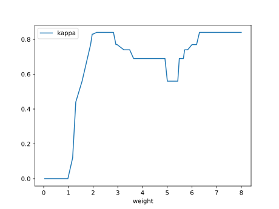
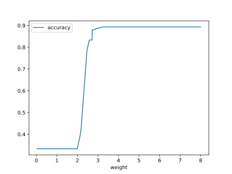

# Report Iris Uniform Distribution [0, 8] run 5

## Best results in hall of fame

| measure       |    value |   individual |
|:--------------|---------:|-------------:|
| mean accuracy | 0.831667 |        17956 |
| max accuracy  | 0.96     |        17459 |
| mean kappa    | 0.7475   |        17956 |
| max kappa     | 0.94     |        17459 |

## Individuals in hall of fame

### Individual 17956

| key                    |      value |
|:-----------------------|-----------:|
| mean log_loss:         |   0.320124 |
| mean accuracy:         |   0.831667 |
| mean kappa:            |   0.7475   |
| number of edges        |  57        |
| number of hidden nodes |  17        |
| number of layers       |  13        |
| birth                  | 200        |

#### Network

### Individual 17459

| key                    |      value |
|:-----------------------|-----------:|
| mean log_loss:         |   0.508385 |
| mean accuracy:         |   0.795667 |
| mean kappa:            |   0.6935   |
| number of edges        |  55        |
| number of hidden nodes |  16        |
| number of layers       |  11        |
| birth                  | 194        |

#### Network

### Individual 17596

| key                    |      value |
|:-----------------------|-----------:|
| mean log_loss:         |   0.334928 |
| mean accuracy:         |   0.805933 |
| mean kappa:            |   0.7089   |
| number of edges        |  57        |
| number of hidden nodes |  17        |
| number of layers       |  13        |
| birth                  | 196        |

#### Network

### Individual 17556

| key                    |      value |
|:-----------------------|-----------:|
| mean log_loss:         |   0.502795 |
| mean accuracy:         |   0.780533 |
| mean kappa:            |   0.6708   |
| number of edges        |  55        |
| number of hidden nodes |  16        |
| number of layers       |  11        |
| birth                  | 196        |

#### Network

### Individual 17341

| key                    |      value |
|:-----------------------|-----------:|
| mean log_loss:         |   0.504832 |
| mean accuracy:         |   0.778733 |
| mean kappa:            |   0.6681   |
| number of edges        |  54        |
| number of hidden nodes |  16        |
| number of layers       |  11        |
| birth                  | 193        |

#### Network

### Individual 17349

| key                    |      value |
|:-----------------------|-----------:|
| mean log_loss:         |   0.426029 |
| mean accuracy:         |   0.781333 |
| mean kappa:            |   0.672    |
| number of edges        |  52        |
| number of hidden nodes |  15        |
| number of layers       |  11        |
| birth                  | 193        |

#### Network

### Individual 17291

| key                    |      value |
|:-----------------------|-----------:|
| mean log_loss:         |   0.393016 |
| mean accuracy:         |   0.784733 |
| mean kappa:            |   0.6771   |
| number of edges        |  54        |
| number of hidden nodes |  16        |
| number of layers       |  12        |
| birth                  | 193        |

#### Network

### Individual 17465

| key                    |      value |
|:-----------------------|-----------:|
| mean log_loss:         |   0.405054 |
| mean accuracy:         |   0.7804   |
| mean kappa:            |   0.6706   |
| number of edges        |  55        |
| number of hidden nodes |  16        |
| number of layers       |  12        |
| birth                  | 195        |

#### Network

### Individual 17337

| key                    |      value |
|:-----------------------|-----------:|
| mean log_loss:         |   0.408038 |
| mean accuracy:         |   0.779267 |
| mean kappa:            |   0.6689   |
| number of edges        |  54        |
| number of hidden nodes |  16        |
| number of layers       |  12        |
| birth                  | 193        |

#### Network

### Individual 17487

| key                    |      value |
|:-----------------------|-----------:|
| mean log_loss:         |   0.426688 |
| mean accuracy:         |   0.775667 |
| mean kappa:            |   0.6635   |
| number of edges        |  55        |
| number of hidden nodes |  16        |
| number of layers       |  12        |
| birth                  | 195        |

#### Network

