# Report Iris Uniform Distribution [0, 8] run 6

## Best results in hall of fame

| measure       |    value |   individual |
|:--------------|---------:|-------------:|
| mean accuracy | 0.789867 |        13237 |
| max accuracy  | 0.973333 |        14142 |
| mean kappa    | 0.6848   |        13237 |
| max kappa     | 0.96     |        14142 |

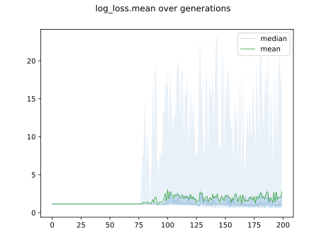

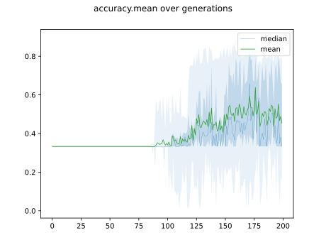

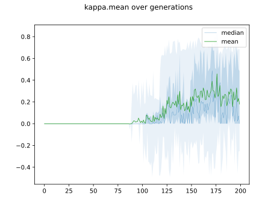

## Individuals in hall of fame

### Individual 15121

| key                    |      value |
|:-----------------------|-----------:|
| mean log_loss:         |   0.692527 |
| mean accuracy:         |   0.780867 |
| mean kappa:            |   0.6713   |
| number of edges        |  35        |
| number of hidden nodes |   8        |
| number of layers       |   6        |
| birth                  | 169        |

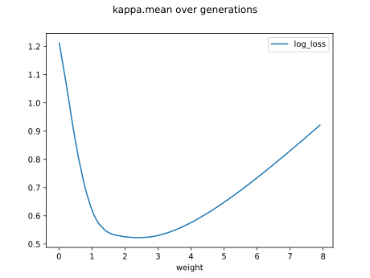

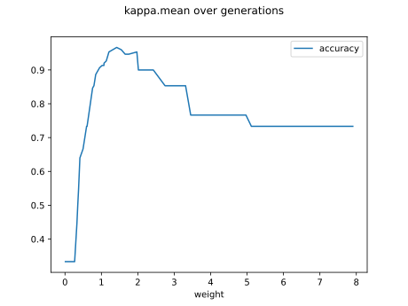

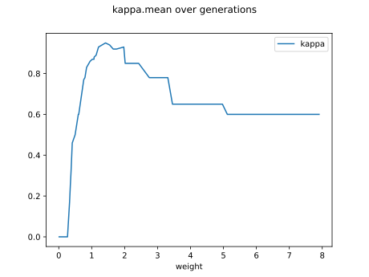

#### Network

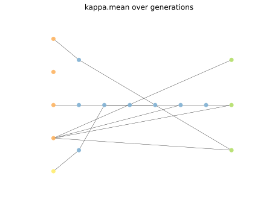

### Individual 15647

| key                    |      value |
|:-----------------------|-----------:|
| mean log_loss:         |   0.69328  |
| mean accuracy:         |   0.778467 |
| mean kappa:            |   0.6677   |
| number of edges        |  40        |
| number of hidden nodes |  10        |
| number of layers       |   8        |
| birth                  | 174        |

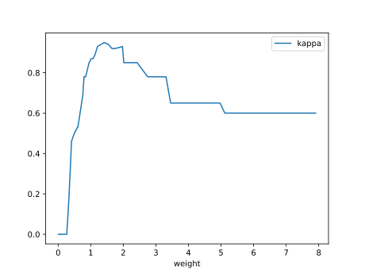

#### Network

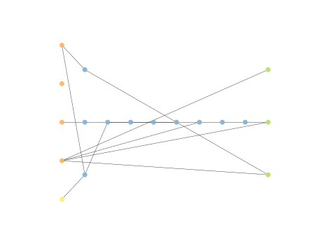

### Individual 14202

| key                    |      value |
|:-----------------------|-----------:|
| mean log_loss:         |   0.691459 |
| mean accuracy:         |   0.7848   |
| mean kappa:            |   0.6772   |
| number of edges        |  31        |
| number of hidden nodes |   6        |
| number of layers       |   4        |
| birth                  | 158        |

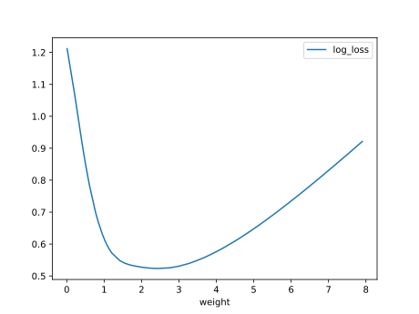

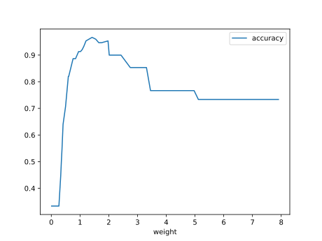

#### Network

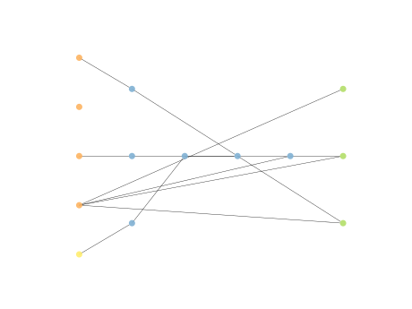

### Individual 14222

| key                    |      value |
|:-----------------------|-----------:|
| mean log_loss:         |   0.691459 |
| mean accuracy:         |   0.7848   |
| mean kappa:            |   0.6772   |
| number of edges        |  33        |
| number of hidden nodes |   7        |
| number of layers       |   5        |
| birth                  | 159        |

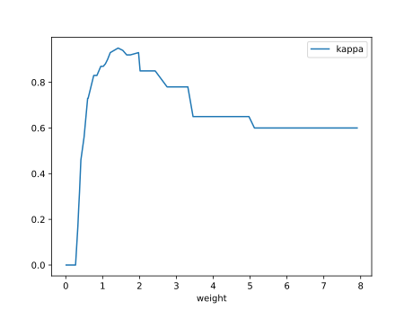

#### Network

### Individual 14142

| key                    |      value |
|:-----------------------|-----------:|
| mean log_loss:         |   0.693909 |
| mean accuracy:         |   0.7892   |
| mean kappa:            |   0.6838   |
| number of edges        |  29        |
| number of hidden nodes |   5        |
| number of layers       |   3        |
| birth                  | 158        |

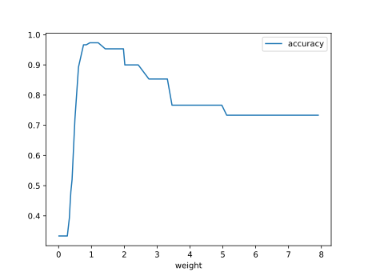

#### Network

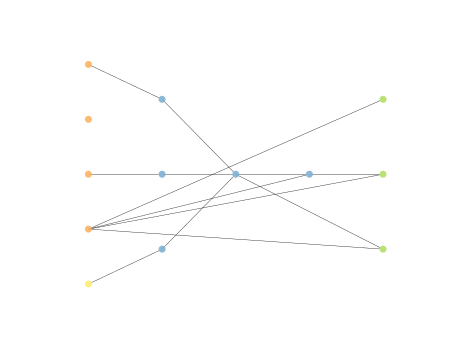

### Individual 13237

| key                    |      value |
|:-----------------------|-----------:|
| mean log_loss:         |   0.698554 |
| mean accuracy:         |   0.789867 |
| mean kappa:            |   0.6848   |
| number of edges        |  31        |
| number of hidden nodes |   6        |
| number of layers       |   4        |
| birth                  | 148        |

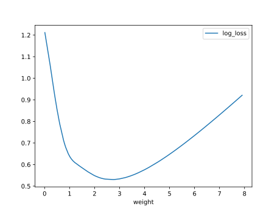

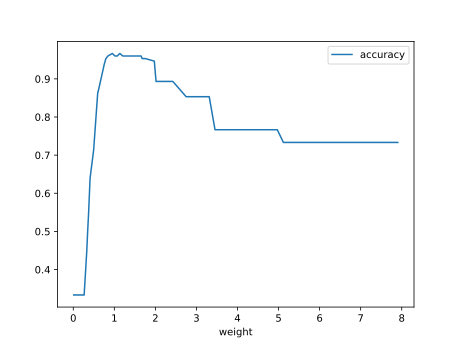

#### Network

### Individual 13684

| key                    |      value |
|:-----------------------|-----------:|
| mean log_loss:         |   0.691459 |
| mean accuracy:         |   0.7848   |
| mean kappa:            |   0.6772   |
| number of edges        |  31        |
| number of hidden nodes |   6        |
| number of layers       |   4        |
| birth                  | 153        |

#### Network

### Individual 14199

| key                    |      value |
|:-----------------------|-----------:|
| mean log_loss:         |   0.769301 |
| mean accuracy:         |   0.776867 |
| mean kappa:            |   0.6653   |
| number of edges        |  33        |
| number of hidden nodes |   7        |
| number of layers       |   5        |
| birth                  | 158        |

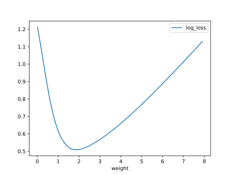

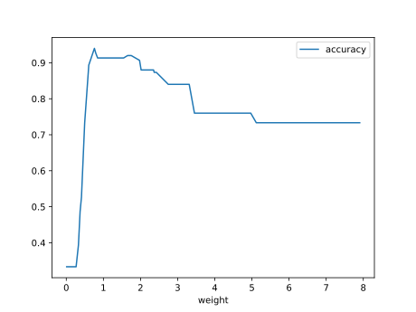

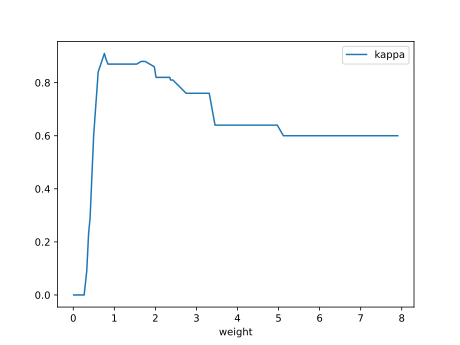

#### Network

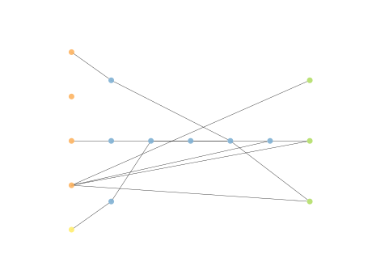

### Individual 13187

| key                    |      value |
|:-----------------------|-----------:|
| mean log_loss:         |   0.691459 |
| mean accuracy:         |   0.7848   |
| mean kappa:            |   0.6772   |
| number of edges        |  29        |
| number of hidden nodes |   5        |
| number of layers       |   3        |
| birth                  | 147        |

#### Network

### Individual 13721

| key                    |      value |
|:-----------------------|-----------:|
| mean log_loss:         |   0.691459 |
| mean accuracy:         |   0.7848   |
| mean kappa:            |   0.6772   |
| number of edges        |  32        |
| number of hidden nodes |   6        |
| number of layers       |   4        |
| birth                  | 153        |

#### Network

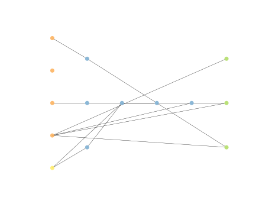

