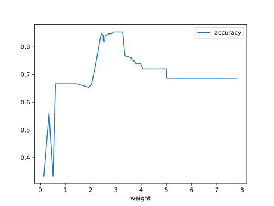

# Report Iris Uniform Distribution [0, 8] run 7

## Best results in hall of fame

| measure       |    value |   individual |
|:--------------|---------:|-------------:|
| mean accuracy | 0.716867 |        17621 |
| max accuracy  | 0.973333 |        17621 |
| mean kappa    | 0.5753   |        17621 |
| max kappa     | 0.96     |        17621 |

## Individuals in hall of fame

### Individual 17621

| key                    |      value |
|:-----------------------|-----------:|
| mean log_loss:         |   1.45059  |
| mean accuracy:         |   0.716867 |
| mean kappa:            |   0.5753   |
| number of edges        |  37        |
| number of hidden nodes |   8        |
| number of layers       |   7        |
| birth                  | 196        |

#### Network

### Individual 16404

| key                    |      value |
|:-----------------------|-----------:|
| mean log_loss:         |   1.56262  |
| mean accuracy:         |   0.688867 |
| mean kappa:            |   0.5333   |
| number of edges        |  34        |
| number of hidden nodes |   6        |
| number of layers       |   6        |
| birth                  | 183        |

#### Network

### Individual 17873

| key                    |      value |
|:-----------------------|-----------:|
| mean log_loss:         |   0.634112 |
| mean accuracy:         |   0.7042   |
| mean kappa:            |   0.5563   |
| number of edges        |  35        |
| number of hidden nodes |   6        |
| number of layers       |   6        |
| birth                  | 199        |

#### Network

### Individual 15658

| key                    |     value |
|:-----------------------|----------:|
| mean log_loss:         |   1.54674 |
| mean accuracy:         |   0.6974  |
| mean kappa:            |   0.5461  |
| number of edges        |  34       |
| number of hidden nodes |   6       |
| number of layers       |   6       |
| birth                  | 174       |

#### Network

### Individual 16526

| key                    |      value |
|:-----------------------|-----------:|
| mean log_loss:         |   1.56428  |
| mean accuracy:         |   0.688133 |
| mean kappa:            |   0.5322   |
| number of edges        |  34        |
| number of hidden nodes |   6        |
| number of layers       |   6        |
| birth                  | 184        |

#### Network

### Individual 17491

| key                    |     value |
|:-----------------------|----------:|
| mean log_loss:         |   1.54673 |
| mean accuracy:         |   0.6974  |
| mean kappa:            |   0.5461  |
| number of edges        |  33       |
| number of hidden nodes |   6       |
| number of layers       |   6       |
| birth                  | 195       |

#### Network

### Individual 15119

| key                    |     value |
|:-----------------------|----------:|
| mean log_loss:         |   1.54674 |
| mean accuracy:         |   0.6974  |
| mean kappa:            |   0.5461  |
| number of edges        |  33       |
| number of hidden nodes |   6       |
| number of layers       |   6       |
| birth                  | 168       |

#### Network

### Individual 9595

| key                    |      value |
|:-----------------------|-----------:|
| mean log_loss:         |   0.602914 |
| mean accuracy:         |   0.666667 |
| mean kappa:            |   0.5      |
| number of edges        |  24        |
| number of hidden nodes |   4        |
| number of layers       |   4        |
| birth                  | 107        |

#### Network

### Individual 16109

| key                    |      value |
|:-----------------------|-----------:|
| mean log_loss:         |   0.60032  |
| mean accuracy:         |   0.666667 |
| mean kappa:            |   0.5      |
| number of edges        |  34        |
| number of hidden nodes |   6        |
| number of layers       |   6        |
| birth                  | 179        |

#### Network

### Individual 15897

| key                    |      value |
|:-----------------------|-----------:|
| mean log_loss:         |   0.598492 |
| mean accuracy:         |   0.666667 |
| mean kappa:            |   0.5      |
| number of edges        |  34        |
| number of hidden nodes |   6        |
| number of layers       |   6        |
| birth                  | 177        |

#### Network

