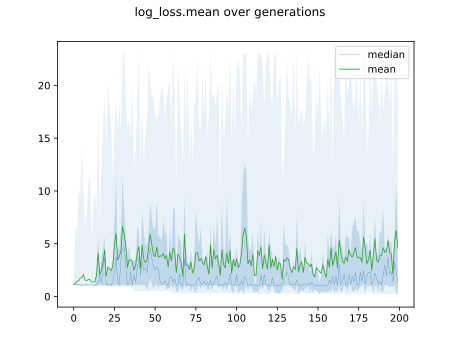
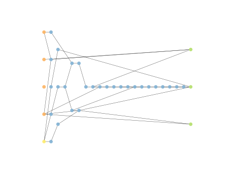

# Report Iris Uniform Distribution [0, 8] run 8

## Best results in hall of fame

| measure       |   value |   individual |
|:--------------|--------:|-------------:|
| mean accuracy |   0.906 |        12555 |
| max accuracy  |   0.96  |        16087 |
| mean kappa    |   0.859 |        12555 |
| max kappa     |   0.94  |        16087 |

## Individuals in hall of fame

### Individual 16087

| key                    |      value |
|:-----------------------|-----------:|
| mean log_loss:         |   0.317871 |
| mean accuracy:         |   0.893067 |
| mean kappa:            |   0.8396   |
| number of edges        | 101        |
| number of hidden nodes |  36        |
| number of layers       |  26        |
| birth                  | 179        |

#### Network

### Individual 12555

| key                    |      value |
|:-----------------------|-----------:|
| mean log_loss:         |   0.327203 |
| mean accuracy:         |   0.906    |
| mean kappa:            |   0.859    |
| number of edges        |  77        |
| number of hidden nodes |  26        |
| number of layers       |  19        |
| birth                  | 140        |

#### Network

### Individual 13148

| key                    |      value |
|:-----------------------|-----------:|
| mean log_loss:         |   0.316316 |
| mean accuracy:         |   0.896933 |
| mean kappa:            |   0.8454   |
| number of edges        |  80        |
| number of hidden nodes |  28        |
| number of layers       |  20        |
| birth                  | 147        |

#### Network

### Individual 13113

| key                    |      value |
|:-----------------------|-----------:|
| mean log_loss:         |   0.317455 |
| mean accuracy:         |   0.894733 |
| mean kappa:            |   0.8421   |
| number of edges        |  78        |
| number of hidden nodes |  27        |
| number of layers       |  20        |
| birth                  | 146        |

#### Network

### Individual 16831

| key                    |      value |
|:-----------------------|-----------:|
| mean log_loss:         |   0.318645 |
| mean accuracy:         |   0.8842   |
| mean kappa:            |   0.8263   |
| number of edges        | 107        |
| number of hidden nodes |  39        |
| number of layers       |  28        |
| birth                  | 188        |

#### Network

### Individual 17212

| key                    |      value |
|:-----------------------|-----------:|
| mean log_loss:         |   0.316304 |
| mean accuracy:         |   0.889467 |
| mean kappa:            |   0.8342   |
| number of edges        | 109        |
| number of hidden nodes |  40        |
| number of layers       |  28        |
| birth                  | 192        |

#### Network

### Individual 14517

| key                    |      value |
|:-----------------------|-----------:|
| mean log_loss:         |   0.319782 |
| mean accuracy:         |   0.877867 |
| mean kappa:            |   0.8168   |
| number of edges        |  89        |
| number of hidden nodes |  31        |
| number of layers       |  23        |
| birth                  | 162        |

#### Network

### Individual 9367

| key                    |      value |
|:-----------------------|-----------:|
| mean log_loss:         |   0.339933 |
| mean accuracy:         |   0.870667 |
| mean kappa:            |   0.806    |
| number of edges        |  68        |
| number of hidden nodes |  23        |
| number of layers       |  14        |
| birth                  | 105        |

#### Network

### Individual 14403

| key                    |      value |
|:-----------------------|-----------:|
| mean log_loss:         |   0.319984 |
| mean accuracy:         |   0.877267 |
| mean kappa:            |   0.8159   |
| number of edges        |  89        |
| number of hidden nodes |  31        |
| number of layers       |  23        |
| birth                  | 161        |

#### Network

### Individual 17021

| key                    |      value |
|:-----------------------|-----------:|
| mean log_loss:         |   0.318735 |
| mean accuracy:         |   0.882933 |
| mean kappa:            |   0.8244   |
| number of edges        | 108        |
| number of hidden nodes |  39        |
| number of layers       |  28        |
| birth                  | 190        |

#### Network

