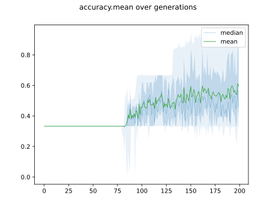
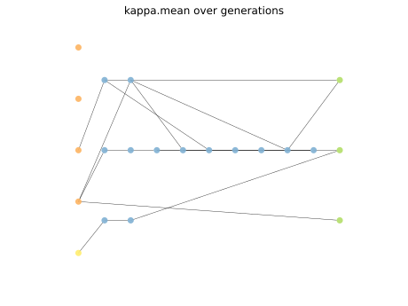

# Report Iris Uniform Distribution [0, 8] run 9

## Best results in hall of fame

| measure       |    value |   individual |
|:--------------|---------:|-------------:|
| mean accuracy | 0.924333 |        14238 |
| max accuracy  | 0.96     |        14767 |
| mean kappa    | 0.8865   |        14238 |
| max kappa     | 0.94     |        14767 |

## Individuals in hall of fame

### Individual 14767

| key                    |      value |
|:-----------------------|-----------:|
| mean log_loss:         |   0.321837 |
| mean accuracy:         |   0.9198   |
| mean kappa:            |   0.8797   |
| number of edges        |  47        |
| number of hidden nodes |  13        |
| number of layers       |   9        |
| birth                  | 165        |

#### Network

### Individual 14740

| key                    |      value |
|:-----------------------|-----------:|
| mean log_loss:         |   0.347307 |
| mean accuracy:         |   0.907867 |
| mean kappa:            |   0.8618   |
| number of edges        |  45        |
| number of hidden nodes |  12        |
| number of layers       |   8        |
| birth                  | 164        |

#### Network

### Individual 14238

| key                    |      value |
|:-----------------------|-----------:|
| mean log_loss:         |   0.321241 |
| mean accuracy:         |   0.924333 |
| mean kappa:            |   0.8865   |
| number of edges        |  45        |
| number of hidden nodes |  12        |
| number of layers       |   8        |
| birth                  | 159        |

#### Network

### Individual 14704

| key                    |      value |
|:-----------------------|-----------:|
| mean log_loss:         |   0.347307 |
| mean accuracy:         |   0.907867 |
| mean kappa:            |   0.8618   |
| number of edges        |  45        |
| number of hidden nodes |  12        |
| number of layers       |   8        |
| birth                  | 164        |

#### Network

### Individual 14085

| key                    |      value |
|:-----------------------|-----------:|
| mean log_loss:         |   0.347887 |
| mean accuracy:         |   0.9118   |
| mean kappa:            |   0.8677   |
| number of edges        |  44        |
| number of hidden nodes |  12        |
| number of layers       |   8        |
| birth                  | 157        |

#### Network

### Individual 14299

| key                    |      value |
|:-----------------------|-----------:|
| mean log_loss:         |   0.346424 |
| mean accuracy:         |   0.913933 |
| mean kappa:            |   0.8709   |
| number of edges        |  45        |
| number of hidden nodes |  12        |
| number of layers       |   8        |
| birth                  | 159        |

#### Network

### Individual 13566

| key                    |      value |
|:-----------------------|-----------:|
| mean log_loss:         |   0.345061 |
| mean accuracy:         |   0.892933 |
| mean kappa:            |   0.8394   |
| number of edges        |  46        |
| number of hidden nodes |  13        |
| number of layers       |   9        |
| birth                  | 151        |

#### Network

### Individual 14542

| key                    |      value |
|:-----------------------|-----------:|
| mean log_loss:         |   0.347887 |
| mean accuracy:         |   0.9118   |
| mean kappa:            |   0.8677   |
| number of edges        |  46        |
| number of hidden nodes |  13        |
| number of layers       |   8        |
| birth                  | 162        |

#### Network

### Individual 14887

| key                    |      value |
|:-----------------------|-----------:|
| mean log_loss:         |   0.338483 |
| mean accuracy:         |   0.907867 |
| mean kappa:            |   0.8618   |
| number of edges        |  49        |
| number of hidden nodes |  14        |
| number of layers       |  10        |
| birth                  | 166        |

#### Network

### Individual 17724

| key                    |      value |
|:-----------------------|-----------:|
| mean log_loss:         |   0.330001 |
| mean accuracy:         |   0.890867 |
| mean kappa:            |   0.8363   |
| number of edges        |  50        |
| number of hidden nodes |  15        |
| number of layers       |   7        |
| birth                  | 197        |

#### Network

