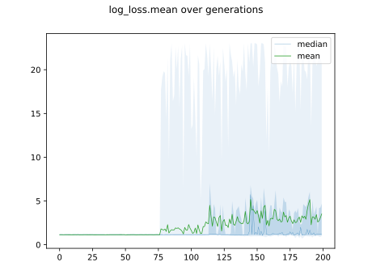

# Report Iris Uniform Distribution [1, 17] run 0

## Best results in hall of fame

| measure       |    value |   individual |
|:--------------|---------:|-------------:|
| mean accuracy | 0.761067 |        14453 |
| max accuracy  | 0.946667 |        14453 |
| mean kappa    | 0.6416   |        14453 |
| max kappa     | 0.92     |        14453 |

## Individuals in hall of fame

### Individual 14453

| key                    |      value |
|:-----------------------|-----------:|
| mean log_loss:         |   0.950961 |
| mean accuracy:         |   0.761067 |
| mean kappa:            |   0.6416   |
| number of edges        |  32        |
| number of hidden nodes |   7        |
| number of layers       |   4        |
| birth                  | 161        |

#### Network

### Individual 13106

| key                    |      value |
|:-----------------------|-----------:|
| mean log_loss:         |   0.968334 |
| mean accuracy:         |   0.619267 |
| mean kappa:            |   0.4289   |
| number of edges        |  28        |
| number of hidden nodes |   5        |
| number of layers       |   3        |
| birth                  | 146        |

#### Network

### Individual 13062

| key                    |      value |
|:-----------------------|-----------:|
| mean log_loss:         |   0.968334 |
| mean accuracy:         |   0.619267 |
| mean kappa:            |   0.4289   |
| number of edges        |  28        |
| number of hidden nodes |   5        |
| number of layers       |   3        |
| birth                  | 146        |

#### Network

### Individual 13552

| key                    |      value |
|:-----------------------|-----------:|
| mean log_loss:         |   0.968324 |
| mean accuracy:         |   0.619267 |
| mean kappa:            |   0.4289   |
| number of edges        |  32        |
| number of hidden nodes |   7        |
| number of layers       |   4        |
| birth                  | 151        |

#### Network

### Individual 11828

| key                    |      value |
|:-----------------------|-----------:|
| mean log_loss:         |   0.998881 |
| mean accuracy:         |   0.6564   |
| mean kappa:            |   0.4846   |
| number of edges        |  21        |
| number of hidden nodes |   2        |
| number of layers       |   1        |
| birth                  | 132        |

#### Network

### Individual 13162

| key                    |      value |
|:-----------------------|-----------:|
| mean log_loss:         |   0.968334 |
| mean accuracy:         |   0.619267 |
| mean kappa:            |   0.4289   |
| number of edges        |  30        |
| number of hidden nodes |   6        |
| number of layers       |   4        |
| birth                  | 147        |

#### Network

### Individual 13295

| key                    |      value |
|:-----------------------|-----------:|
| mean log_loss:         |   0.968334 |
| mean accuracy:         |   0.619267 |
| mean kappa:            |   0.4289   |
| number of edges        |  30        |
| number of hidden nodes |   6        |
| number of layers       |   4        |
| birth                  | 148        |

#### Network

### Individual 13252

| key                    |      value |
|:-----------------------|-----------:|
| mean log_loss:         |   0.968334 |
| mean accuracy:         |   0.619267 |
| mean kappa:            |   0.4289   |
| number of edges        |  32        |
| number of hidden nodes |   7        |
| number of layers       |   4        |
| birth                  | 148        |

#### Network

### Individual 13418

| key                    |      value |
|:-----------------------|-----------:|
| mean log_loss:         |   0.968333 |
| mean accuracy:         |   0.619267 |
| mean kappa:            |   0.4289   |
| number of edges        |  30        |
| number of hidden nodes |   6        |
| number of layers       |   4        |
| birth                  | 150        |

#### Network

### Individual 13585

| key                    |      value |
|:-----------------------|-----------:|
| mean log_loss:         |   0.968416 |
| mean accuracy:         |   0.5908   |
| mean kappa:            |   0.3862   |
| number of edges        |  32        |
| number of hidden nodes |   7        |
| number of layers       |   4        |
| birth                  | 151        |

#### Network

