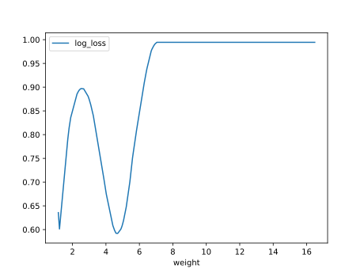
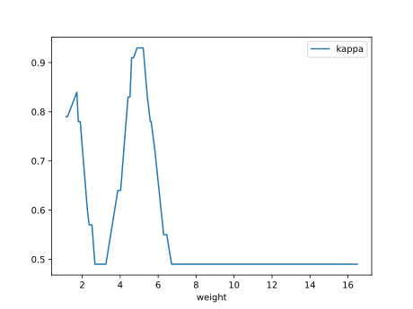

# Report Iris Uniform Distribution [1, 17] run 1

## Best results in hall of fame

| measure       |   value |   individual |
|:--------------|--------:|-------------:|
| mean accuracy |  0.7312 |        17462 |
| max accuracy  |  0.96   |        16799 |
| mean kappa    |  0.5968 |        17462 |
| max kappa     |  0.94   |        16799 |

## Individuals in hall of fame

### Individual 17462

| key                    |     value |
|:-----------------------|----------:|
| mean log_loss:         |   8.10224 |
| mean accuracy:         |   0.7312  |
| mean kappa:            |   0.5968  |
| number of edges        |  34       |
| number of hidden nodes |   7       |
| number of layers       |   6       |
| birth                  | 195       |

#### Network

### Individual 17353

| key                    |     value |
|:-----------------------|----------:|
| mean log_loss:         |   8.04972 |
| mean accuracy:         |   0.7296  |
| mean kappa:            |   0.5944  |
| number of edges        |  34       |
| number of hidden nodes |   7       |
| number of layers       |   6       |
| birth                  | 193       |

#### Network

### Individual 17071

| key                    |      value |
|:-----------------------|-----------:|
| mean log_loss:         |   0.915155 |
| mean accuracy:         |   0.699267 |
| mean kappa:            |   0.5489   |
| number of edges        |  35        |
| number of hidden nodes |   8        |
| number of layers       |   7        |
| birth                  | 190        |

#### Network

### Individual 17238

| key                    |      value |
|:-----------------------|-----------:|
| mean log_loss:         |   0.914571 |
| mean accuracy:         |   0.699933 |
| mean kappa:            |   0.5499   |
| number of edges        |  35        |
| number of hidden nodes |   8        |
| number of layers       |   7        |
| birth                  | 192        |

#### Network

### Individual 17974

| key                    |      value |
|:-----------------------|-----------:|
| mean log_loss:         |   0.892296 |
| mean accuracy:         |   0.710933 |
| mean kappa:            |   0.5664   |
| number of edges        |  40        |
| number of hidden nodes |  10        |
| number of layers       |   8        |
| birth                  | 200        |

#### Network

### Individual 17558

| key                    |      value |
|:-----------------------|-----------:|
| mean log_loss:         |   0.914283 |
| mean accuracy:         |   0.700867 |
| mean kappa:            |   0.5513   |
| number of edges        |  42        |
| number of hidden nodes |  11        |
| number of layers       |   9        |
| birth                  | 196        |

#### Network

### Individual 16799

| key                    |      value |
|:-----------------------|-----------:|
| mean log_loss:         |   0.93513  |
| mean accuracy:         |   0.703533 |
| mean kappa:            |   0.5553   |
| number of edges        |  31        |
| number of hidden nodes |   6        |
| number of layers       |   6        |
| birth                  | 187        |

#### Network

### Individual 17502

| key                    |      value |
|:-----------------------|-----------:|
| mean log_loss:         |   0.914283 |
| mean accuracy:         |   0.700867 |
| mean kappa:            |   0.5513   |
| number of edges        |  40        |
| number of hidden nodes |  10        |
| number of layers       |   8        |
| birth                  | 195        |

#### Network

### Individual 16879

| key                    |      value |
|:-----------------------|-----------:|
| mean log_loss:         |   0.900575 |
| mean accuracy:         |   0.703333 |
| mean kappa:            |   0.555    |
| number of edges        |  33        |
| number of hidden nodes |   7        |
| number of layers       |   6        |
| birth                  | 188        |

#### Network

### Individual 16510

| key                    |      value |
|:-----------------------|-----------:|
| mean log_loss:         |   0.93513  |
| mean accuracy:         |   0.703533 |
| mean kappa:            |   0.5553   |
| number of edges        |  30        |
| number of hidden nodes |   6        |
| number of layers       |   5        |
| birth                  | 184        |

#### Network

