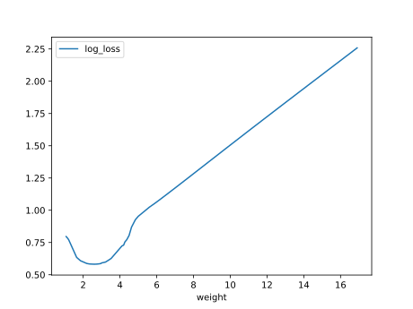
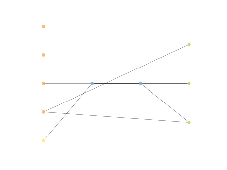

# Report Iris Uniform Distribution [1, 17] run 2

## Best results in hall of fame

| measure       |    value |   individual |
|:--------------|---------:|-------------:|
| mean accuracy | 0.712133 |        16395 |
| max accuracy  | 0.933333 |        15760 |
| mean kappa    | 0.5682   |        16395 |
| max kappa     | 0.9      |        15760 |

## Individuals in hall of fame

### Individual 16395

| key                    |      value |
|:-----------------------|-----------:|
| mean log_loss:         |   1.43967  |
| mean accuracy:         |   0.712133 |
| mean kappa:            |   0.5682   |
| number of edges        |  21        |
| number of hidden nodes |   2        |
| number of layers       |   2        |
| birth                  | 183        |

#### Network

### Individual 17292

| key                    |      value |
|:-----------------------|-----------:|
| mean log_loss:         |   1.43967  |
| mean accuracy:         |   0.712133 |
| mean kappa:            |   0.5682   |
| number of edges        |  21        |
| number of hidden nodes |   2        |
| number of layers       |   2        |
| birth                  | 193        |

#### Network

### Individual 17845

| key                    |      value |
|:-----------------------|-----------:|
| mean log_loss:         |   1.32135  |
| mean accuracy:         |   0.711933 |
| mean kappa:            |   0.5679   |
| number of edges        |  23        |
| number of hidden nodes |   3        |
| number of layers       |   3        |
| birth                  | 199        |

#### Network

### Individual 15760

| key                    |      value |
|:-----------------------|-----------:|
| mean log_loss:         |   1.32298  |
| mean accuracy:         |   0.708267 |
| mean kappa:            |   0.5624   |
| number of edges        |  20        |
| number of hidden nodes |   2        |
| number of layers       |   2        |
| birth                  | 176        |

#### Network

### Individual 17291

| key                    |     value |
|:-----------------------|----------:|
| mean log_loss:         |   1.47697 |
| mean accuracy:         |   0.7046  |
| mean kappa:            |   0.5569  |
| number of edges        |  23       |
| number of hidden nodes |   3       |
| number of layers       |   3       |
| birth                  | 193       |

#### Network

### Individual 16148

| key                    |     value |
|:-----------------------|----------:|
| mean log_loss:         |   1.47697 |
| mean accuracy:         |   0.7046  |
| mean kappa:            |   0.5569  |
| number of edges        |  21       |
| number of hidden nodes |   2       |
| number of layers       |   2       |
| birth                  | 180       |

#### Network

### Individual 17866

| key                    |     value |
|:-----------------------|----------:|
| mean log_loss:         |   1.47697 |
| mean accuracy:         |   0.7046  |
| mean kappa:            |   0.5569  |
| number of edges        |  24       |
| number of hidden nodes |   3       |
| number of layers       |   3       |
| birth                  | 199       |

#### Network

### Individual 16155

| key                    |     value |
|:-----------------------|----------:|
| mean log_loss:         |   1.36515 |
| mean accuracy:         |   0.695   |
| mean kappa:            |   0.5425  |
| number of edges        |  23       |
| number of hidden nodes |   3       |
| number of layers       |   2       |
| birth                  | 180       |

#### Network

### Individual 15964

| key                    |     value |
|:-----------------------|----------:|
| mean log_loss:         |   1.31982 |
| mean accuracy:         |   0.695   |
| mean kappa:            |   0.5425  |
| number of edges        |  21       |
| number of hidden nodes |   2       |
| number of layers       |   2       |
| birth                  | 178       |

#### Network

### Individual 16922

| key                    |      value |
|:-----------------------|-----------:|
| mean log_loss:         |   1.3083   |
| mean accuracy:         |   0.695733 |
| mean kappa:            |   0.5436   |
| number of edges        |  23        |
| number of hidden nodes |   3        |
| number of layers       |   2        |
| birth                  | 189        |

#### Network

