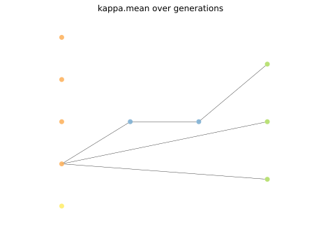

# Report Iris Uniform Distribution [1, 17] run 3

## Best results in hall of fame

| measure       |    value |   individual |
|:--------------|---------:|-------------:|
| mean accuracy | 0.666667 |        15662 |
| max accuracy  | 0.666667 |        15662 |
| mean kappa    | 0.5      |        15662 |
| max kappa     | 0.5      |        15662 |

## Individuals in hall of fame

### Individual 15662

| key                    |      value |
|:-----------------------|-----------:|
| mean log_loss:         |   0.546351 |
| mean accuracy:         |   0.666667 |
| mean kappa:            |   0.5      |
| number of edges        |  19        |
| number of hidden nodes |   2        |
| number of layers       |   2        |
| birth                  | 175        |

#### Network

### Individual 17300

| key                    |      value |
|:-----------------------|-----------:|
| mean log_loss:         |   0.53908  |
| mean accuracy:         |   0.666667 |
| mean kappa:            |   0.5      |
| number of edges        |  24        |
| number of hidden nodes |   3        |
| number of layers       |   3        |
| birth                  | 193        |

#### Network

### Individual 17728

| key                    |      value |
|:-----------------------|-----------:|
| mean log_loss:         |   0.538813 |
| mean accuracy:         |   0.666667 |
| mean kappa:            |   0.5      |
| number of edges        |  26        |
| number of hidden nodes |   4        |
| number of layers       |   4        |
| birth                  | 197        |

#### Network

### Individual 16054

| key                    |      value |
|:-----------------------|-----------:|
| mean log_loss:         |   0.546351 |
| mean accuracy:         |   0.666667 |
| mean kappa:            |   0.5      |
| number of edges        |  20        |
| number of hidden nodes |   2        |
| number of layers       |   2        |
| birth                  | 179        |

#### Network

### Individual 17069

| key                    |      value |
|:-----------------------|-----------:|
| mean log_loss:         |   0.540314 |
| mean accuracy:         |   0.666667 |
| mean kappa:            |   0.5      |
| number of edges        |  25        |
| number of hidden nodes |   3        |
| number of layers       |   3        |
| birth                  | 190        |

#### Network

### Individual 17272

| key                    |      value |
|:-----------------------|-----------:|
| mean log_loss:         |   0.538813 |
| mean accuracy:         |   0.666667 |
| mean kappa:            |   0.5      |
| number of edges        |  26        |
| number of hidden nodes |   4        |
| number of layers       |   4        |
| birth                  | 192        |

#### Network

### Individual 16348

| key                    |      value |
|:-----------------------|-----------:|
| mean log_loss:         |   0.546361 |
| mean accuracy:         |   0.666667 |
| mean kappa:            |   0.5      |
| number of edges        |  22        |
| number of hidden nodes |   3        |
| number of layers       |   2        |
| birth                  | 182        |

#### Network

### Individual 16455

| key                    |      value |
|:-----------------------|-----------:|
| mean log_loss:         |   0.547203 |
| mean accuracy:         |   0.666667 |
| mean kappa:            |   0.5      |
| number of edges        |  22        |
| number of hidden nodes |   3        |
| number of layers       |   2        |
| birth                  | 183        |

#### Network

### Individual 16380

| key                    |      value |
|:-----------------------|-----------:|
| mean log_loss:         |   0.54669  |
| mean accuracy:         |   0.666667 |
| mean kappa:            |   0.5      |
| number of edges        |  24        |
| number of hidden nodes |   4        |
| number of layers       |   3        |
| birth                  | 183        |

#### Network

### Individual 15847

| key                    |      value |
|:-----------------------|-----------:|
| mean log_loss:         |   0.547507 |
| mean accuracy:         |   0.666667 |
| mean kappa:            |   0.5      |
| number of edges        |  21        |
| number of hidden nodes |   3        |
| number of layers       |   3        |
| birth                  | 177        |

#### Network

