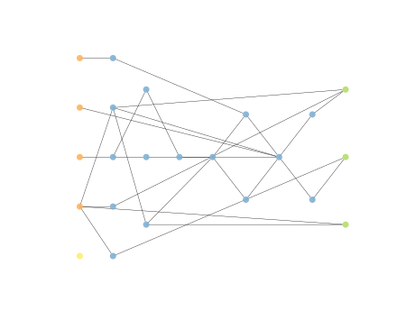
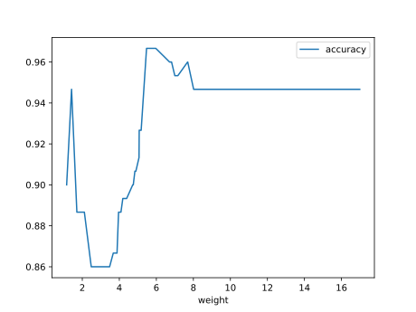

# Report Iris Uniform Distribution [1, 17] run 4

## Best results in hall of fame

| measure       |    value |   individual |
|:--------------|---------:|-------------:|
| mean accuracy | 0.9452   |        17087 |
| max accuracy  | 0.966667 |        17087 |
| mean kappa    | 0.9178   |        17087 |
| max kappa     | 0.95     |        17087 |

## Individuals in hall of fame

### Individual 17087

| key                    |     value |
|:-----------------------|----------:|
| mean log_loss:         |   0.16922 |
| mean accuracy:         |   0.9452  |
| mean kappa:            |   0.9178  |
| number of edges        |  54       |
| number of hidden nodes |  15       |
| number of layers       |   6       |
| birth                  | 190       |

#### Network

### Individual 17084

| key                    |     value |
|:-----------------------|----------:|
| mean log_loss:         |   0.16922 |
| mean accuracy:         |   0.9452  |
| mean kappa:            |   0.9178  |
| number of edges        |  53       |
| number of hidden nodes |  14       |
| number of layers       |   6       |
| birth                  | 190       |

#### Network

### Individual 17632

| key                    |      value |
|:-----------------------|-----------:|
| mean log_loss:         |   0.174605 |
| mean accuracy:         |   0.944133 |
| mean kappa:            |   0.9162   |
| number of edges        |  52        |
| number of hidden nodes |  14        |
| number of layers       |   6        |
| birth                  | 196        |

#### Network

### Individual 17678

| key                    |     value |
|:-----------------------|----------:|
| mean log_loss:         |   0.17505 |
| mean accuracy:         |   0.9438  |
| mean kappa:            |   0.9157  |
| number of edges        |  54       |
| number of hidden nodes |  15       |
| number of layers       |   6       |
| birth                  | 197       |

#### Network

### Individual 16869

| key                    |      value |
|:-----------------------|-----------:|
| mean log_loss:         |   0.174584 |
| mean accuracy:         |   0.9442   |
| mean kappa:            |   0.9163   |
| number of edges        |  52        |
| number of hidden nodes |  14        |
| number of layers       |   6        |
| birth                  | 188        |

#### Network

### Individual 17647

| key                    |      value |
|:-----------------------|-----------:|
| mean log_loss:         |   0.178089 |
| mean accuracy:         |   0.939533 |
| mean kappa:            |   0.9093   |
| number of edges        |  54        |
| number of hidden nodes |  15        |
| number of layers       |   7        |
| birth                  | 197        |

#### Network

### Individual 16726

| key                    |      value |
|:-----------------------|-----------:|
| mean log_loss:         |   0.177962 |
| mean accuracy:         |   0.940267 |
| mean kappa:            |   0.9104   |
| number of edges        |  52        |
| number of hidden nodes |  14        |
| number of layers       |   6        |
| birth                  | 186        |

#### Network

### Individual 17790

| key                    |      value |
|:-----------------------|-----------:|
| mean log_loss:         |   0.174584 |
| mean accuracy:         |   0.9442   |
| mean kappa:            |   0.9163   |
| number of edges        |  52        |
| number of hidden nodes |  14        |
| number of layers       |   6        |
| birth                  | 198        |

#### Network

### Individual 15948

| key                    |      value |
|:-----------------------|-----------:|
| mean log_loss:         |   0.190759 |
| mean accuracy:         |   0.929067 |
| mean kappa:            |   0.8936   |
| number of edges        |  50        |
| number of hidden nodes |  13        |
| number of layers       |   6        |
| birth                  | 178        |

#### Network

### Individual 17162

| key                    |      value |
|:-----------------------|-----------:|
| mean log_loss:         |   0.178766 |
| mean accuracy:         |   0.934333 |
| mean kappa:            |   0.9015   |
| number of edges        |  54        |
| number of hidden nodes |  15        |
| number of layers       |   6        |
| birth                  | 191        |

#### Network

