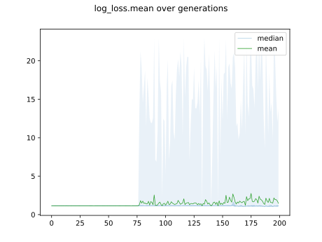

# Report Iris Uniform Distribution [1, 17] run 5

## Best results in hall of fame

| measure       |    value |   individual |
|:--------------|---------:|-------------:|
| mean accuracy | 0.556267 |        14359 |
| max accuracy  | 0.666667 |        14359 |
| mean kappa    | 0.3344   |        14359 |
| max kappa     | 0.5      |        14359 |

## Individuals in hall of fame

### Individual 14359

| key                    |      value |
|:-----------------------|-----------:|
| mean log_loss:         |   1.10914  |
| mean accuracy:         |   0.556267 |
| mean kappa:            |   0.3344   |
| number of edges        |  15        |
| number of hidden nodes |   0        |
| number of layers       |   0        |
| birth                  | 160        |

#### Network

### Individual 14151

| key                    |      value |
|:-----------------------|-----------:|
| mean log_loss:         |   1.1594   |
| mean accuracy:         |   0.361267 |
| mean kappa:            |   0.0419   |
| number of edges        |  15        |
| number of hidden nodes |   0        |
| number of layers       |   0        |
| birth                  | 158        |

#### Network

### Individual 14215

| key                    |      value |
|:-----------------------|-----------:|
| mean log_loss:         |   1.1594   |
| mean accuracy:         |   0.361267 |
| mean kappa:            |   0.0419   |
| number of edges        |  15        |
| number of hidden nodes |   0        |
| number of layers       |   0        |
| birth                  | 158        |

#### Network

### Individual 14101

| key                    |      value |
|:-----------------------|-----------:|
| mean log_loss:         |   1.1594   |
| mean accuracy:         |   0.361267 |
| mean kappa:            |   0.0419   |
| number of edges        |  15        |
| number of hidden nodes |   0        |
| number of layers       |   0        |
| birth                  | 157        |

#### Network

### Individual 14068

| key                    |      value |
|:-----------------------|-----------:|
| mean log_loss:         |   1.1594   |
| mean accuracy:         |   0.361267 |
| mean kappa:            |   0.0419   |
| number of edges        |  15        |
| number of hidden nodes |   0        |
| number of layers       |   0        |
| birth                  | 157        |

#### Network

### Individual 14306

| key                    |      value |
|:-----------------------|-----------:|
| mean log_loss:         |   1.10929  |
| mean accuracy:         |   0.361267 |
| mean kappa:            |   0.0419   |
| number of edges        |  15        |
| number of hidden nodes |   0        |
| number of layers       |   0        |
| birth                  | 159        |

#### Network

### Individual 14262

| key                    |      value |
|:-----------------------|-----------:|
| mean log_loss:         |   1.10929  |
| mean accuracy:         |   0.361267 |
| mean kappa:            |   0.0419   |
| number of edges        |  15        |
| number of hidden nodes |   0        |
| number of layers       |   0        |
| birth                  | 159        |

#### Network

### Individual 14231

| key                    |      value |
|:-----------------------|-----------:|
| mean log_loss:         |   1.10929  |
| mean accuracy:         |   0.361267 |
| mean kappa:            |   0.0419   |
| number of edges        |  15        |
| number of hidden nodes |   0        |
| number of layers       |   0        |
| birth                  | 159        |

#### Network

### Individual 17484

| key                    |      value |
|:-----------------------|-----------:|
| mean log_loss:         |   1.0439   |
| mean accuracy:         |   0.333333 |
| mean kappa:            |   0        |
| number of edges        |  15        |
| number of hidden nodes |   0        |
| number of layers       |   0        |
| birth                  | 195        |

#### Network

### Individual 17535

| key                    |      value |
|:-----------------------|-----------:|
| mean log_loss:         |   1.0439   |
| mean accuracy:         |   0.333333 |
| mean kappa:            |   0        |
| number of edges        |  15        |
| number of hidden nodes |   0        |
| number of layers       |   0        |
| birth                  | 195        |

#### Network

