# Report Iris Uniform Distribution [1, 17] run 6

## Best results in hall of fame

| measure       |    value |   individual |
|:--------------|---------:|-------------:|
| mean accuracy | 0.527067 |        17817 |
| max accuracy  | 0.8      |        17817 |
| mean kappa    | 0.2906   |        17817 |
| max kappa     | 0.7      |        17817 |

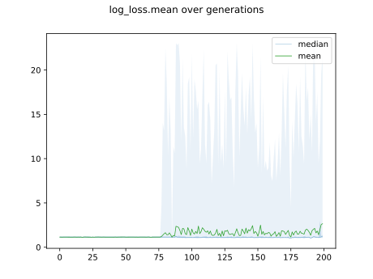

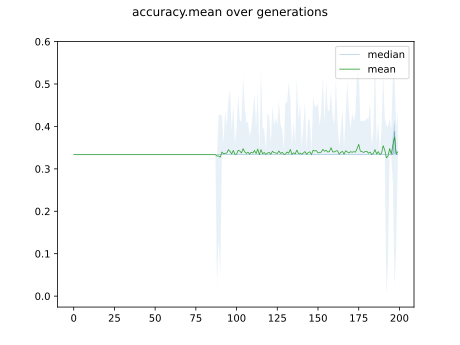

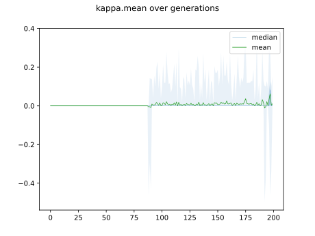

## Individuals in hall of fame

### Individual 17817

| key                    |      value |
|:-----------------------|-----------:|
| mean log_loss:         |   1.09129  |
| mean accuracy:         |   0.527067 |
| mean kappa:            |   0.2906   |
| number of edges        |  15        |
| number of hidden nodes |   0        |
| number of layers       |   0        |
| birth                  | 198        |

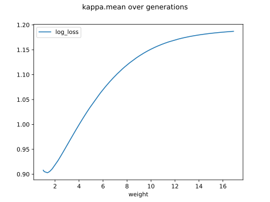

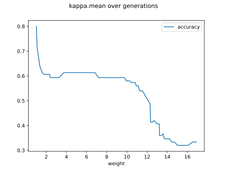

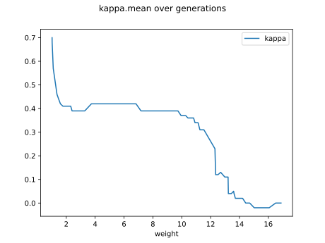

#### Network

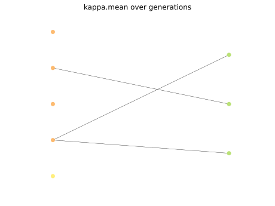

### Individual 17809

| key                    |      value |
|:-----------------------|-----------:|
| mean log_loss:         |   1.05801  |
| mean accuracy:         |   0.440867 |
| mean kappa:            |   0.1613   |
| number of edges        |  19        |
| number of hidden nodes |   2        |
| number of layers       |   2        |
| birth                  | 198        |

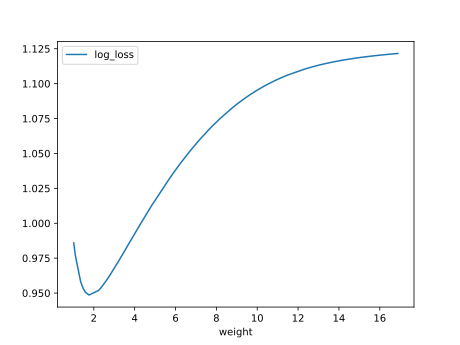

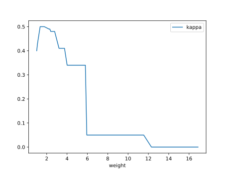

#### Network

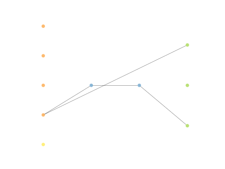

### Individual 9985

| key                    |      value |
|:-----------------------|-----------:|
| mean log_loss:         |   1.05801  |
| mean accuracy:         |   0.440867 |
| mean kappa:            |   0.1613   |
| number of edges        |  15        |
| number of hidden nodes |   0        |
| number of layers       |   0        |
| birth                  | 111        |

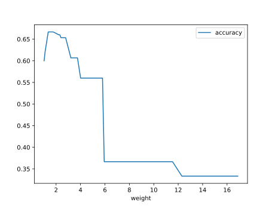

#### Network

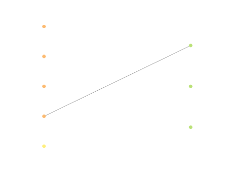

### Individual 9952

| key                    |      value |
|:-----------------------|-----------:|
| mean log_loss:         |   1.05801  |
| mean accuracy:         |   0.440867 |
| mean kappa:            |   0.1613   |
| number of edges        |  15        |
| number of hidden nodes |   0        |
| number of layers       |   0        |
| birth                  | 111        |

#### Network

### Individual 8013

| key                    |     value |
|:-----------------------|----------:|
| mean log_loss:         |  1.05801  |
| mean accuracy:         |  0.442667 |
| mean kappa:            |  0.164    |
| number of edges        | 15        |
| number of hidden nodes |  0        |
| number of layers       |  0        |
| birth                  | 90        |

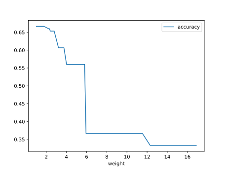

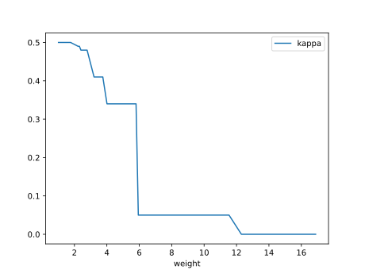

#### Network

### Individual 17255

| key                    |      value |
|:-----------------------|-----------:|
| mean log_loss:         |   1.11624  |
| mean accuracy:         |   0.406667 |
| mean kappa:            |   0.11     |
| number of edges        |  15        |
| number of hidden nodes |   0        |
| number of layers       |   0        |
| birth                  | 192        |

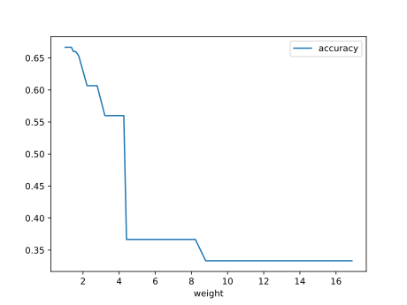

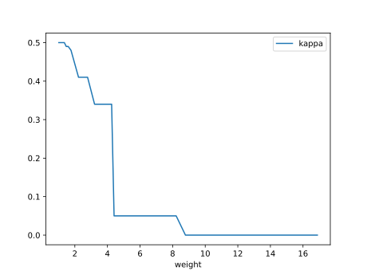

#### Network

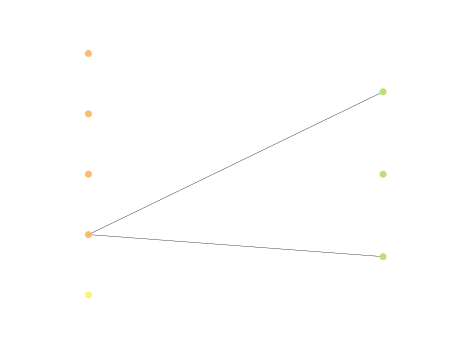

### Individual 17761

| key                    |      value |
|:-----------------------|-----------:|
| mean log_loss:         |   1.07739  |
| mean accuracy:         |   0.406667 |
| mean kappa:            |   0.11     |
| number of edges        |  15        |
| number of hidden nodes |   0        |
| number of layers       |   0        |
| birth                  | 198        |

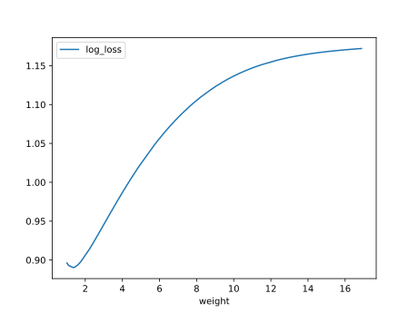

#### Network

### Individual 17814

| key                    |      value |
|:-----------------------|-----------:|
| mean log_loss:         |   1.07739  |
| mean accuracy:         |   0.406667 |
| mean kappa:            |   0.11     |
| number of edges        |  15        |
| number of hidden nodes |   0        |
| number of layers       |   0        |
| birth                  | 198        |

#### Network

### Individual 17803

| key                    |      value |
|:-----------------------|-----------:|
| mean log_loss:         |   1.07739  |
| mean accuracy:         |   0.406667 |
| mean kappa:            |   0.11     |
| number of edges        |  15        |
| number of hidden nodes |   0        |
| number of layers       |   0        |
| birth                  | 198        |

#### Network

### Individual 17776

| key                    |     value |
|:-----------------------|----------:|
| mean log_loss:         |   1.07406 |
| mean accuracy:         |   0.4028  |
| mean kappa:            |   0.1042  |
| number of edges        |  15       |
| number of hidden nodes |   0       |
| number of layers       |   0       |
| birth                  | 198       |

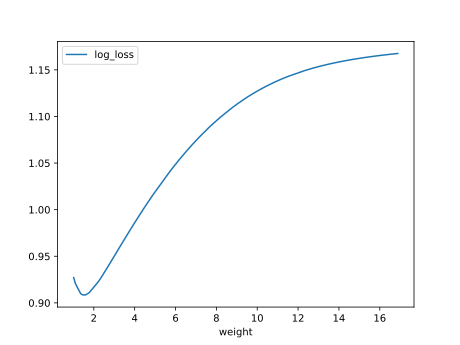

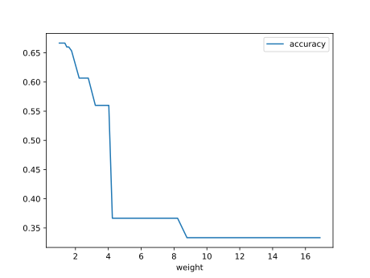

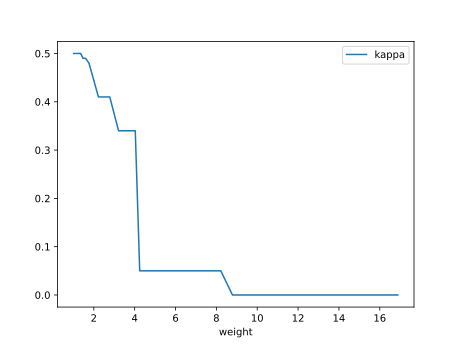

#### Network

