# Report Iris Uniform Distribution [1, 17] run 7

## Best results in hall of fame

| measure       |    value |   individual |
|:--------------|---------:|-------------:|
| mean accuracy | 0.666667 |        17869 |
| max accuracy  | 0.666667 |        17869 |
| mean kappa    | 0.5      |        17869 |
| max kappa     | 0.5      |        17869 |

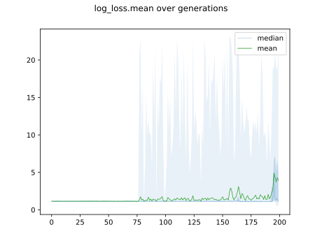

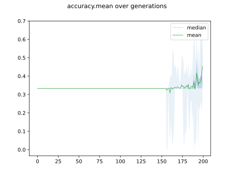

## Individuals in hall of fame

### Individual 17869

| key                    |      value |
|:-----------------------|-----------:|
| mean log_loss:         |   0.5261   |
| mean accuracy:         |   0.666667 |
| mean kappa:            |   0.5      |
| number of edges        |  19        |
| number of hidden nodes |   2        |
| number of layers       |   2        |
| birth                  | 199        |

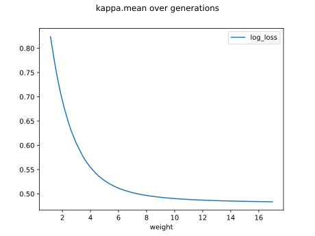

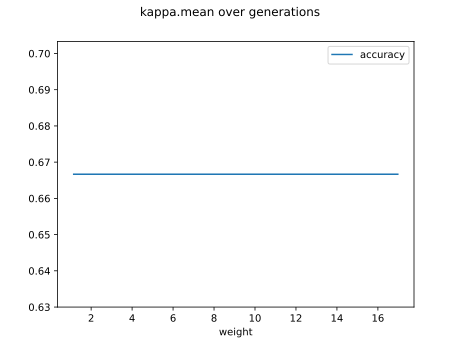

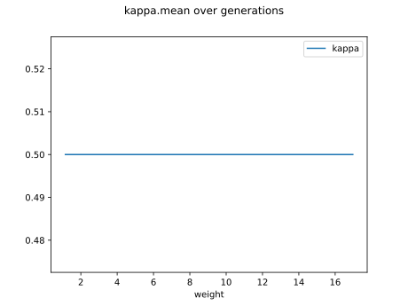

#### Network

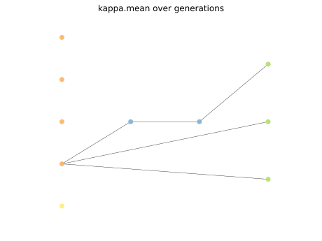

### Individual 17848

| key                    |      value |
|:-----------------------|-----------:|
| mean log_loss:         |   0.529606 |
| mean accuracy:         |   0.666667 |
| mean kappa:            |   0.5      |
| number of edges        |  19        |
| number of hidden nodes |   2        |
| number of layers       |   2        |
| birth                  | 199        |

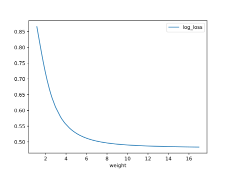

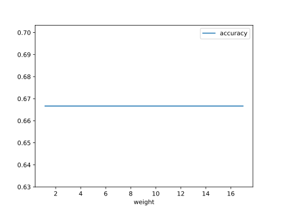

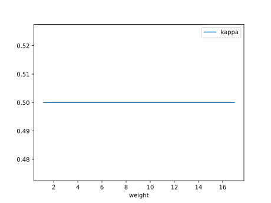

#### Network

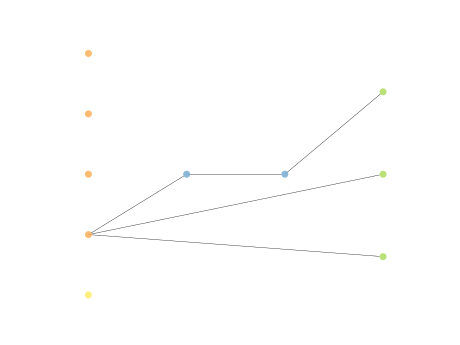

### Individual 17980

| key                    |      value |
|:-----------------------|-----------:|
| mean log_loss:         |   0.5261   |
| mean accuracy:         |   0.666667 |
| mean kappa:            |   0.5      |
| number of edges        |  19        |
| number of hidden nodes |   2        |
| number of layers       |   2        |
| birth                  | 200        |

#### Network

### Individual 17935

| key                    |      value |
|:-----------------------|-----------:|
| mean log_loss:         |   0.5261   |
| mean accuracy:         |   0.666667 |
| mean kappa:            |   0.5      |
| number of edges        |  19        |
| number of hidden nodes |   2        |
| number of layers       |   2        |
| birth                  | 200        |

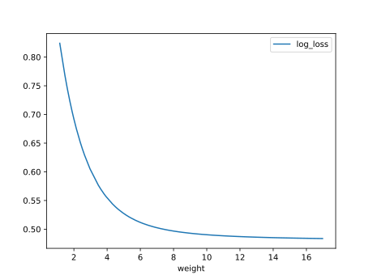

#### Network

### Individual 17769

| key                    |      value |
|:-----------------------|-----------:|
| mean log_loss:         |   0.552737 |
| mean accuracy:         |   0.6666   |
| mean kappa:            |   0.4999   |
| number of edges        |  17        |
| number of hidden nodes |   1        |
| number of layers       |   1        |
| birth                  | 198        |

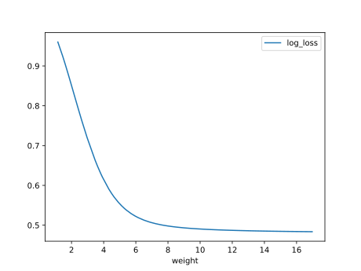

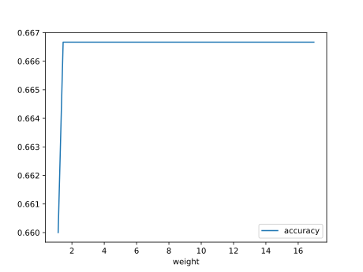

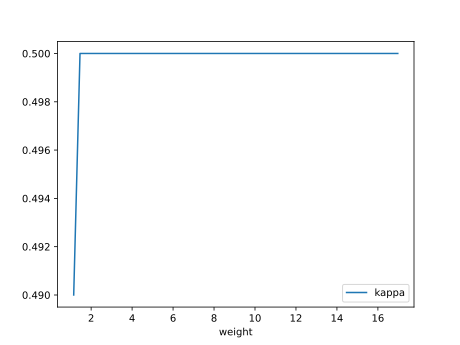

#### Network

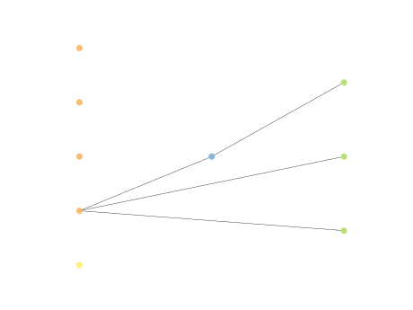

### Individual 17881

| key                    |      value |
|:-----------------------|-----------:|
| mean log_loss:         |   0.525838 |
| mean accuracy:         |   0.6332   |
| mean kappa:            |   0.4498   |
| number of edges        |  18        |
| number of hidden nodes |   1        |
| number of layers       |   1        |
| birth                  | 199        |

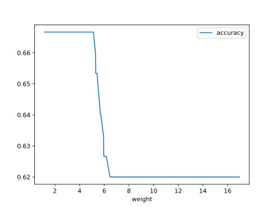

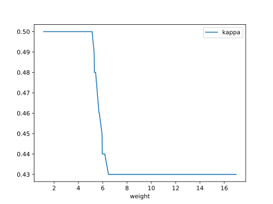

#### Network

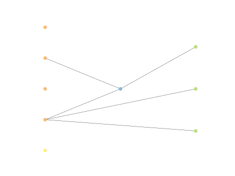

### Individual 17842

| key                    |      value |
|:-----------------------|-----------:|
| mean log_loss:         |   0.525837 |
| mean accuracy:         |   0.6258   |
| mean kappa:            |   0.4387   |
| number of edges        |  18        |
| number of hidden nodes |   1        |
| number of layers       |   1        |
| birth                  | 199        |

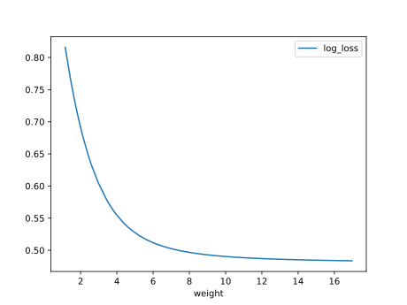

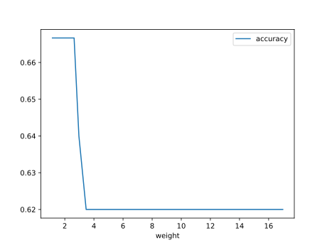

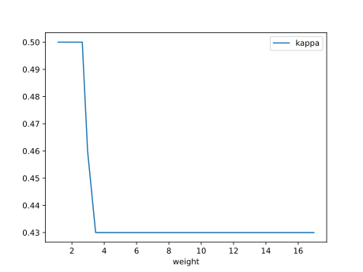

#### Network

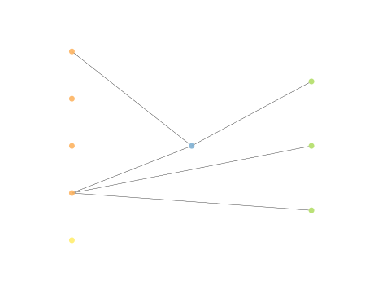

### Individual 17988

| key                    |      value |
|:-----------------------|-----------:|
| mean log_loss:         |   0.525837 |
| mean accuracy:         |   0.625133 |
| mean kappa:            |   0.4377   |
| number of edges        |  19        |
| number of hidden nodes |   1        |
| number of layers       |   1        |
| birth                  | 200        |

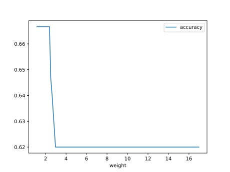

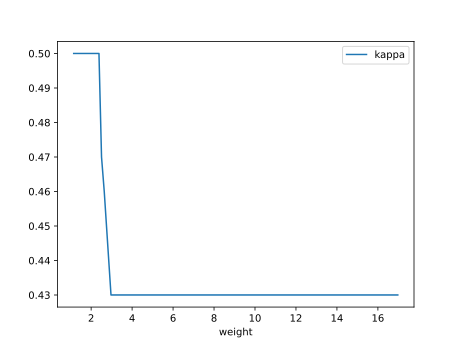

#### Network

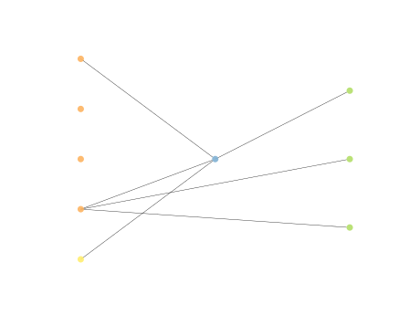

### Individual 17973

| key                    |      value |
|:-----------------------|-----------:|
| mean log_loss:         |   0.525837 |
| mean accuracy:         |   0.624    |
| mean kappa:            |   0.436    |
| number of edges        |  19        |
| number of hidden nodes |   1        |
| number of layers       |   1        |
| birth                  | 200        |

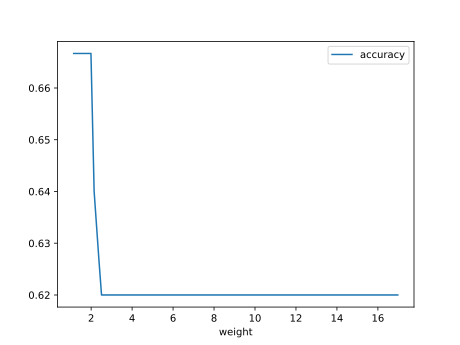

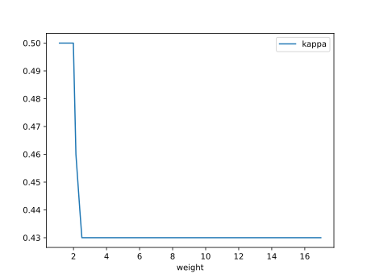

#### Network

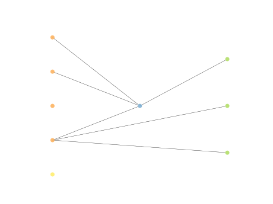

### Individual 17916

| key                    |      value |
|:-----------------------|-----------:|
| mean log_loss:         |   0.525837 |
| mean accuracy:         |   0.622933 |
| mean kappa:            |   0.4344   |
| number of edges        |  19        |
| number of hidden nodes |   1        |
| number of layers       |   1        |
| birth                  | 200        |

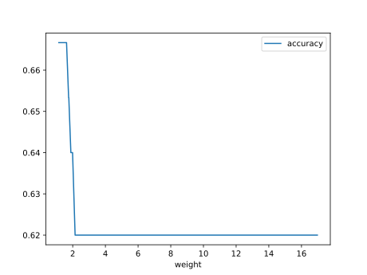

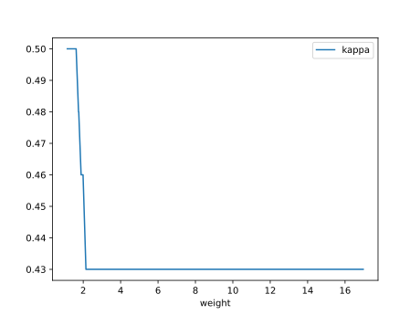

#### Network

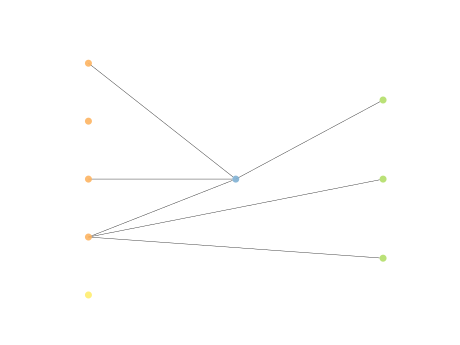

