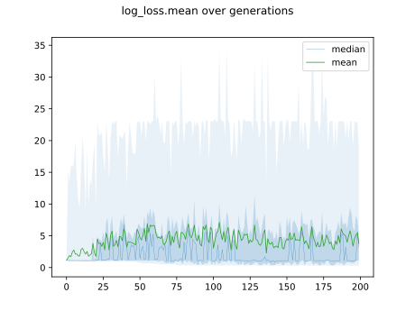

# Report Iris Uniform Distribution [1, 17] run 8

## Best results in hall of fame

| measure       |    value |   individual |
|:--------------|---------:|-------------:|
| mean accuracy | 0.918067 |        15036 |
| max accuracy  | 0.96     |        16217 |
| mean kappa    | 0.8771   |        15036 |
| max kappa     | 0.94     |        16217 |

## Individuals in hall of fame

### Individual 16217

| key                    |      value |
|:-----------------------|-----------:|
| mean log_loss:         |   0.316904 |
| mean accuracy:         |   0.915267 |
| mean kappa:            |   0.8729   |
| number of edges        |  53        |
| number of hidden nodes |  15        |
| number of layers       |  12        |
| birth                  | 181        |

#### Network

### Individual 16251

| key                    |      value |
|:-----------------------|-----------:|
| mean log_loss:         |   0.316904 |
| mean accuracy:         |   0.915267 |
| mean kappa:            |   0.8729   |
| number of edges        |  51        |
| number of hidden nodes |  14        |
| number of layers       |  12        |
| birth                  | 181        |

#### Network

### Individual 16250

| key                    |      value |
|:-----------------------|-----------:|
| mean log_loss:         |   0.317515 |
| mean accuracy:         |   0.913267 |
| mean kappa:            |   0.8699   |
| number of edges        |  52        |
| number of hidden nodes |  14        |
| number of layers       |  13        |
| birth                  | 181        |

#### Network

### Individual 15036

| key                    |      value |
|:-----------------------|-----------:|
| mean log_loss:         |   0.316458 |
| mean accuracy:         |   0.918067 |
| mean kappa:            |   0.8771   |
| number of edges        |  52        |
| number of hidden nodes |  14        |
| number of layers       |  12        |
| birth                  | 168        |

#### Network

### Individual 14404

| key                    |      value |
|:-----------------------|-----------:|
| mean log_loss:         |   0.316904 |
| mean accuracy:         |   0.915267 |
| mean kappa:            |   0.8729   |
| number of edges        |  51        |
| number of hidden nodes |  14        |
| number of layers       |  12        |
| birth                  | 161        |

#### Network

### Individual 13610

| key                    |      value |
|:-----------------------|-----------:|
| mean log_loss:         |   0.316904 |
| mean accuracy:         |   0.915267 |
| mean kappa:            |   0.8729   |
| number of edges        |  50        |
| number of hidden nodes |  14        |
| number of layers       |  12        |
| birth                  | 152        |

#### Network

### Individual 15567

| key                    |      value |
|:-----------------------|-----------:|
| mean log_loss:         |   0.316904 |
| mean accuracy:         |   0.915267 |
| mean kappa:            |   0.8729   |
| number of edges        |  53        |
| number of hidden nodes |  14        |
| number of layers       |  12        |
| birth                  | 173        |

#### Network

### Individual 12426

| key                    |      value |
|:-----------------------|-----------:|
| mean log_loss:         |   0.317806 |
| mean accuracy:         |   0.914933 |
| mean kappa:            |   0.8724   |
| number of edges        |  54        |
| number of hidden nodes |  16        |
| number of layers       |  14        |
| birth                  | 139        |

#### Network

### Individual 17668

| key                    |      value |
|:-----------------------|-----------:|
| mean log_loss:         |   0.316904 |
| mean accuracy:         |   0.915267 |
| mean kappa:            |   0.8729   |
| number of edges        |  52        |
| number of hidden nodes |  14        |
| number of layers       |  12        |
| birth                  | 197        |

#### Network

### Individual 17729

| key                    |      value |
|:-----------------------|-----------:|
| mean log_loss:         |   0.316904 |
| mean accuracy:         |   0.915267 |
| mean kappa:            |   0.8729   |
| number of edges        |  51        |
| number of hidden nodes |  14        |
| number of layers       |  12        |
| birth                  | 197        |

#### Network

