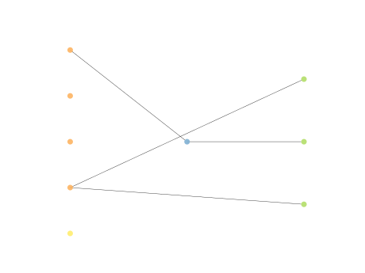

# Report Iris Uniform Distribution [1, 17] run 9

## Best results in hall of fame

| measure       |    value |   individual |
|:--------------|---------:|-------------:|
| mean accuracy | 0.4032   |        16747 |
| max accuracy  | 0.666667 |        16747 |
| mean kappa    | 0.1048   |        16747 |
| max kappa     | 0.5      |        16747 |

## Individuals in hall of fame

### Individual 16747

| key                    |     value |
|:-----------------------|----------:|
| mean log_loss:         |   4.74313 |
| mean accuracy:         |   0.4032  |
| mean kappa:            |   0.1048  |
| number of edges        |  15       |
| number of hidden nodes |   0       |
| number of layers       |   0       |
| birth                  | 187       |

#### Network

### Individual 13427

| key                    |      value |
|:-----------------------|-----------:|
| mean log_loss:         |   1.13566  |
| mean accuracy:         |   0.394667 |
| mean kappa:            |   0.092    |
| number of edges        |  15        |
| number of hidden nodes |   0        |
| number of layers       |   0        |
| birth                  | 150        |

#### Network

### Individual 17147

| key                    |     value |
|:-----------------------|----------:|
| mean log_loss:         |   4.74261 |
| mean accuracy:         |   0.4032  |
| mean kappa:            |   0.1048  |
| number of edges        |  15       |
| number of hidden nodes |   0       |
| number of layers       |   0       |
| birth                  | 191       |

#### Network

### Individual 17378

| key                    |     value |
|:-----------------------|----------:|
| mean log_loss:         |   4.74261 |
| mean accuracy:         |   0.4032  |
| mean kappa:            |   0.1048  |
| number of edges        |  15       |
| number of hidden nodes |   0       |
| number of layers       |   0       |
| birth                  | 194       |

#### Network

### Individual 14057

| key                    |     value |
|:-----------------------|----------:|
| mean log_loss:         |   1.09176 |
| mean accuracy:         |   0.394   |
| mean kappa:            |   0.091   |
| number of edges        |  17       |
| number of hidden nodes |   1       |
| number of layers       |   1       |
| birth                  | 157       |

#### Network

### Individual 16313

| key                    |      value |
|:-----------------------|-----------:|
| mean log_loss:         |   1.09579  |
| mean accuracy:         |   0.394667 |
| mean kappa:            |   0.092    |
| number of edges        |  21        |
| number of hidden nodes |   2        |
| number of layers       |   2        |
| birth                  | 182        |

#### Network

### Individual 16008

| key                    |      value |
|:-----------------------|-----------:|
| mean log_loss:         |   1.09578  |
| mean accuracy:         |   0.394667 |
| mean kappa:            |   0.092    |
| number of edges        |  25        |
| number of hidden nodes |   3        |
| number of layers       |   3        |
| birth                  | 178        |

#### Network

### Individual 15579

| key                    |      value |
|:-----------------------|-----------:|
| mean log_loss:         |   1.09132  |
| mean accuracy:         |   0.394333 |
| mean kappa:            |   0.0915   |
| number of edges        |  17        |
| number of hidden nodes |   1        |
| number of layers       |   1        |
| birth                  | 174        |

#### Network

### Individual 13568

| key                    |      value |
|:-----------------------|-----------:|
| mean log_loss:         |   1.09703  |
| mean accuracy:         |   0.394667 |
| mean kappa:            |   0.092    |
| number of edges        |  17        |
| number of hidden nodes |   1        |
| number of layers       |   1        |
| birth                  | 151        |

#### Network

### Individual 17123

| key                    |      value |
|:-----------------------|-----------:|
| mean log_loss:         |   1.09579  |
| mean accuracy:         |   0.394667 |
| mean kappa:            |   0.092    |
| number of edges        |  25        |
| number of hidden nodes |   4        |
| number of layers       |   4        |
| birth                  | 191        |

#### Network

