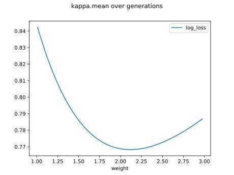

# Report Iris Uniform Distribution [1, 3] run 0

## Best results in hall of fame

| measure       |    value |   individual |
|:--------------|---------:|-------------:|
| mean accuracy | 0.6484   |        15353 |
| max accuracy  | 0.666667 |        15353 |
| mean kappa    | 0.4726   |        15353 |
| max kappa     | 0.5      |        15353 |

## Individuals in hall of fame

### Individual 15353

| key                    |      value |
|:-----------------------|-----------:|
| mean log_loss:         |   0.784093 |
| mean accuracy:         |   0.6484   |
| mean kappa:            |   0.4726   |
| number of edges        |  15        |
| number of hidden nodes |   0        |
| number of layers       |   0        |
| birth                  | 171        |

#### Network

### Individual 15344

| key                    |      value |
|:-----------------------|-----------:|
| mean log_loss:         |   0.784093 |
| mean accuracy:         |   0.6484   |
| mean kappa:            |   0.4726   |
| number of edges        |  15        |
| number of hidden nodes |   0        |
| number of layers       |   0        |
| birth                  | 171        |

#### Network

### Individual 13138

| key                    |      value |
|:-----------------------|-----------:|
| mean log_loss:         |   0.784093 |
| mean accuracy:         |   0.6484   |
| mean kappa:            |   0.4726   |
| number of edges        |  15        |
| number of hidden nodes |   0        |
| number of layers       |   0        |
| birth                  | 146        |

#### Network

### Individual 13102

| key                    |      value |
|:-----------------------|-----------:|
| mean log_loss:         |   0.784093 |
| mean accuracy:         |   0.6484   |
| mean kappa:            |   0.4726   |
| number of edges        |  15        |
| number of hidden nodes |   0        |
| number of layers       |   0        |
| birth                  | 146        |

#### Network

### Individual 13071

| key                    |      value |
|:-----------------------|-----------:|
| mean log_loss:         |   0.784093 |
| mean accuracy:         |   0.6484   |
| mean kappa:            |   0.4726   |
| number of edges        |  15        |
| number of hidden nodes |   0        |
| number of layers       |   0        |
| birth                  | 146        |

#### Network

### Individual 15639

| key                    |      value |
|:-----------------------|-----------:|
| mean log_loss:         |   0.784093 |
| mean accuracy:         |   0.6484   |
| mean kappa:            |   0.4726   |
| number of edges        |  15        |
| number of hidden nodes |   0        |
| number of layers       |   0        |
| birth                  | 174        |

#### Network

### Individual 15586

| key                    |      value |
|:-----------------------|-----------:|
| mean log_loss:         |   0.784093 |
| mean accuracy:         |   0.6484   |
| mean kappa:            |   0.4726   |
| number of edges        |  15        |
| number of hidden nodes |   0        |
| number of layers       |   0        |
| birth                  | 174        |

#### Network

### Individual 9582

| key                    |      value |
|:-----------------------|-----------:|
| mean log_loss:         |   0.784093 |
| mean accuracy:         |   0.6484   |
| mean kappa:            |   0.4726   |
| number of edges        |  15        |
| number of hidden nodes |   0        |
| number of layers       |   0        |
| birth                  | 107        |

#### Network

### Individual 16554

| key                    |      value |
|:-----------------------|-----------:|
| mean log_loss:         |   0.784093 |
| mean accuracy:         |   0.6484   |
| mean kappa:            |   0.4726   |
| number of edges        |  15        |
| number of hidden nodes |   0        |
| number of layers       |   0        |
| birth                  | 184        |

#### Network

### Individual 8743

| key                    |    value |
|:-----------------------|---------:|
| mean log_loss:         |  1.13582 |
| mean accuracy:         |  0.6484  |
| mean kappa:            |  0.4726  |
| number of edges        | 15       |
| number of hidden nodes |  0       |
| number of layers       |  0       |
| birth                  | 98       |

#### Network

