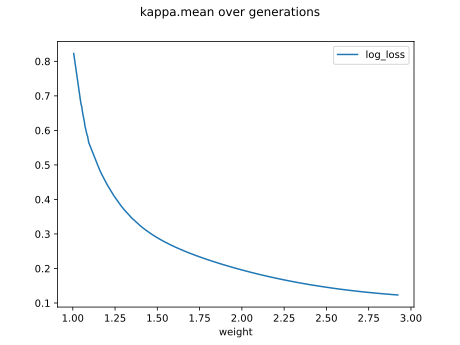

# Report Iris Uniform Distribution [1, 3] run 1

## Best results in hall of fame

| measure       |    value |   individual |
|:--------------|---------:|-------------:|
| mean accuracy | 0.944933 |        17930 |
| max accuracy  | 0.96     |        17909 |
| mean kappa    | 0.9174   |        17930 |
| max kappa     | 0.94     |        17909 |

## Individuals in hall of fame

### Individual 17909

| key                    |      value |
|:-----------------------|-----------:|
| mean log_loss:         |   0.262599 |
| mean accuracy:         |   0.933667 |
| mean kappa:            |   0.9005   |
| number of edges        |  72        |
| number of hidden nodes |  23        |
| number of layers       |  15        |
| birth                  | 199        |

#### Network

### Individual 16848

| key                    |      value |
|:-----------------------|-----------:|
| mean log_loss:         |   0.27105  |
| mean accuracy:         |   0.927533 |
| mean kappa:            |   0.8913   |
| number of edges        |  64        |
| number of hidden nodes |  19        |
| number of layers       |  13        |
| birth                  | 188        |

#### Network

### Individual 17930

| key                    |      value |
|:-----------------------|-----------:|
| mean log_loss:         |   0.246214 |
| mean accuracy:         |   0.944933 |
| mean kappa:            |   0.9174   |
| number of edges        |  70        |
| number of hidden nodes |  22        |
| number of layers       |  15        |
| birth                  | 200        |

#### Network

### Individual 17039

| key                    |      value |
|:-----------------------|-----------:|
| mean log_loss:         |   0.274952 |
| mean accuracy:         |   0.925467 |
| mean kappa:            |   0.8882   |
| number of edges        |  66        |
| number of hidden nodes |  20        |
| number of layers       |  13        |
| birth                  | 190        |

#### Network

### Individual 17677

| key                    |      value |
|:-----------------------|-----------:|
| mean log_loss:         |   0.260632 |
| mean accuracy:         |   0.9338   |
| mean kappa:            |   0.9007   |
| number of edges        |  70        |
| number of hidden nodes |  22        |
| number of layers       |  15        |
| birth                  | 197        |

#### Network

### Individual 16829

| key                    |      value |
|:-----------------------|-----------:|
| mean log_loss:         |   0.295457 |
| mean accuracy:         |   0.9142   |
| mean kappa:            |   0.8713   |
| number of edges        |  64        |
| number of hidden nodes |  19        |
| number of layers       |  13        |
| birth                  | 187        |

#### Network

### Individual 17225

| key                    |      value |
|:-----------------------|-----------:|
| mean log_loss:         |   0.274952 |
| mean accuracy:         |   0.925467 |
| mean kappa:            |   0.8882   |
| number of edges        |  66        |
| number of hidden nodes |  20        |
| number of layers       |  13        |
| birth                  | 192        |

#### Network

### Individual 17853

| key                    |      value |
|:-----------------------|-----------:|
| mean log_loss:         |   0.251739 |
| mean accuracy:         |   0.916867 |
| mean kappa:            |   0.8753   |
| number of edges        |  70        |
| number of hidden nodes |  22        |
| number of layers       |  15        |
| birth                  | 199        |

#### Network

### Individual 17621

| key                    |      value |
|:-----------------------|-----------:|
| mean log_loss:         |   0.261497 |
| mean accuracy:         |   0.91     |
| mean kappa:            |   0.865    |
| number of edges        |  71        |
| number of hidden nodes |  22        |
| number of layers       |  15        |
| birth                  | 196        |

#### Network

### Individual 16550

| key                    |      value |
|:-----------------------|-----------:|
| mean log_loss:         |   0.300152 |
| mean accuracy:         |   0.886733 |
| mean kappa:            |   0.8301   |
| number of edges        |  64        |
| number of hidden nodes |  19        |
| number of layers       |  13        |
| birth                  | 184        |

#### Network

