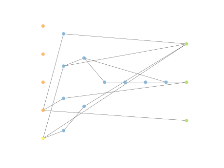

# Report Iris Uniform Distribution [1, 3] run 2

## Best results in hall of fame

| measure       |   value |   individual |
|:--------------|--------:|-------------:|
| mean accuracy |    0.96 |        16757 |
| max accuracy  |    0.96 |        16757 |
| mean kappa    |    0.94 |        16757 |
| max kappa     |    0.94 |        16757 |

## Individuals in hall of fame

### Individual 16757

| key                    |      value |
|:-----------------------|-----------:|
| mean log_loss:         |   0.376982 |
| mean accuracy:         |   0.96     |
| mean kappa:            |   0.94     |
| number of edges        |  40        |
| number of hidden nodes |  12        |
| number of layers       |   6        |
| birth                  | 187        |

#### Network

### Individual 16533

| key                    |    value |
|:-----------------------|---------:|
| mean log_loss:         |   0.3764 |
| mean accuracy:         |   0.9584 |
| mean kappa:            |   0.9376 |
| number of edges        |  41      |
| number of hidden nodes |  12      |
| number of layers       |   6      |
| birth                  | 184      |

#### Network

### Individual 16739

| key                    |      value |
|:-----------------------|-----------:|
| mean log_loss:         |   0.376966 |
| mean accuracy:         |   0.9584   |
| mean kappa:            |   0.9376   |
| number of edges        |  43        |
| number of hidden nodes |  13        |
| number of layers       |   6        |
| birth                  | 186        |

#### Network

### Individual 16623

| key                    |      value |
|:-----------------------|-----------:|
| mean log_loss:         |   0.377018 |
| mean accuracy:         |   0.9584   |
| mean kappa:            |   0.9376   |
| number of edges        |  43        |
| number of hidden nodes |  13        |
| number of layers       |   6        |
| birth                  | 185        |

#### Network

### Individual 16231

| key                    |      value |
|:-----------------------|-----------:|
| mean log_loss:         |   0.376792 |
| mean accuracy:         |   0.9572   |
| mean kappa:            |   0.9358   |
| number of edges        |  36        |
| number of hidden nodes |  10        |
| number of layers       |   6        |
| birth                  | 181        |

#### Network

### Individual 15788

| key                    |      value |
|:-----------------------|-----------:|
| mean log_loss:         |   0.376578 |
| mean accuracy:         |   0.9532   |
| mean kappa:            |   0.9298   |
| number of edges        |  36        |
| number of hidden nodes |  10        |
| number of layers       |   5        |
| birth                  | 176        |

#### Network

### Individual 15862

| key                    |      value |
|:-----------------------|-----------:|
| mean log_loss:         |   0.376578 |
| mean accuracy:         |   0.9532   |
| mean kappa:            |   0.9298   |
| number of edges        |  38        |
| number of hidden nodes |  11        |
| number of layers       |   5        |
| birth                  | 177        |

#### Network

### Individual 15092

| key                    |     value |
|:-----------------------|----------:|
| mean log_loss:         |   0.39568 |
| mean accuracy:         |   0.9534  |
| mean kappa:            |   0.9301  |
| number of edges        |  29       |
| number of hidden nodes |   6       |
| number of layers       |   4       |
| birth                  | 168       |

#### Network

### Individual 14827

| key                    |      value |
|:-----------------------|-----------:|
| mean log_loss:         |   0.386936 |
| mean accuracy:         |   0.950667 |
| mean kappa:            |   0.926    |
| number of edges        |  27        |
| number of hidden nodes |   6        |
| number of layers       |   2        |
| birth                  | 165        |

#### Network

### Individual 14840

| key                    |      value |
|:-----------------------|-----------:|
| mean log_loss:         |   0.386936 |
| mean accuracy:         |   0.950667 |
| mean kappa:            |   0.926    |
| number of edges        |  27        |
| number of hidden nodes |   6        |
| number of layers       |   2        |
| birth                  | 165        |

#### Network

