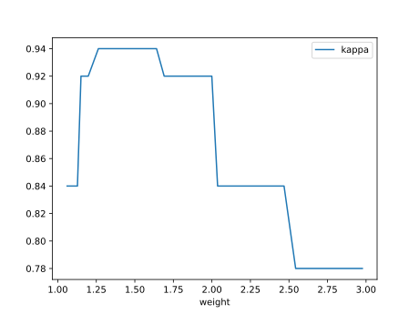
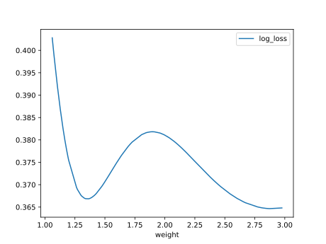
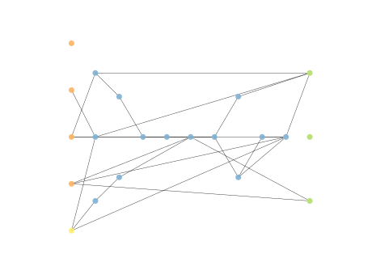
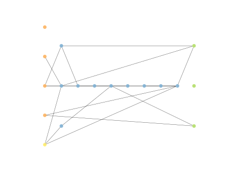
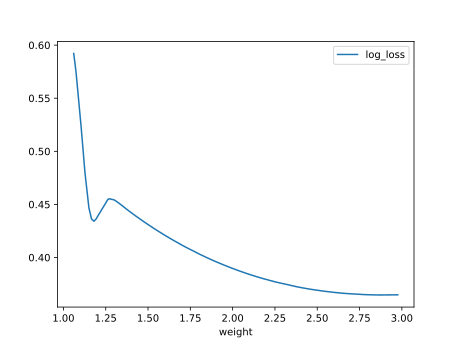

# Report Iris Uniform Distribution [1, 3] run 3

## Best results in hall of fame

| measure       |   value |   individual |
|:--------------|--------:|-------------:|
| mean accuracy |  0.9244 |        17138 |
| max accuracy  |  0.96   |        17138 |
| mean kappa    |  0.8866 |        17138 |
| max kappa     |  0.94   |        17138 |

## Individuals in hall of fame

### Individual 17138

| key                    |      value |
|:-----------------------|-----------:|
| mean log_loss:         |   0.393488 |
| mean accuracy:         |   0.9244   |
| mean kappa:            |   0.8866   |
| number of edges        |  47        |
| number of hidden nodes |  12        |
| number of layers       |   8        |
| birth                  | 191        |

#### Network

### Individual 17086

| key                    |      value |
|:-----------------------|-----------:|
| mean log_loss:         |   0.393553 |
| mean accuracy:         |   0.9244   |
| mean kappa:            |   0.8866   |
| number of edges        |  45        |
| number of hidden nodes |  11        |
| number of layers       |   8        |
| birth                  | 190        |

#### Network

### Individual 16764

| key                    |      value |
|:-----------------------|-----------:|
| mean log_loss:         |   0.407294 |
| mean accuracy:         |   0.916133 |
| mean kappa:            |   0.8742   |
| number of edges        |  42        |
| number of hidden nodes |  10        |
| number of layers       |   8        |
| birth                  | 187        |

#### Network

### Individual 16824

| key                    |      value |
|:-----------------------|-----------:|
| mean log_loss:         |   0.411843 |
| mean accuracy:         |   0.9118   |
| mean kappa:            |   0.8677   |
| number of edges        |  45        |
| number of hidden nodes |  11        |
| number of layers       |   8        |
| birth                  | 187        |

#### Network

### Individual 17247

| key                    |      value |
|:-----------------------|-----------:|
| mean log_loss:         |   0.374655 |
| mean accuracy:         |   0.908933 |
| mean kappa:            |   0.8634   |
| number of edges        |  49        |
| number of hidden nodes |  13        |
| number of layers       |   9        |
| birth                  | 192        |

#### Network

### Individual 16604

| key                    |      value |
|:-----------------------|-----------:|
| mean log_loss:         |   0.406975 |
| mean accuracy:         |   0.916133 |
| mean kappa:            |   0.8742   |
| number of edges        |  41        |
| number of hidden nodes |  10        |
| number of layers       |   8        |
| birth                  | 185        |

#### Network

### Individual 17112

| key                    |      value |
|:-----------------------|-----------:|
| mean log_loss:         |   0.374692 |
| mean accuracy:         |   0.908933 |
| mean kappa:            |   0.8634   |
| number of edges        |  47        |
| number of hidden nodes |  12        |
| number of layers       |   9        |
| birth                  | 191        |

#### Network

### Individual 16024

| key                    |      value |
|:-----------------------|-----------:|
| mean log_loss:         |   0.407904 |
| mean accuracy:         |   0.916133 |
| mean kappa:            |   0.8742   |
| number of edges        |  41        |
| number of hidden nodes |  10        |
| number of layers       |   8        |
| birth                  | 179        |

#### Network

### Individual 16731

| key                    |      value |
|:-----------------------|-----------:|
| mean log_loss:         |   0.412109 |
| mean accuracy:         |   0.910733 |
| mean kappa:            |   0.8661   |
| number of edges        |  45        |
| number of hidden nodes |  11        |
| number of layers       |   8        |
| birth                  | 186        |

#### Network

### Individual 16562

| key                    |      value |
|:-----------------------|-----------:|
| mean log_loss:         |   0.41226  |
| mean accuracy:         |   0.910733 |
| mean kappa:            |   0.8661   |
| number of edges        |  45        |
| number of hidden nodes |  11        |
| number of layers       |   8        |
| birth                  | 185        |

#### Network

