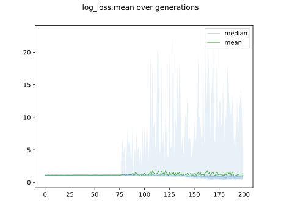
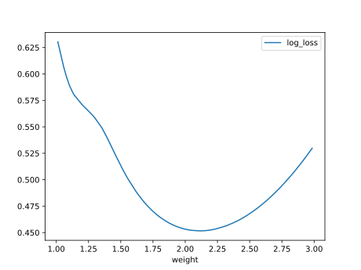

# Report Iris Uniform Distribution [1, 3] run 4

## Best results in hall of fame

| measure       |   value |   individual |
|:--------------|--------:|-------------:|
| mean accuracy |  0.8868 |        14078 |
| max accuracy  |  0.98   |        14070 |
| mean kappa    |  0.8302 |        14078 |
| max kappa     |  0.97   |        14070 |

## Individuals in hall of fame

### Individual 14078

| key                    |     value |
|:-----------------------|----------:|
| mean log_loss:         |   0.50867 |
| mean accuracy:         |   0.8868  |
| mean kappa:            |   0.8302  |
| number of edges        |  37       |
| number of hidden nodes |   8       |
| number of layers       |   4       |
| birth                  | 157       |

#### Network

### Individual 14319

| key                    |     value |
|:-----------------------|----------:|
| mean log_loss:         |   0.50867 |
| mean accuracy:         |   0.8868  |
| mean kappa:            |   0.8302  |
| number of edges        |  37       |
| number of hidden nodes |   8       |
| number of layers       |   4       |
| birth                  | 160       |

#### Network

### Individual 14096

| key                    |     value |
|:-----------------------|----------:|
| mean log_loss:         |   0.50867 |
| mean accuracy:         |   0.8868  |
| mean kappa:            |   0.8302  |
| number of edges        |  37       |
| number of hidden nodes |   8       |
| number of layers       |   4       |
| birth                  | 157       |

#### Network

### Individual 14009

| key                    |      value |
|:-----------------------|-----------:|
| mean log_loss:         |   0.50045  |
| mean accuracy:         |   0.867867 |
| mean kappa:            |   0.8018   |
| number of edges        |  36        |
| number of hidden nodes |   7        |
| number of layers       |   3        |
| birth                  | 156        |

#### Network

### Individual 14300

| key                    |      value |
|:-----------------------|-----------:|
| mean log_loss:         |   0.500418 |
| mean accuracy:         |   0.869867 |
| mean kappa:            |   0.8048   |
| number of edges        |  38        |
| number of hidden nodes |   8        |
| number of layers       |   4        |
| birth                  | 159        |

#### Network

### Individual 14070

| key                    |      value |
|:-----------------------|-----------:|
| mean log_loss:         |   0.502089 |
| mean accuracy:         |   0.878333 |
| mean kappa:            |   0.8175   |
| number of edges        |  38        |
| number of hidden nodes |   8        |
| number of layers       |   4        |
| birth                  | 157        |

#### Network

### Individual 13792

| key                    |      value |
|:-----------------------|-----------:|
| mean log_loss:         |   0.500458 |
| mean accuracy:         |   0.867867 |
| mean kappa:            |   0.8018   |
| number of edges        |  35        |
| number of hidden nodes |   7        |
| number of layers       |   3        |
| birth                  | 154        |

#### Network

### Individual 13997

| key                    |      value |
|:-----------------------|-----------:|
| mean log_loss:         |   0.500566 |
| mean accuracy:         |   0.865267 |
| mean kappa:            |   0.7979   |
| number of edges        |  37        |
| number of hidden nodes |   8        |
| number of layers       |   4        |
| birth                  | 156        |

#### Network

### Individual 13945

| key                    |      value |
|:-----------------------|-----------:|
| mean log_loss:         |   0.501093 |
| mean accuracy:         |   0.8684   |
| mean kappa:            |   0.8026   |
| number of edges        |  35        |
| number of hidden nodes |   7        |
| number of layers       |   3        |
| birth                  | 155        |

#### Network

### Individual 13881

| key                    |      value |
|:-----------------------|-----------:|
| mean log_loss:         |   0.500499 |
| mean accuracy:         |   0.8678   |
| mean kappa:            |   0.8017   |
| number of edges        |  35        |
| number of hidden nodes |   7        |
| number of layers       |   3        |
| birth                  | 155        |

#### Network

