# Report Iris Uniform Distribution [1, 3] run 5

## Best results in hall of fame

| measure       |    value |   individual |
|:--------------|---------:|-------------:|
| mean accuracy | 0.644733 |        17188 |
| max accuracy  | 0.666667 |        17188 |
| mean kappa    | 0.4671   |        17188 |
| max kappa     | 0.5      |        17188 |

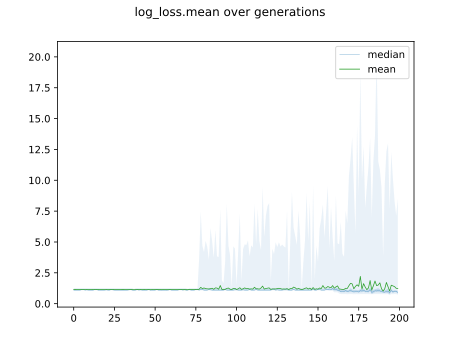

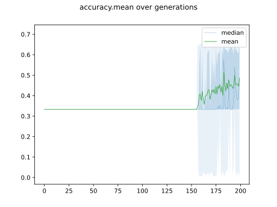

## Individuals in hall of fame

### Individual 17188

| key                    |      value |
|:-----------------------|-----------:|
| mean log_loss:         |   0.937603 |
| mean accuracy:         |   0.644733 |
| mean kappa:            |   0.4671   |
| number of edges        |  26        |
| number of hidden nodes |   5        |
| number of layers       |   3        |
| birth                  | 191        |

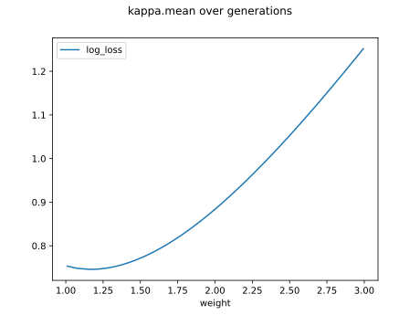

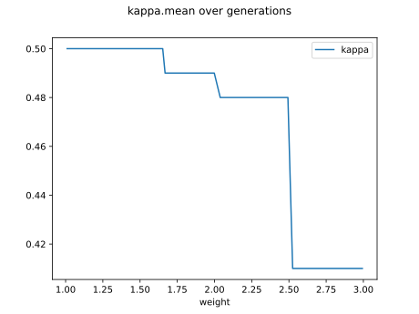

#### Network

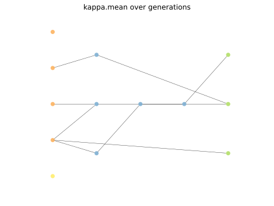

### Individual 16154

| key                    |      value |
|:-----------------------|-----------:|
| mean log_loss:         |   0.909356 |
| mean accuracy:         |   0.644733 |
| mean kappa:            |   0.4671   |
| number of edges        |  28        |
| number of hidden nodes |   5        |
| number of layers       |   3        |
| birth                  | 180        |

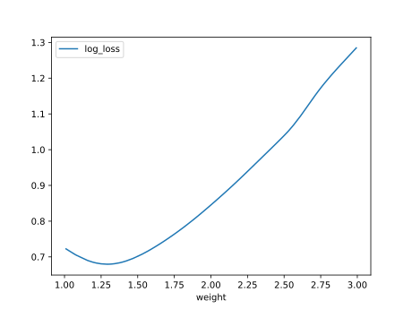

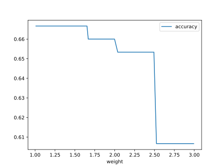

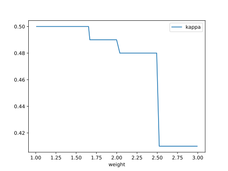

#### Network

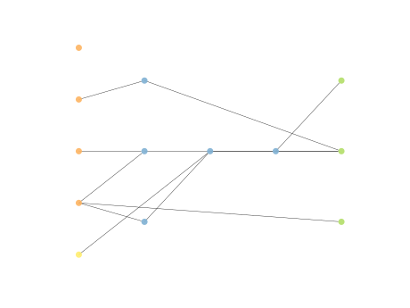

### Individual 14426

| key                    |      value |
|:-----------------------|-----------:|
| mean log_loss:         |   1.15491  |
| mean accuracy:         |   0.644733 |
| mean kappa:            |   0.4671   |
| number of edges        |  15        |
| number of hidden nodes |   0        |
| number of layers       |   0        |
| birth                  | 161        |

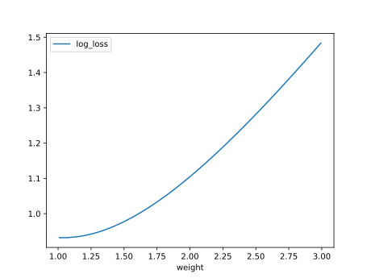

#### Network

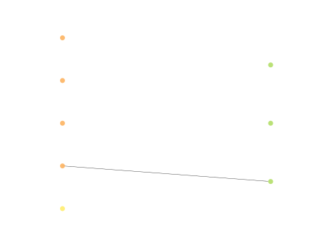

### Individual 14427

| key                    |      value |
|:-----------------------|-----------:|
| mean log_loss:         |   1.15491  |
| mean accuracy:         |   0.644733 |
| mean kappa:            |   0.4671   |
| number of edges        |  15        |
| number of hidden nodes |   0        |
| number of layers       |   0        |
| birth                  | 161        |

#### Network

### Individual 17219

| key                    |      value |
|:-----------------------|-----------:|
| mean log_loss:         |   0.937603 |
| mean accuracy:         |   0.644733 |
| mean kappa:            |   0.4671   |
| number of edges        |  26        |
| number of hidden nodes |   5        |
| number of layers       |   3        |
| birth                  | 192        |

#### Network

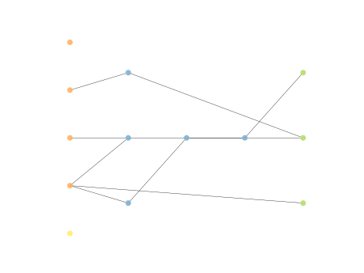

### Individual 14477

| key                    |      value |
|:-----------------------|-----------:|
| mean log_loss:         |   1.07272  |
| mean accuracy:         |   0.644733 |
| mean kappa:            |   0.4671   |
| number of edges        |  15        |
| number of hidden nodes |   0        |
| number of layers       |   0        |
| birth                  | 161        |

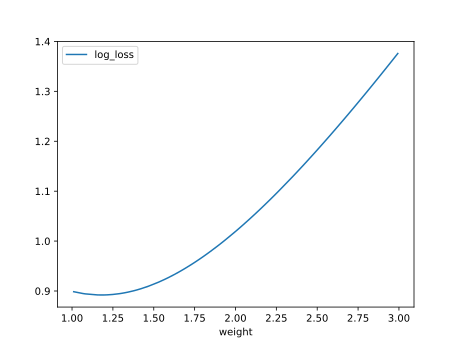

#### Network

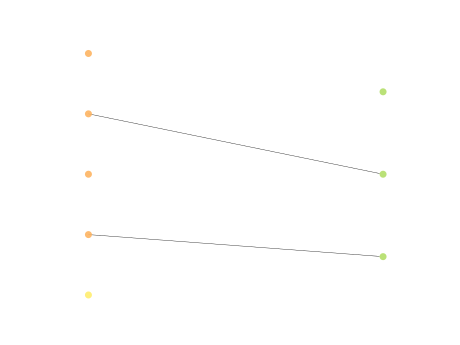

### Individual 14388

| key                    |      value |
|:-----------------------|-----------:|
| mean log_loss:         |   1.07099  |
| mean accuracy:         |   0.644733 |
| mean kappa:            |   0.4671   |
| number of edges        |  15        |
| number of hidden nodes |   0        |
| number of layers       |   0        |
| birth                  | 160        |

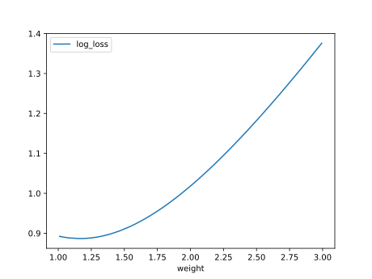

#### Network

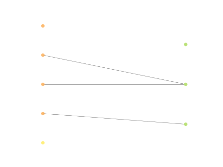

### Individual 14309

| key                    |      value |
|:-----------------------|-----------:|
| mean log_loss:         |   1.07099  |
| mean accuracy:         |   0.644733 |
| mean kappa:            |   0.4671   |
| number of edges        |  15        |
| number of hidden nodes |   0        |
| number of layers       |   0        |
| birth                  | 159        |

#### Network

### Individual 14243

| key                    |      value |
|:-----------------------|-----------:|
| mean log_loss:         |   1.07099  |
| mean accuracy:         |   0.644733 |
| mean kappa:            |   0.4671   |
| number of edges        |  17        |
| number of hidden nodes |   1        |
| number of layers       |   1        |
| birth                  | 159        |

#### Network

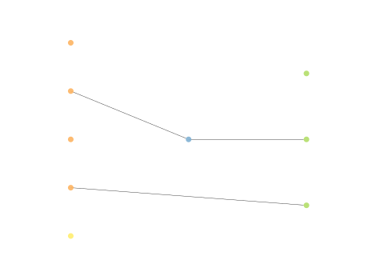

### Individual 14266

| key                    |      value |
|:-----------------------|-----------:|
| mean log_loss:         |   1.15491  |
| mean accuracy:         |   0.644733 |
| mean kappa:            |   0.4671   |
| number of edges        |  15        |
| number of hidden nodes |   0        |
| number of layers       |   0        |
| birth                  | 159        |

#### Network

