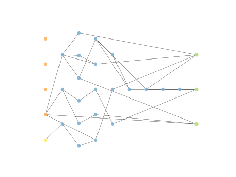
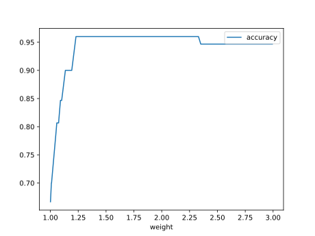
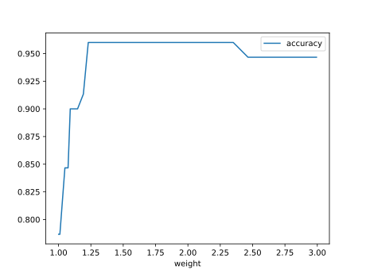

# Report Iris Uniform Distribution [1, 3] run 6

## Best results in hall of fame

| measure       |   value |   individual |
|:--------------|--------:|-------------:|
| mean accuracy |  0.9494 |        16092 |
| max accuracy  |  0.96   |        16092 |
| mean kappa    |  0.9241 |        16092 |
| max kappa     |  0.94   |        16092 |

## Individuals in hall of fame

### Individual 16092

| key                    |      value |
|:-----------------------|-----------:|
| mean log_loss:         |   0.204502 |
| mean accuracy:         |   0.9494   |
| mean kappa:            |   0.9241   |
| number of edges        |  63        |
| number of hidden nodes |  21        |
| number of layers       |   9        |
| birth                  | 179        |

#### Network

### Individual 14289

| key                    |      value |
|:-----------------------|-----------:|
| mean log_loss:         |   0.264853 |
| mean accuracy:         |   0.942267 |
| mean kappa:            |   0.9134   |
| number of edges        |  47        |
| number of hidden nodes |  15        |
| number of layers       |   7        |
| birth                  | 159        |

#### Network

### Individual 16000

| key                    |      value |
|:-----------------------|-----------:|
| mean log_loss:         |   0.209646 |
| mean accuracy:         |   0.943267 |
| mean kappa:            |   0.9149   |
| number of edges        |  63        |
| number of hidden nodes |  21        |
| number of layers       |   9        |
| birth                  | 178        |

#### Network

### Individual 16021

| key                    |      value |
|:-----------------------|-----------:|
| mean log_loss:         |   0.209376 |
| mean accuracy:         |   0.9432   |
| mean kappa:            |   0.9148   |
| number of edges        |  64        |
| number of hidden nodes |  21        |
| number of layers       |   9        |
| birth                  | 179        |

#### Network

### Individual 16268

| key                    |      value |
|:-----------------------|-----------:|
| mean log_loss:         |   0.211452 |
| mean accuracy:         |   0.939    |
| mean kappa:            |   0.9085   |
| number of edges        |  66        |
| number of hidden nodes |  22        |
| number of layers       |   9        |
| birth                  | 181        |

#### Network

### Individual 16507

| key                    |      value |
|:-----------------------|-----------:|
| mean log_loss:         |   0.200645 |
| mean accuracy:         |   0.945467 |
| mean kappa:            |   0.9182   |
| number of edges        |  65        |
| number of hidden nodes |  21        |
| number of layers       |   9        |
| birth                  | 184        |

#### Network

### Individual 15774

| key                    |      value |
|:-----------------------|-----------:|
| mean log_loss:         |   0.224028 |
| mean accuracy:         |   0.9422   |
| mean kappa:            |   0.9133   |
| number of edges        |  61        |
| number of hidden nodes |  21        |
| number of layers       |   8        |
| birth                  | 176        |

#### Network

### Individual 13638

| key                    |      value |
|:-----------------------|-----------:|
| mean log_loss:         |   0.278106 |
| mean accuracy:         |   0.941733 |
| mean kappa:            |   0.9126   |
| number of edges        |  44        |
| number of hidden nodes |  13        |
| number of layers       |   7        |
| birth                  | 152        |

#### Network

### Individual 17638

| key                    |      value |
|:-----------------------|-----------:|
| mean log_loss:         |   0.204286 |
| mean accuracy:         |   0.938667 |
| mean kappa:            |   0.908    |
| number of edges        |  71        |
| number of hidden nodes |  22        |
| number of layers       |   9        |
| birth                  | 196        |

#### Network

### Individual 17932

| key                    |      value |
|:-----------------------|-----------:|
| mean log_loss:         |   0.202094 |
| mean accuracy:         |   0.944333 |
| mean kappa:            |   0.9165   |
| number of edges        |  74        |
| number of hidden nodes |  23        |
| number of layers       |   9        |
| birth                  | 200        |

#### Network

