# Report Iris Uniform Distribution [1, 3] run 7

## Best results in hall of fame

| measure       |    value |   individual |
|:--------------|---------:|-------------:|
| mean accuracy | 0.826733 |        17274 |
| max accuracy  | 0.96     |        17967 |
| mean kappa    | 0.7401   |        17274 |
| max kappa     | 0.94     |        17967 |

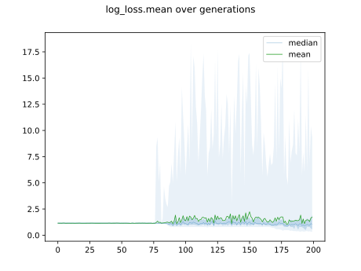

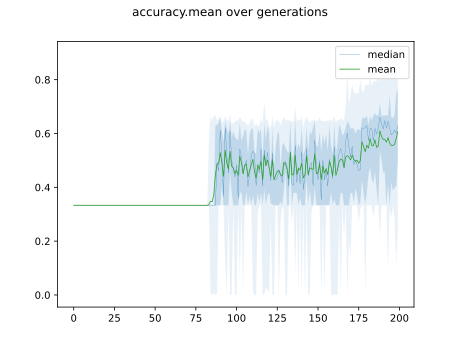

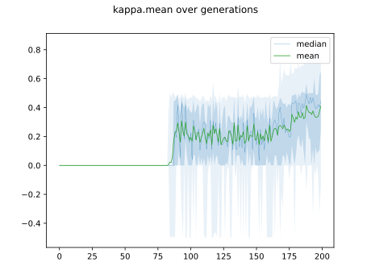

## Individuals in hall of fame

### Individual 17967

| key                    |      value |
|:-----------------------|-----------:|
| mean log_loss:         |   0.348258 |
| mean accuracy:         |   0.817933 |
| mean kappa:            |   0.7269   |
| number of edges        |  43        |
| number of hidden nodes |  12        |
| number of layers       |   5        |
| birth                  | 200        |

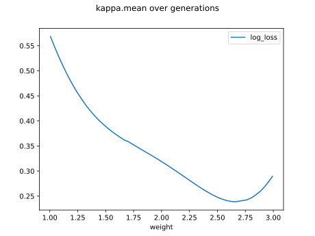

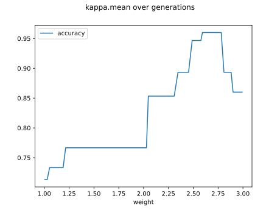

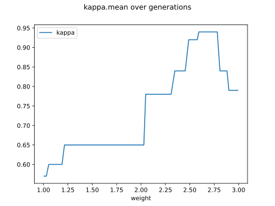

#### Network

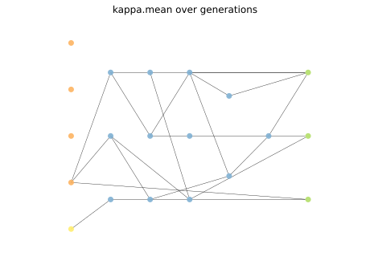

### Individual 17886

| key                    |      value |
|:-----------------------|-----------:|
| mean log_loss:         |   0.362244 |
| mean accuracy:         |   0.8086   |
| mean kappa:            |   0.7129   |
| number of edges        |  41        |
| number of hidden nodes |  11        |
| number of layers       |   5        |
| birth                  | 199        |

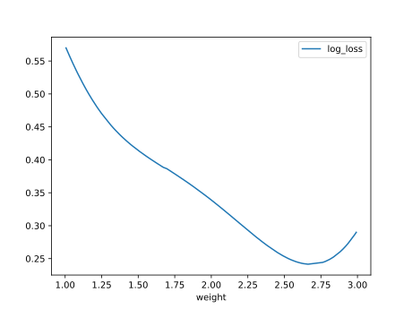

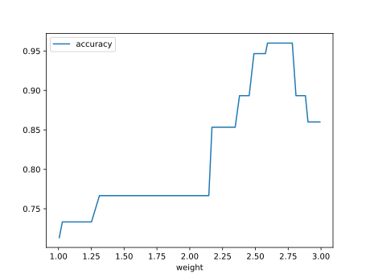

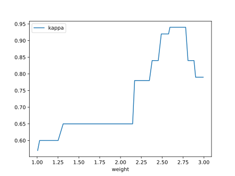

#### Network

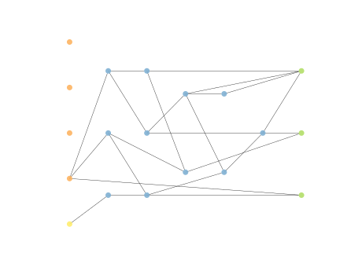

### Individual 17900

| key                    |      value |
|:-----------------------|-----------:|
| mean log_loss:         |   0.381922 |
| mean accuracy:         |   0.8086   |
| mean kappa:            |   0.7129   |
| number of edges        |  40        |
| number of hidden nodes |  11        |
| number of layers       |   4        |
| birth                  | 199        |

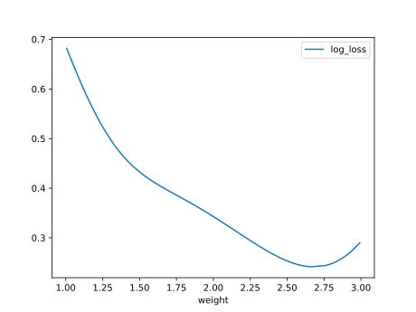

#### Network

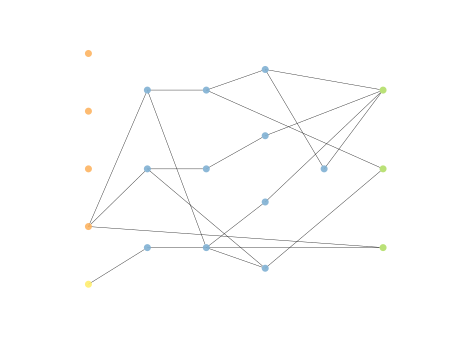

### Individual 17799

| key                    |      value |
|:-----------------------|-----------:|
| mean log_loss:         |   0.390768 |
| mean accuracy:         |   0.8086   |
| mean kappa:            |   0.7129   |
| number of edges        |  40        |
| number of hidden nodes |  11        |
| number of layers       |   4        |
| birth                  | 198        |

#### Network

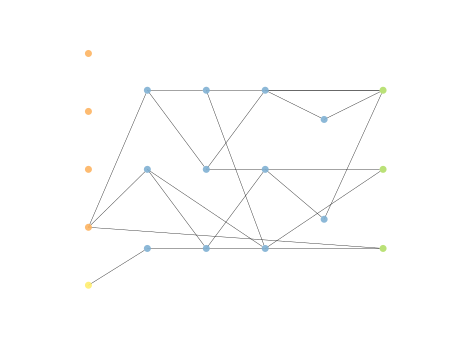

### Individual 17274

| key                    |      value |
|:-----------------------|-----------:|
| mean log_loss:         |   0.474494 |
| mean accuracy:         |   0.826733 |
| mean kappa:            |   0.7401   |
| number of edges        |  37        |
| number of hidden nodes |  10        |
| number of layers       |   4        |
| birth                  | 192        |

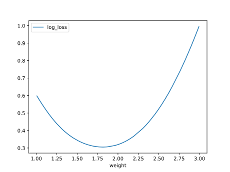

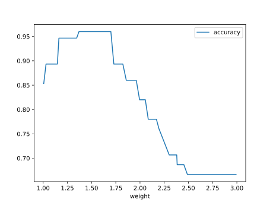

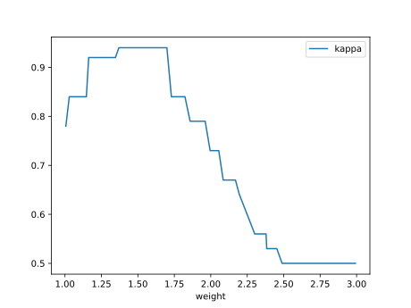

#### Network

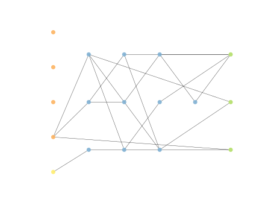

### Individual 17832

| key                    |      value |
|:-----------------------|-----------:|
| mean log_loss:         |   0.371161 |
| mean accuracy:         |   0.8014   |
| mean kappa:            |   0.7021   |
| number of edges        |  41        |
| number of hidden nodes |  11        |
| number of layers       |   4        |
| birth                  | 199        |

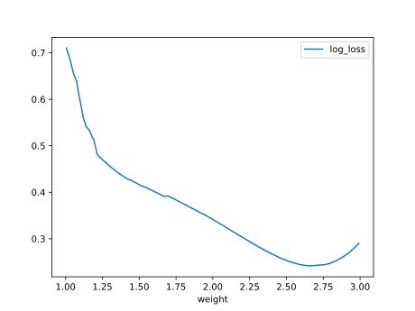

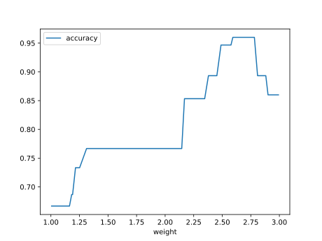

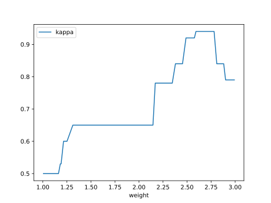

#### Network

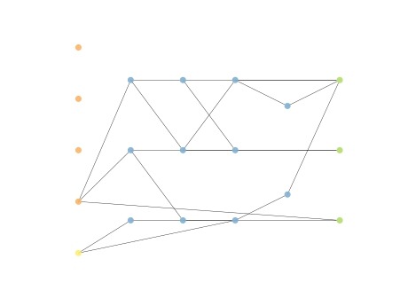

### Individual 17720

| key                    |      value |
|:-----------------------|-----------:|
| mean log_loss:         |   0.390768 |
| mean accuracy:         |   0.8086   |
| mean kappa:            |   0.7129   |
| number of edges        |  38        |
| number of hidden nodes |  10        |
| number of layers       |   4        |
| birth                  | 197        |

#### Network

### Individual 17992

| key                    |      value |
|:-----------------------|-----------:|
| mean log_loss:         |   0.403307 |
| mean accuracy:         |   0.7954   |
| mean kappa:            |   0.6931   |
| number of edges        |  38        |
| number of hidden nodes |  10        |
| number of layers       |   4        |
| birth                  | 200        |

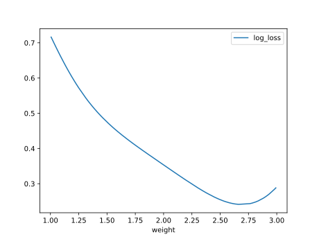

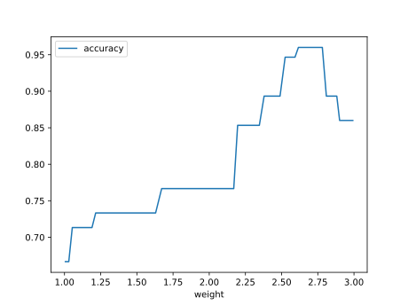

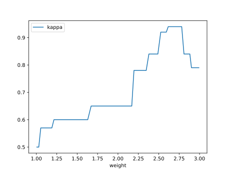

#### Network

### Individual 17448

| key                    |      value |
|:-----------------------|-----------:|
| mean log_loss:         |   0.464396 |
| mean accuracy:         |   0.811933 |
| mean kappa:            |   0.7179   |
| number of edges        |  38        |
| number of hidden nodes |  10        |
| number of layers       |   4        |
| birth                  | 194        |

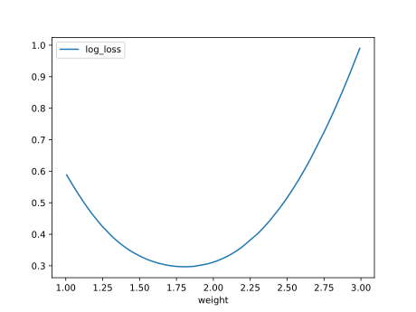

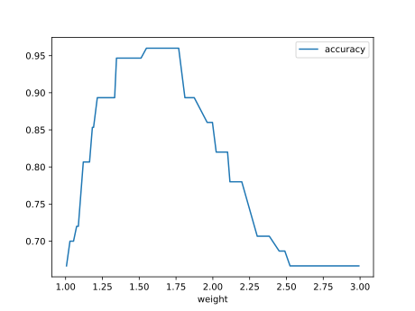

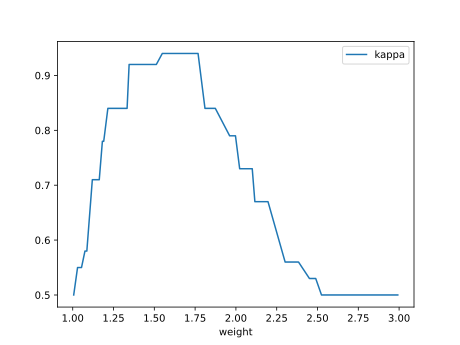

#### Network

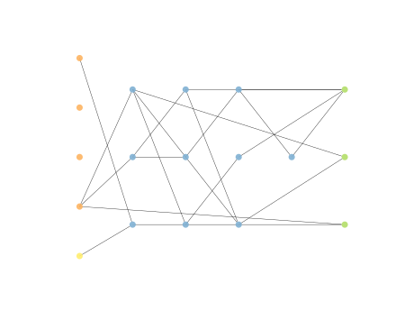

### Individual 17972

| key                    |      value |
|:-----------------------|-----------:|
| mean log_loss:         |   0.373378 |
| mean accuracy:         |   0.791533 |
| mean kappa:            |   0.6873   |
| number of edges        |  38        |
| number of hidden nodes |  10        |
| number of layers       |   4        |
| birth                  | 200        |

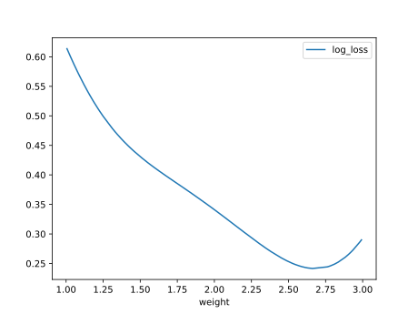

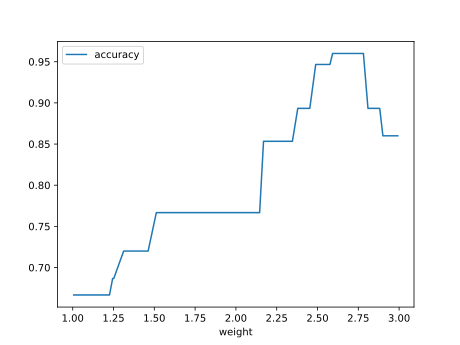

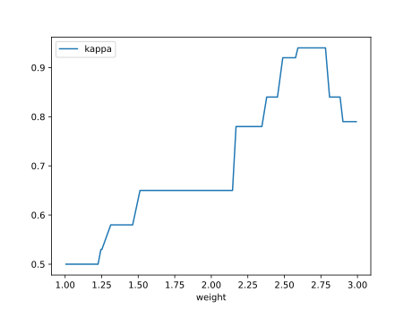

#### Network

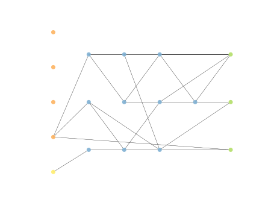

