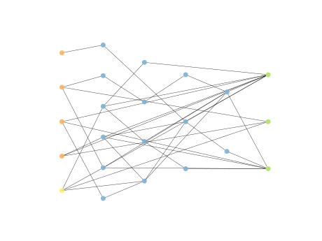

# Report Iris Uniform Distribution [1, 3] run 8

## Best results in hall of fame

| measure       |    value |   individual |
|:--------------|---------:|-------------:|
| mean accuracy | 0.955133 |        17030 |
| max accuracy  | 0.973333 |        12601 |
| mean kappa    | 0.9327   |        17030 |
| max kappa     | 0.96     |        12601 |

## Individuals in hall of fame

### Individual 12601

| key                    |      value |
|:-----------------------|-----------:|
| mean log_loss:         |   0.217194 |
| mean accuracy:         |   0.951267 |
| mean kappa:            |   0.9269   |
| number of edges        |  63        |
| number of hidden nodes |  17        |
| number of layers       |   4        |
| birth                  | 141        |

#### Network

### Individual 17030

| key                    |      value |
|:-----------------------|-----------:|
| mean log_loss:         |   0.221419 |
| mean accuracy:         |   0.955133 |
| mean kappa:            |   0.9327   |
| number of edges        |  59        |
| number of hidden nodes |  16        |
| number of layers       |   4        |
| birth                  | 190        |

#### Network

### Individual 16798

| key                    |      value |
|:-----------------------|-----------:|
| mean log_loss:         |   0.221503 |
| mean accuracy:         |   0.9538   |
| mean kappa:            |   0.9307   |
| number of edges        |  60        |
| number of hidden nodes |  16        |
| number of layers       |   4        |
| birth                  | 187        |

#### Network

### Individual 14149

| key                    |      value |
|:-----------------------|-----------:|
| mean log_loss:         |   0.221419 |
| mean accuracy:         |   0.955133 |
| mean kappa:            |   0.9327   |
| number of edges        |  56        |
| number of hidden nodes |  15        |
| number of layers       |   4        |
| birth                  | 158        |

#### Network

### Individual 17437

| key                    |      value |
|:-----------------------|-----------:|
| mean log_loss:         |   0.222203 |
| mean accuracy:         |   0.9538   |
| mean kappa:            |   0.9307   |
| number of edges        |  61        |
| number of hidden nodes |  17        |
| number of layers       |   4        |
| birth                  | 194        |

#### Network

### Individual 17555

| key                    |      value |
|:-----------------------|-----------:|
| mean log_loss:         |   0.222203 |
| mean accuracy:         |   0.9538   |
| mean kappa:            |   0.9307   |
| number of edges        |  63        |
| number of hidden nodes |  18        |
| number of layers       |   4        |
| birth                  | 196        |

#### Network

### Individual 12025

| key                    |      value |
|:-----------------------|-----------:|
| mean log_loss:         |   0.217872 |
| mean accuracy:         |   0.9534   |
| mean kappa:            |   0.9301   |
| number of edges        |  58        |
| number of hidden nodes |  15        |
| number of layers       |   4        |
| birth                  | 134        |

#### Network

### Individual 12027

| key                    |      value |
|:-----------------------|-----------:|
| mean log_loss:         |   0.217872 |
| mean accuracy:         |   0.9534   |
| mean kappa:            |   0.9301   |
| number of edges        |  58        |
| number of hidden nodes |  15        |
| number of layers       |   4        |
| birth                  | 134        |

#### Network

### Individual 15953

| key                    |      value |
|:-----------------------|-----------:|
| mean log_loss:         |   0.218716 |
| mean accuracy:         |   0.954    |
| mean kappa:            |   0.931    |
| number of edges        |  61        |
| number of hidden nodes |  17        |
| number of layers       |   5        |
| birth                  | 178        |

#### Network

### Individual 17970

| key                    |      value |
|:-----------------------|-----------:|
| mean log_loss:         |   0.218296 |
| mean accuracy:         |   0.9538   |
| mean kappa:            |   0.9307   |
| number of edges        |  63        |
| number of hidden nodes |  18        |
| number of layers       |   4        |
| birth                  | 200        |

#### Network

