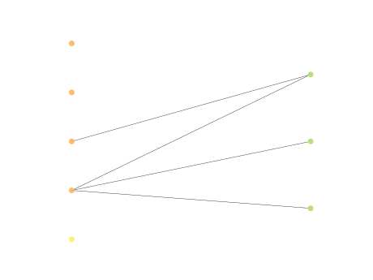

# Report Iris Uniform Distribution [1, 3] run 9

## Best results in hall of fame

| measure       |    value |   individual |
|:--------------|---------:|-------------:|
| mean accuracy | 0.666667 |         7714 |
| max accuracy  | 0.666667 |         7714 |
| mean kappa    | 0.5      |         7714 |
| max kappa     | 0.5      |         7714 |

## Individuals in hall of fame

### Individual 7714

| key                    |     value |
|:-----------------------|----------:|
| mean log_loss:         |  0.988515 |
| mean accuracy:         |  0.666667 |
| mean kappa:            |  0.5      |
| number of edges        | 15        |
| number of hidden nodes |  0        |
| number of layers       |  0        |
| birth                  | 86        |

#### Network

### Individual 12550

| key                    |      value |
|:-----------------------|-----------:|
| mean log_loss:         |   0.783505 |
| mean accuracy:         |   0.642333 |
| mean kappa:            |   0.4635   |
| number of edges        |  15        |
| number of hidden nodes |   0        |
| number of layers       |   0        |
| birth                  | 140        |

#### Network

### Individual 15306

| key                    |      value |
|:-----------------------|-----------:|
| mean log_loss:         |   0.783505 |
| mean accuracy:         |   0.642333 |
| mean kappa:            |   0.4635   |
| number of edges        |  15        |
| number of hidden nodes |   0        |
| number of layers       |   0        |
| birth                  | 171        |

#### Network

### Individual 7961

| key                    |     value |
|:-----------------------|----------:|
| mean log_loss:         |  0.783525 |
| mean accuracy:         |  0.642333 |
| mean kappa:            |  0.4635   |
| number of edges        | 15        |
| number of hidden nodes |  0        |
| number of layers       |  0        |
| birth                  | 89        |

#### Network

### Individual 7963

| key                    |     value |
|:-----------------------|----------:|
| mean log_loss:         |  0.783525 |
| mean accuracy:         |  0.642333 |
| mean kappa:            |  0.4635   |
| number of edges        | 15        |
| number of hidden nodes |  0        |
| number of layers       |  0        |
| birth                  | 89        |

#### Network

### Individual 7922

| key                    |     value |
|:-----------------------|----------:|
| mean log_loss:         |  0.786517 |
| mean accuracy:         |  0.642333 |
| mean kappa:            |  0.4635   |
| number of edges        | 15        |
| number of hidden nodes |  0        |
| number of layers       |  0        |
| birth                  | 89        |

#### Network

### Individual 7945

| key                    |     value |
|:-----------------------|----------:|
| mean log_loss:         |  0.783525 |
| mean accuracy:         |  0.642333 |
| mean kappa:            |  0.4635   |
| number of edges        | 15        |
| number of hidden nodes |  0        |
| number of layers       |  0        |
| birth                  | 89        |

#### Network

### Individual 8000

| key                    |     value |
|:-----------------------|----------:|
| mean log_loss:         |  0.783506 |
| mean accuracy:         |  0.642333 |
| mean kappa:            |  0.4635   |
| number of edges        | 15        |
| number of hidden nodes |  0        |
| number of layers       |  0        |
| birth                  | 89        |

#### Network

### Individual 7924

| key                    |     value |
|:-----------------------|----------:|
| mean log_loss:         |  0.783506 |
| mean accuracy:         |  0.642333 |
| mean kappa:            |  0.4635   |
| number of edges        | 15        |
| number of hidden nodes |  0        |
| number of layers       |  0        |
| birth                  | 89        |

#### Network

### Individual 7947

| key                    |     value |
|:-----------------------|----------:|
| mean log_loss:         |  0.79131  |
| mean accuracy:         |  0.642133 |
| mean kappa:            |  0.4632   |
| number of edges        | 15        |
| number of hidden nodes |  0        |
| number of layers       |  0        |
| birth                  | 89        |

#### Network

