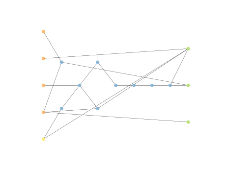

# Report Iris Uniform Distribution [1, 5] run 0

## Best results in hall of fame

| measure       |    value |   individual |
|:--------------|---------:|-------------:|
| mean accuracy | 0.953467 |        17030 |
| max accuracy  | 0.96     |        17594 |
| mean kappa    | 0.9302   |        17030 |
| max kappa     | 0.94     |        17594 |

## Individuals in hall of fame

### Individual 17594

| key                    |     value |
|:-----------------------|----------:|
| mean log_loss:         |   0.25188 |
| mean accuracy:         |   0.9532  |
| mean kappa:            |   0.9298  |
| number of edges        |  37       |
| number of hidden nodes |   9       |
| number of layers       |   7       |
| birth                  | 196       |

#### Network

### Individual 16833

| key                    |      value |
|:-----------------------|-----------:|
| mean log_loss:         |   0.251907 |
| mean accuracy:         |   0.9532   |
| mean kappa:            |   0.9298   |
| number of edges        |  37        |
| number of hidden nodes |   9        |
| number of layers       |   8        |
| birth                  | 188        |

#### Network

### Individual 17749

| key                    |      value |
|:-----------------------|-----------:|
| mean log_loss:         |   0.253231 |
| mean accuracy:         |   0.952933 |
| mean kappa:            |   0.9294   |
| number of edges        |  38        |
| number of hidden nodes |  10        |
| number of layers       |   8        |
| birth                  | 198        |

#### Network

### Individual 17129

| key                    |      value |
|:-----------------------|-----------:|
| mean log_loss:         |   0.251907 |
| mean accuracy:         |   0.9532   |
| mean kappa:            |   0.9298   |
| number of edges        |  39        |
| number of hidden nodes |  10        |
| number of layers       |   8        |
| birth                  | 191        |

#### Network

### Individual 16412

| key                    |      value |
|:-----------------------|-----------:|
| mean log_loss:         |   0.252877 |
| mean accuracy:         |   0.952933 |
| mean kappa:            |   0.9294   |
| number of edges        |  36        |
| number of hidden nodes |   9        |
| number of layers       |   7        |
| birth                  | 183        |

#### Network

### Individual 17885

| key                    |      value |
|:-----------------------|-----------:|
| mean log_loss:         |   0.251817 |
| mean accuracy:         |   0.9532   |
| mean kappa:            |   0.9298   |
| number of edges        |  37        |
| number of hidden nodes |   9        |
| number of layers       |   7        |
| birth                  | 199        |

#### Network

### Individual 16969

| key                    |      value |
|:-----------------------|-----------:|
| mean log_loss:         |   0.251878 |
| mean accuracy:         |   0.9532   |
| mean kappa:            |   0.9298   |
| number of edges        |  37        |
| number of hidden nodes |   9        |
| number of layers       |   7        |
| birth                  | 189        |

#### Network

### Individual 17900

| key                    |      value |
|:-----------------------|-----------:|
| mean log_loss:         |   0.253109 |
| mean accuracy:         |   0.952933 |
| mean kappa:            |   0.9294   |
| number of edges        |  38        |
| number of hidden nodes |  10        |
| number of layers       |   8        |
| birth                  | 199        |

#### Network

### Individual 17030

| key                    |      value |
|:-----------------------|-----------:|
| mean log_loss:         |   0.252655 |
| mean accuracy:         |   0.953467 |
| mean kappa:            |   0.9302   |
| number of edges        |  36        |
| number of hidden nodes |   9        |
| number of layers       |   7        |
| birth                  | 190        |

#### Network

### Individual 17037

| key                    |      value |
|:-----------------------|-----------:|
| mean log_loss:         |   0.252934 |
| mean accuracy:         |   0.952933 |
| mean kappa:            |   0.9294   |
| number of edges        |  38        |
| number of hidden nodes |  10        |
| number of layers       |   7        |
| birth                  | 190        |

#### Network

