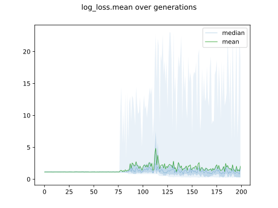
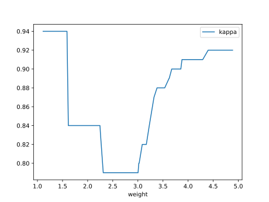

# Report Iris Uniform Distribution [1, 5] run 1

## Best results in hall of fame

| measure       |   value |   individual |
|:--------------|--------:|-------------:|
| mean accuracy |  0.949  |        14982 |
| max accuracy  |  0.96   |        14982 |
| mean kappa    |  0.9235 |        14982 |
| max kappa     |  0.94   |        14982 |

## Individuals in hall of fame

### Individual 14982

| key                    |     value |
|:-----------------------|----------:|
| mean log_loss:         |   0.29451 |
| mean accuracy:         |   0.949   |
| mean kappa:            |   0.9235  |
| number of edges        |  49       |
| number of hidden nodes |  13       |
| number of layers       |   8       |
| birth                  | 167       |

#### Network

### Individual 14678

| key                    |    value |
|:-----------------------|---------:|
| mean log_loss:         |   0.2959 |
| mean accuracy:         |   0.9486 |
| mean kappa:            |   0.9229 |
| number of edges        |  47      |
| number of hidden nodes |  13      |
| number of layers       |   7      |
| birth                  | 164      |

#### Network

### Individual 15021

| key                    |      value |
|:-----------------------|-----------:|
| mean log_loss:         |   0.295461 |
| mean accuracy:         |   0.948733 |
| mean kappa:            |   0.9231   |
| number of edges        |  48        |
| number of hidden nodes |  13        |
| number of layers       |   8        |
| birth                  | 167        |

#### Network

### Individual 14824

| key                    |      value |
|:-----------------------|-----------:|
| mean log_loss:         |   0.295463 |
| mean accuracy:         |   0.948733 |
| mean kappa:            |   0.9231   |
| number of edges        |  48        |
| number of hidden nodes |  13        |
| number of layers       |   8        |
| birth                  | 165        |

#### Network

### Individual 14782

| key                    |      value |
|:-----------------------|-----------:|
| mean log_loss:         |   0.296346 |
| mean accuracy:         |   0.948667 |
| mean kappa:            |   0.923    |
| number of edges        |  47        |
| number of hidden nodes |  13        |
| number of layers       |   7        |
| birth                  | 165        |

#### Network

### Individual 14648

| key                    |      value |
|:-----------------------|-----------:|
| mean log_loss:         |   0.322041 |
| mean accuracy:         |   0.9252   |
| mean kappa:            |   0.8878   |
| number of edges        |  46        |
| number of hidden nodes |  13        |
| number of layers       |   7        |
| birth                  | 163        |

#### Network

### Individual 17033

| key                    |      value |
|:-----------------------|-----------:|
| mean log_loss:         |   0.292405 |
| mean accuracy:         |   0.911    |
| mean kappa:            |   0.8665   |
| number of edges        |  53        |
| number of hidden nodes |  16        |
| number of layers       |   9        |
| birth                  | 190        |

#### Network

### Individual 16034

| key                    |      value |
|:-----------------------|-----------:|
| mean log_loss:         |   0.299847 |
| mean accuracy:         |   0.908267 |
| mean kappa:            |   0.8624   |
| number of edges        |  48        |
| number of hidden nodes |  14        |
| number of layers       |   8        |
| birth                  | 179        |

#### Network

### Individual 15618

| key                    |      value |
|:-----------------------|-----------:|
| mean log_loss:         |   0.325673 |
| mean accuracy:         |   0.9162   |
| mean kappa:            |   0.8743   |
| number of edges        |  44        |
| number of hidden nodes |  12        |
| number of layers       |   6        |
| birth                  | 174        |

#### Network

### Individual 16942

| key                    |      value |
|:-----------------------|-----------:|
| mean log_loss:         |   0.292405 |
| mean accuracy:         |   0.911    |
| mean kappa:            |   0.8665   |
| number of edges        |  53        |
| number of hidden nodes |  16        |
| number of layers       |   9        |
| birth                  | 189        |

#### Network

