# Report Iris Uniform Distribution [1, 5] run 2

## Best results in hall of fame

| measure       |    value |   individual |
|:--------------|---------:|-------------:|
| mean accuracy | 0.910133 |        17100 |
| max accuracy  | 0.96     |        17100 |
| mean kappa    | 0.8652   |        17100 |
| max kappa     | 0.94     |        17100 |

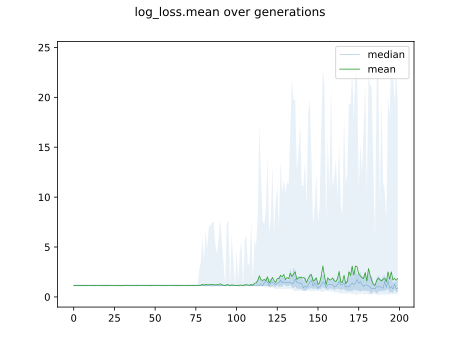

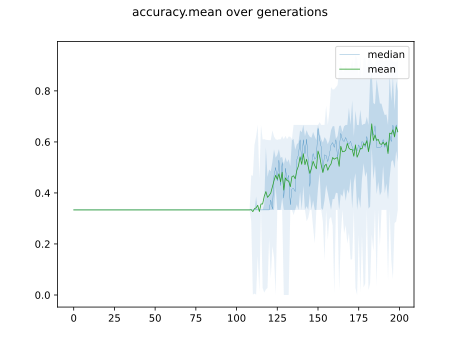

## Individuals in hall of fame

### Individual 17100

| key                    |      value |
|:-----------------------|-----------:|
| mean log_loss:         |   0.272461 |
| mean accuracy:         |   0.910133 |
| mean kappa:            |   0.8652   |
| number of edges        |  57        |
| number of hidden nodes |  16        |
| number of layers       |   8        |
| birth                  | 191        |

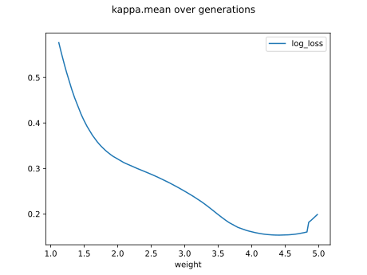

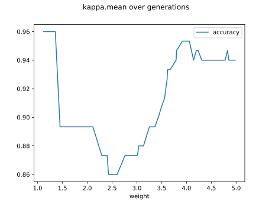

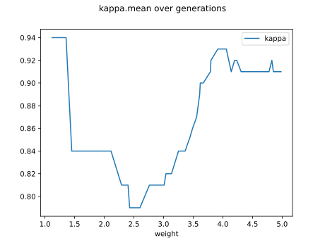

#### Network

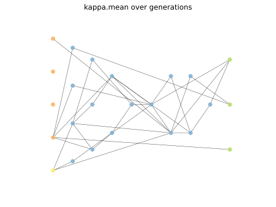

### Individual 17210

| key                    |      value |
|:-----------------------|-----------:|
| mean log_loss:         |   0.274505 |
| mean accuracy:         |   0.909133 |
| mean kappa:            |   0.8637   |
| number of edges        |  57        |
| number of hidden nodes |  16        |
| number of layers       |   9        |
| birth                  | 192        |

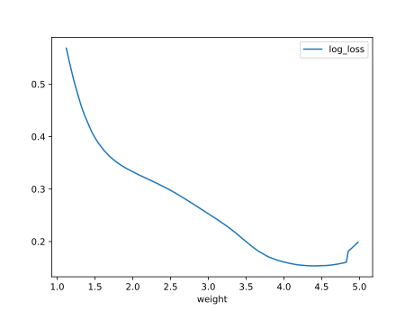

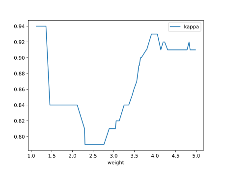

#### Network

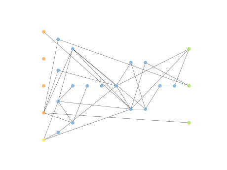

### Individual 16957

| key                    |      value |
|:-----------------------|-----------:|
| mean log_loss:         |   0.27886  |
| mean accuracy:         |   0.909133 |
| mean kappa:            |   0.8637   |
| number of edges        |  55        |
| number of hidden nodes |  15        |
| number of layers       |   8        |
| birth                  | 189        |

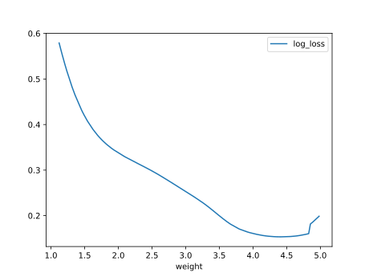

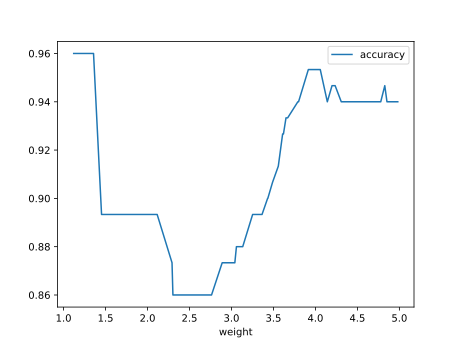

#### Network

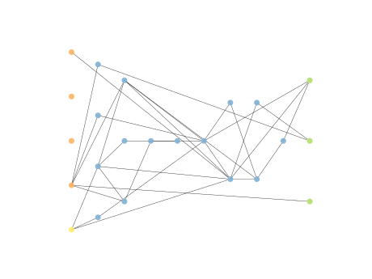

### Individual 17206

| key                    |      value |
|:-----------------------|-----------:|
| mean log_loss:         |   0.27337  |
| mean accuracy:         |   0.909133 |
| mean kappa:            |   0.8637   |
| number of edges        |  55        |
| number of hidden nodes |  15        |
| number of layers       |   8        |
| birth                  | 192        |

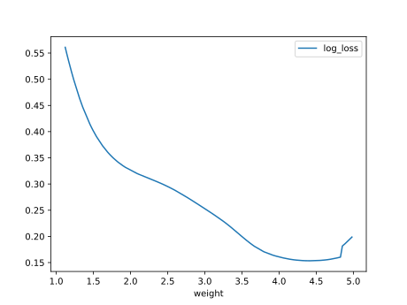

#### Network

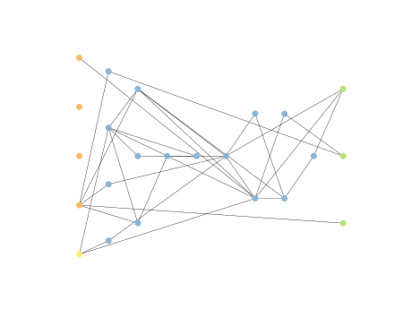

### Individual 17410

| key                    |      value |
|:-----------------------|-----------:|
| mean log_loss:         |   0.27337  |
| mean accuracy:         |   0.909133 |
| mean kappa:            |   0.8637   |
| number of edges        |  57        |
| number of hidden nodes |  16        |
| number of layers       |   8        |
| birth                  | 194        |

#### Network

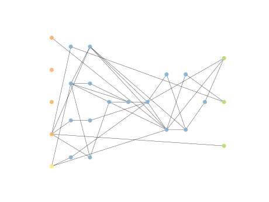

### Individual 17485

| key                    |      value |
|:-----------------------|-----------:|
| mean log_loss:         |   0.273396 |
| mean accuracy:         |   0.906867 |
| mean kappa:            |   0.8603   |
| number of edges        |  57        |
| number of hidden nodes |  16        |
| number of layers       |   8        |
| birth                  | 195        |

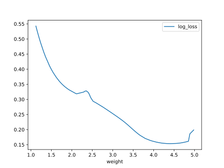

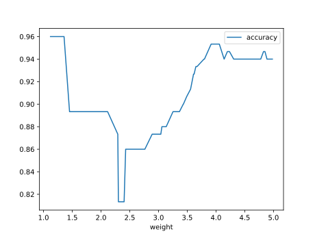

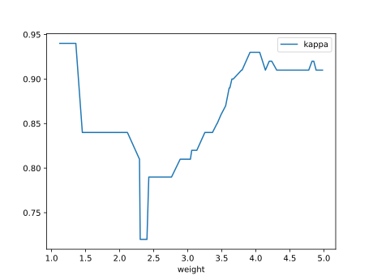

#### Network

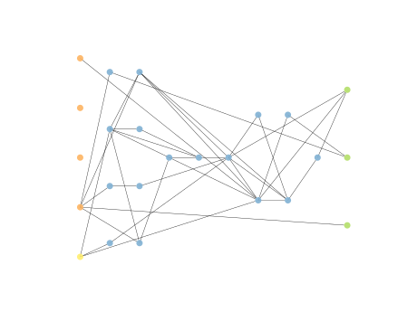

### Individual 17645

| key                    |      value |
|:-----------------------|-----------:|
| mean log_loss:         |   0.266584 |
| mean accuracy:         |   0.909933 |
| mean kappa:            |   0.8649   |
| number of edges        |  57        |
| number of hidden nodes |  16        |
| number of layers       |   8        |
| birth                  | 197        |

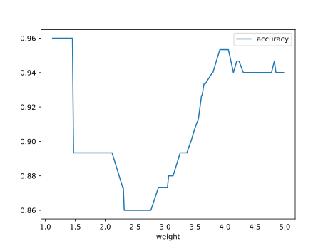

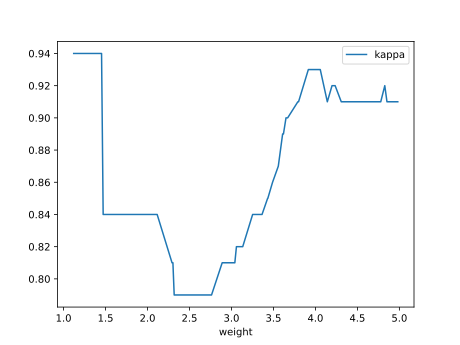

#### Network

### Individual 17518

| key                    |      value |
|:-----------------------|-----------:|
| mean log_loss:         |   0.269962 |
| mean accuracy:         |   0.909933 |
| mean kappa:            |   0.8649   |
| number of edges        |  57        |
| number of hidden nodes |  16        |
| number of layers       |   8        |
| birth                  | 195        |

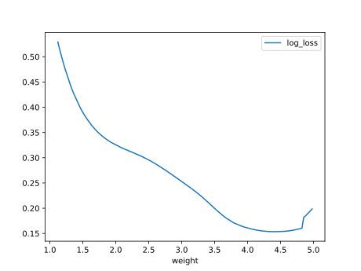

#### Network

### Individual 17908

| key                    |      value |
|:-----------------------|-----------:|
| mean log_loss:         |   0.265618 |
| mean accuracy:         |   0.909933 |
| mean kappa:            |   0.8649   |
| number of edges        |  58        |
| number of hidden nodes |  16        |
| number of layers       |   8        |
| birth                  | 199        |

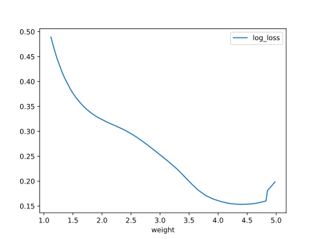

#### Network

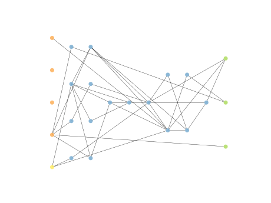

### Individual 17926

| key                    |      value |
|:-----------------------|-----------:|
| mean log_loss:         |   0.277693 |
| mean accuracy:         |   0.902    |
| mean kappa:            |   0.853    |
| number of edges        |  60        |
| number of hidden nodes |  17        |
| number of layers       |   9        |
| birth                  | 200        |

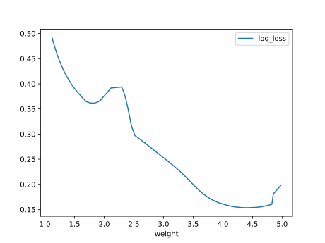

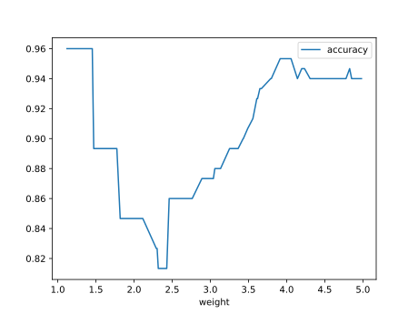

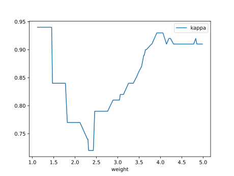

#### Network

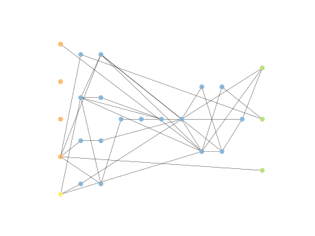

