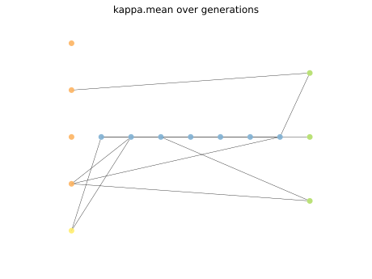

# Report Iris Uniform Distribution [1, 5] run 3

## Best results in hall of fame

| measure       |   value |   individual |
|:--------------|--------:|-------------:|
| mean accuracy |  0.7298 |        17983 |
| max accuracy  |  0.96   |        17983 |
| mean kappa    |  0.5947 |        17983 |
| max kappa     |  0.94   |        17983 |

## Individuals in hall of fame

### Individual 17983

| key                    |      value |
|:-----------------------|-----------:|
| mean log_loss:         |   0.602376 |
| mean accuracy:         |   0.7298   |
| mean kappa:            |   0.5947   |
| number of edges        |  34        |
| number of hidden nodes |   7        |
| number of layers       |   7        |
| birth                  | 200        |

#### Network

### Individual 17941

| key                    |      value |
|:-----------------------|-----------:|
| mean log_loss:         |   0.604306 |
| mean accuracy:         |   0.7298   |
| mean kappa:            |   0.5947   |
| number of edges        |  34        |
| number of hidden nodes |   7        |
| number of layers       |   7        |
| birth                  | 200        |

#### Network

### Individual 17001

| key                    |      value |
|:-----------------------|-----------:|
| mean log_loss:         |   0.597899 |
| mean accuracy:         |   0.666667 |
| mean kappa:            |   0.5      |
| number of edges        |  30        |
| number of hidden nodes |   7        |
| number of layers       |   7        |
| birth                  | 189        |

#### Network

### Individual 16712

| key                    |      value |
|:-----------------------|-----------:|
| mean log_loss:         |   0.598032 |
| mean accuracy:         |   0.666667 |
| mean kappa:            |   0.5      |
| number of edges        |  30        |
| number of hidden nodes |   7        |
| number of layers       |   7        |
| birth                  | 186        |

#### Network

### Individual 16343

| key                    |      value |
|:-----------------------|-----------:|
| mean log_loss:         |   0.598178 |
| mean accuracy:         |   0.666333 |
| mean kappa:            |   0.4995   |
| number of edges        |  26        |
| number of hidden nodes |   5        |
| number of layers       |   5        |
| birth                  | 182        |

#### Network

### Individual 17729

| key                    |      value |
|:-----------------------|-----------:|
| mean log_loss:         |   0.595415 |
| mean accuracy:         |   0.666667 |
| mean kappa:            |   0.5      |
| number of edges        |  33        |
| number of hidden nodes |   7        |
| number of layers       |   7        |
| birth                  | 197        |

#### Network

### Individual 17543

| key                    |      value |
|:-----------------------|-----------:|
| mean log_loss:         |   0.596443 |
| mean accuracy:         |   0.666667 |
| mean kappa:            |   0.5      |
| number of edges        |  32        |
| number of hidden nodes |   7        |
| number of layers       |   7        |
| birth                  | 195        |

#### Network

### Individual 17638

| key                    |      value |
|:-----------------------|-----------:|
| mean log_loss:         |   0.596371 |
| mean accuracy:         |   0.666667 |
| mean kappa:            |   0.5      |
| number of edges        |  32        |
| number of hidden nodes |   7        |
| number of layers       |   7        |
| birth                  | 196        |

#### Network

### Individual 17342

| key                    |      value |
|:-----------------------|-----------:|
| mean log_loss:         |   0.597933 |
| mean accuracy:         |   0.666667 |
| mean kappa:            |   0.5      |
| number of edges        |  32        |
| number of hidden nodes |   8        |
| number of layers       |   8        |
| birth                  | 193        |

#### Network

### Individual 17850

| key                    |      value |
|:-----------------------|-----------:|
| mean log_loss:         |   0.599347 |
| mean accuracy:         |   0.666133 |
| mean kappa:            |   0.4992   |
| number of edges        |  33        |
| number of hidden nodes |   7        |
| number of layers       |   7        |
| birth                  | 199        |

#### Network

