# Report Iris Uniform Distribution [1, 5] run 4

## Best results in hall of fame

| measure       |    value |   individual |
|:--------------|---------:|-------------:|
| mean accuracy | 0.946733 |        16902 |
| max accuracy  | 0.96     |        14434 |
| mean kappa    | 0.9201   |        16902 |
| max kappa     | 0.94     |        14434 |

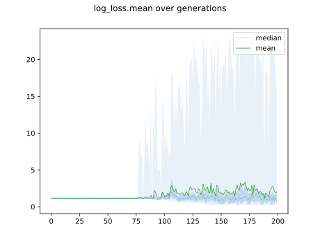

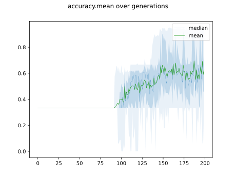

## Individuals in hall of fame

### Individual 14434

| key                    |      value |
|:-----------------------|-----------:|
| mean log_loss:         |   0.272515 |
| mean accuracy:         |   0.943867 |
| mean kappa:            |   0.9158   |
| number of edges        |  45        |
| number of hidden nodes |  13        |
| number of layers       |   6        |
| birth                  | 161        |

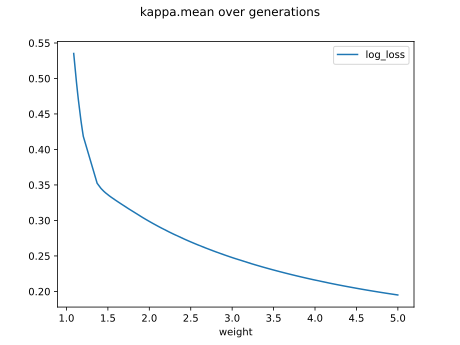

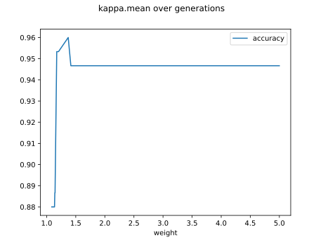

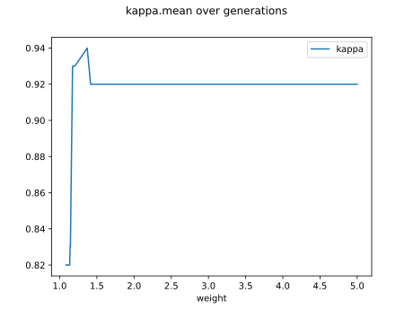

#### Network

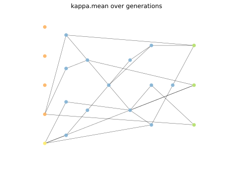

### Individual 16902

| key                    |      value |
|:-----------------------|-----------:|
| mean log_loss:         |   0.268514 |
| mean accuracy:         |   0.946733 |
| mean kappa:            |   0.9201   |
| number of edges        |  48        |
| number of hidden nodes |  13        |
| number of layers       |   7        |
| birth                  | 188        |

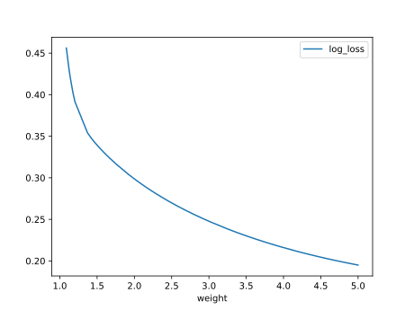

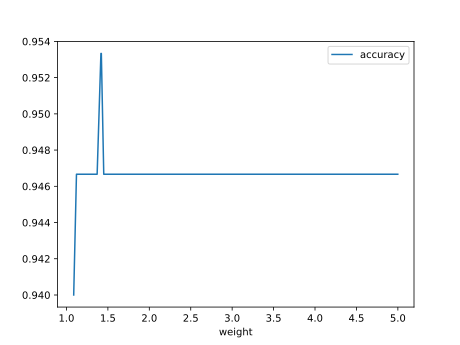

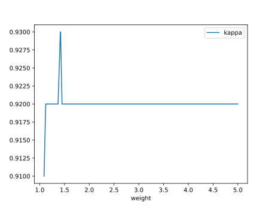

#### Network

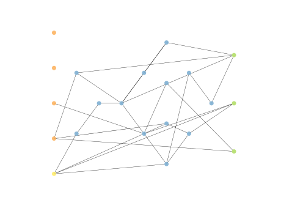

### Individual 16254

| key                    |      value |
|:-----------------------|-----------:|
| mean log_loss:         |   0.271496 |
| mean accuracy:         |   0.9432   |
| mean kappa:            |   0.9148   |
| number of edges        |  48        |
| number of hidden nodes |  13        |
| number of layers       |   6        |
| birth                  | 181        |

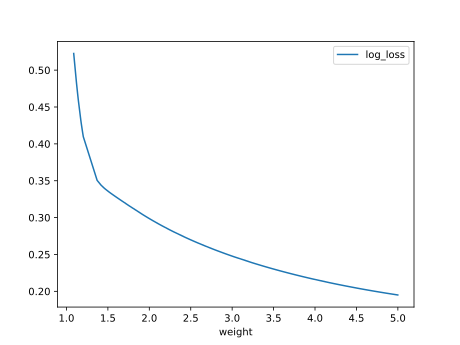

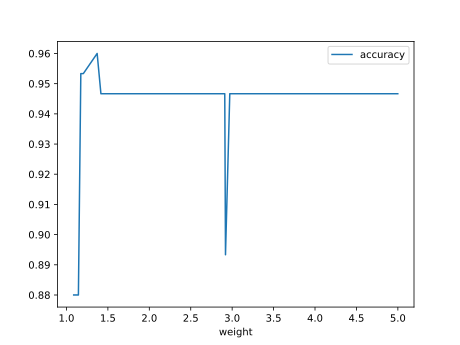

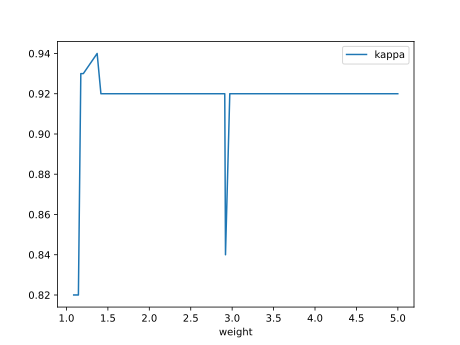

#### Network

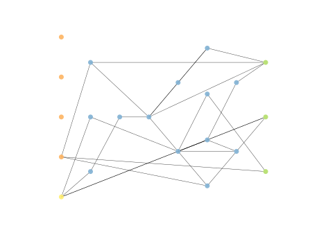

### Individual 16291

| key                    |      value |
|:-----------------------|-----------:|
| mean log_loss:         |   0.264558 |
| mean accuracy:         |   0.938533 |
| mean kappa:            |   0.9078   |
| number of edges        |  47        |
| number of hidden nodes |  13        |
| number of layers       |   6        |
| birth                  | 182        |

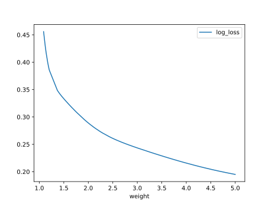

#### Network

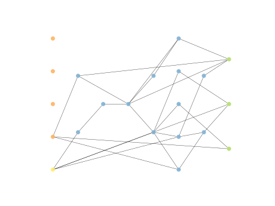

### Individual 16401

| key                    |      value |
|:-----------------------|-----------:|
| mean log_loss:         |   0.263986 |
| mean accuracy:         |   0.938667 |
| mean kappa:            |   0.908    |
| number of edges        |  49        |
| number of hidden nodes |  14        |
| number of layers       |   6        |
| birth                  | 183        |

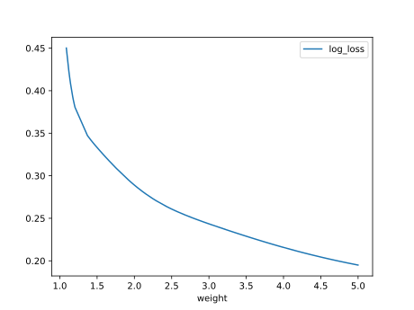

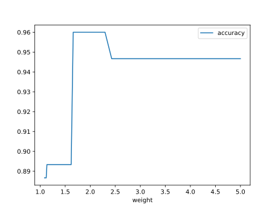

#### Network

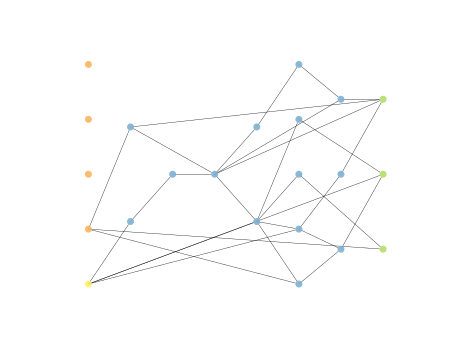

### Individual 14334

| key                    |      value |
|:-----------------------|-----------:|
| mean log_loss:         |   0.272515 |
| mean accuracy:         |   0.943867 |
| mean kappa:            |   0.9158   |
| number of edges        |  45        |
| number of hidden nodes |  13        |
| number of layers       |   6        |
| birth                  | 160        |

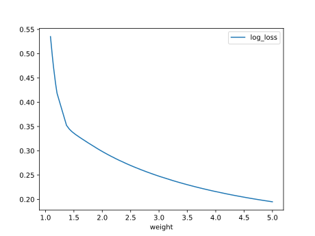

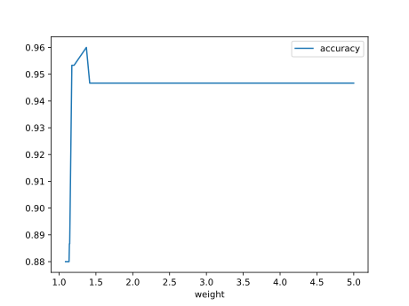

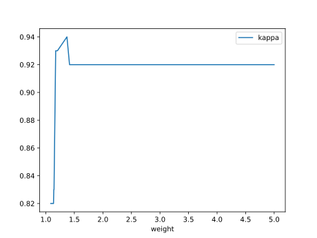

#### Network

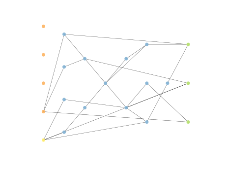

### Individual 16406

| key                    |      value |
|:-----------------------|-----------:|
| mean log_loss:         |   0.264558 |
| mean accuracy:         |   0.938533 |
| mean kappa:            |   0.9078   |
| number of edges        |  48        |
| number of hidden nodes |  13        |
| number of layers       |   6        |
| birth                  | 183        |

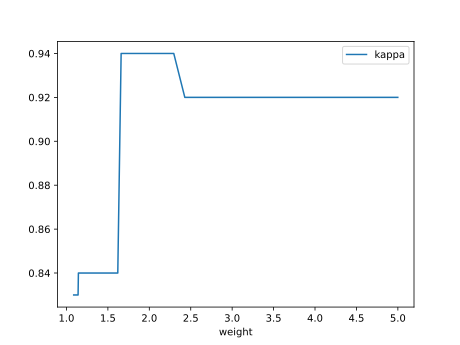

#### Network

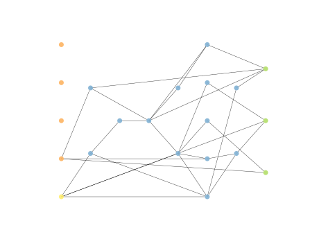

### Individual 15654

| key                    |      value |
|:-----------------------|-----------:|
| mean log_loss:         |   0.271496 |
| mean accuracy:         |   0.9432   |
| mean kappa:            |   0.9148   |
| number of edges        |  48        |
| number of hidden nodes |  14        |
| number of layers       |   6        |
| birth                  | 174        |

#### Network

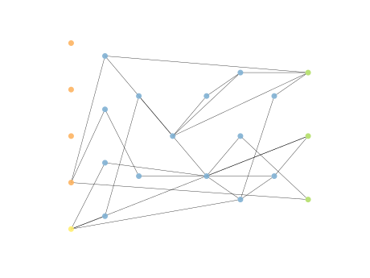

### Individual 16324

| key                    |      value |
|:-----------------------|-----------:|
| mean log_loss:         |   0.271496 |
| mean accuracy:         |   0.9432   |
| mean kappa:            |   0.9148   |
| number of edges        |  47        |
| number of hidden nodes |  13        |
| number of layers       |   6        |
| birth                  | 182        |

#### Network

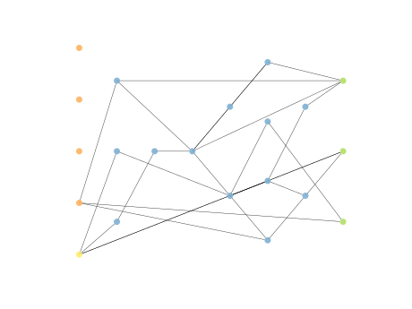

### Individual 17726

| key                    |      value |
|:-----------------------|-----------:|
| mean log_loss:         |   0.263903 |
| mean accuracy:         |   0.934067 |
| mean kappa:            |   0.9011   |
| number of edges        |  52        |
| number of hidden nodes |  15        |
| number of layers       |   7        |
| birth                  | 197        |

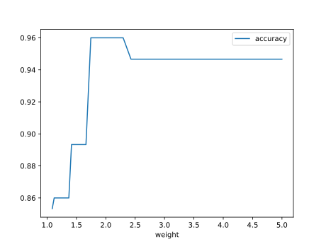

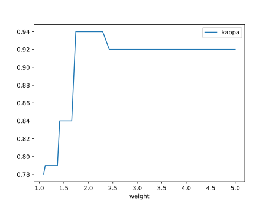

#### Network

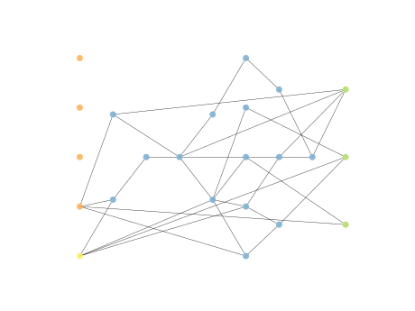

