# Report Iris Uniform Distribution [1, 5] run 5

## Best results in hall of fame

| measure       |    value |   individual |
|:--------------|---------:|-------------:|
| mean accuracy | 0.610667 |        17220 |
| max accuracy  | 0.8      |        14627 |
| mean kappa    | 0.416    |        17220 |
| max kappa     | 0.7      |        14627 |

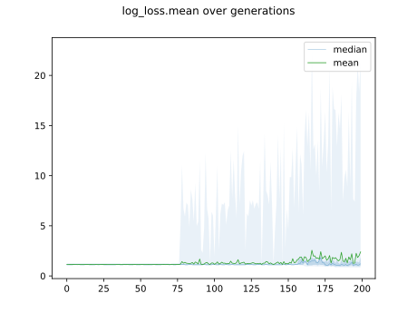

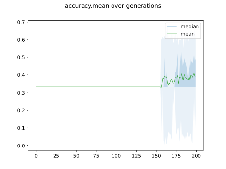

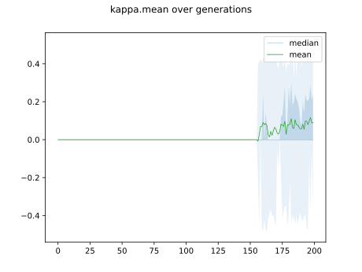

## Individuals in hall of fame

### Individual 14627

| key                    |      value |
|:-----------------------|-----------:|
| mean log_loss:         |   0.957888 |
| mean accuracy:         |   0.6104   |
| mean kappa:            |   0.4156   |
| number of edges        |  15        |
| number of hidden nodes |   0        |
| number of layers       |   0        |
| birth                  | 163        |

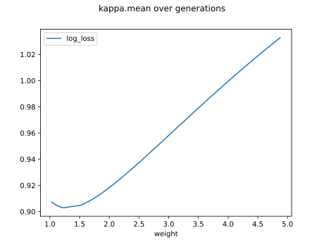

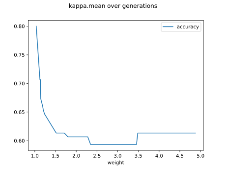

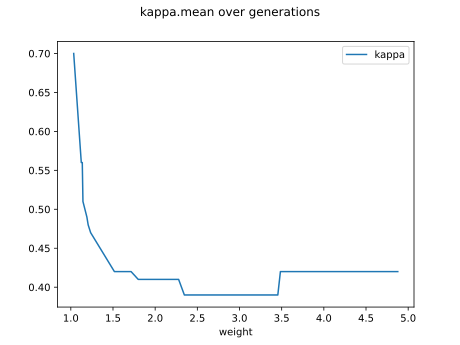

#### Network

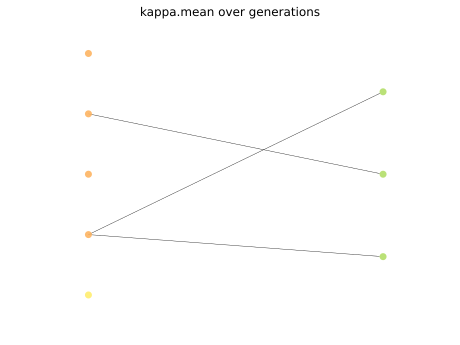

### Individual 17220

| key                    |      value |
|:-----------------------|-----------:|
| mean log_loss:         |   1.40456  |
| mean accuracy:         |   0.610667 |
| mean kappa:            |   0.416    |
| number of edges        |  15        |
| number of hidden nodes |   0        |
| number of layers       |   0        |
| birth                  | 192        |

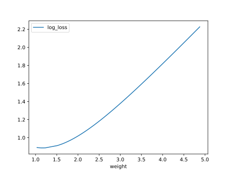

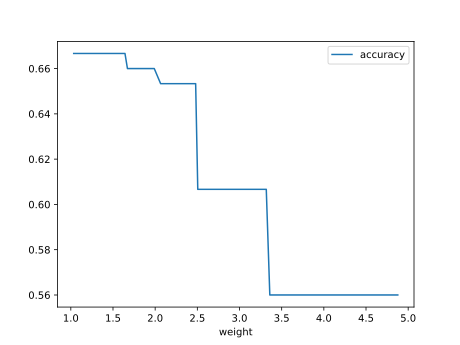

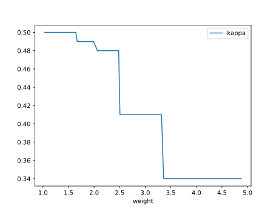

#### Network

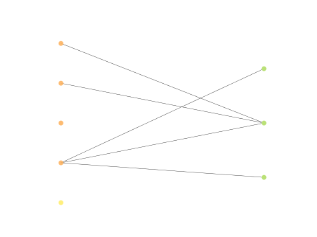

### Individual 14584

| key                    |      value |
|:-----------------------|-----------:|
| mean log_loss:         |   1.40456  |
| mean accuracy:         |   0.610667 |
| mean kappa:            |   0.416    |
| number of edges        |  15        |
| number of hidden nodes |   0        |
| number of layers       |   0        |
| birth                  | 163        |

#### Network

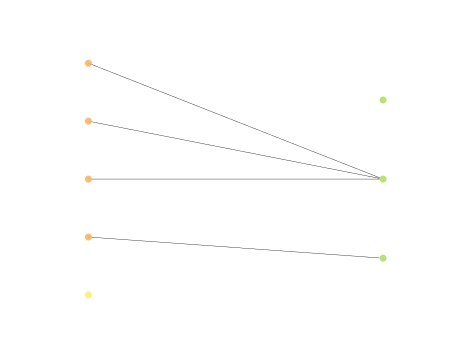

### Individual 14783

| key                    |      value |
|:-----------------------|-----------:|
| mean log_loss:         |   1.40456  |
| mean accuracy:         |   0.610667 |
| mean kappa:            |   0.416    |
| number of edges        |  17        |
| number of hidden nodes |   1        |
| number of layers       |   1        |
| birth                  | 165        |

#### Network

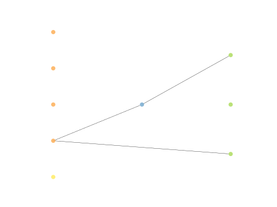

### Individual 14508

| key                    |      value |
|:-----------------------|-----------:|
| mean log_loss:         |   1.40456  |
| mean accuracy:         |   0.610667 |
| mean kappa:            |   0.416    |
| number of edges        |  15        |
| number of hidden nodes |   0        |
| number of layers       |   0        |
| birth                  | 162        |

#### Network

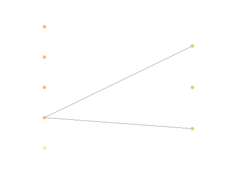

### Individual 14559

| key                    |      value |
|:-----------------------|-----------:|
| mean log_loss:         |   1.40456  |
| mean accuracy:         |   0.610667 |
| mean kappa:            |   0.416    |
| number of edges        |  15        |
| number of hidden nodes |   0        |
| number of layers       |   0        |
| birth                  | 162        |

#### Network

### Individual 14446

| key                    |      value |
|:-----------------------|-----------:|
| mean log_loss:         |   1.40456  |
| mean accuracy:         |   0.610667 |
| mean kappa:            |   0.416    |
| number of edges        |  15        |
| number of hidden nodes |   0        |
| number of layers       |   0        |
| birth                  | 161        |

#### Network

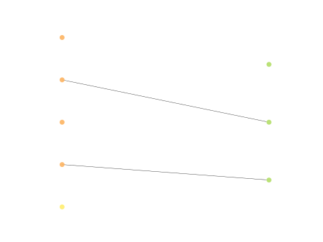

### Individual 14484

| key                    |      value |
|:-----------------------|-----------:|
| mean log_loss:         |   1.40456  |
| mean accuracy:         |   0.610667 |
| mean kappa:            |   0.416    |
| number of edges        |  15        |
| number of hidden nodes |   0        |
| number of layers       |   0        |
| birth                  | 161        |

#### Network

### Individual 14524

| key                    |      value |
|:-----------------------|-----------:|
| mean log_loss:         |   1.40456  |
| mean accuracy:         |   0.610667 |
| mean kappa:            |   0.416    |
| number of edges        |  15        |
| number of hidden nodes |   0        |
| number of layers       |   0        |
| birth                  | 162        |

#### Network

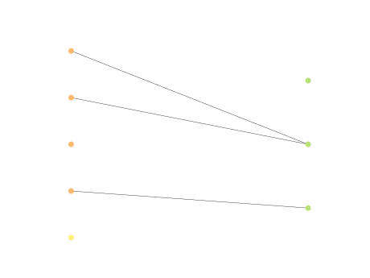

### Individual 17867

| key                    |      value |
|:-----------------------|-----------:|
| mean log_loss:         |   1.40456  |
| mean accuracy:         |   0.610667 |
| mean kappa:            |   0.416    |
| number of edges        |  15        |
| number of hidden nodes |   0        |
| number of layers       |   0        |
| birth                  | 199        |

#### Network

