# Report Iris Uniform Distribution [1, 5] run 6

## Best results in hall of fame

| measure       |    value |   individual |
|:--------------|---------:|-------------:|
| mean accuracy | 0.9366   |        13851 |
| max accuracy  | 0.966667 |        13690 |
| mean kappa    | 0.9049   |        13851 |
| max kappa     | 0.95     |        13690 |

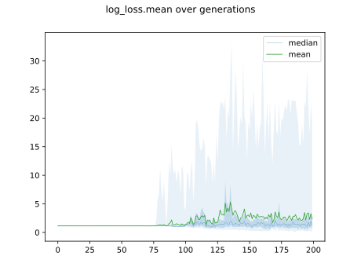

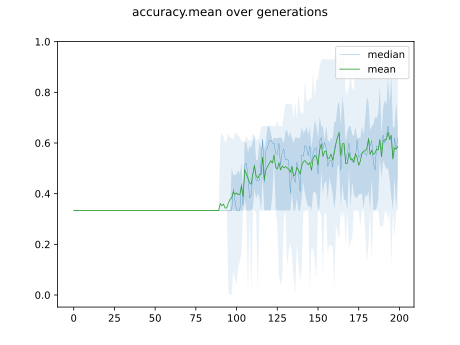

## Individuals in hall of fame

### Individual 13851

| key                    |      value |
|:-----------------------|-----------:|
| mean log_loss:         |   0.247302 |
| mean accuracy:         |   0.9366   |
| mean kappa:            |   0.9049   |
| number of edges        |  36        |
| number of hidden nodes |   8        |
| number of layers       |   5        |
| birth                  | 154        |

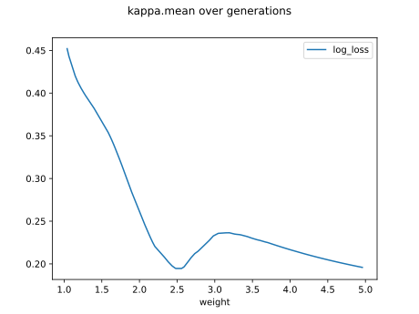

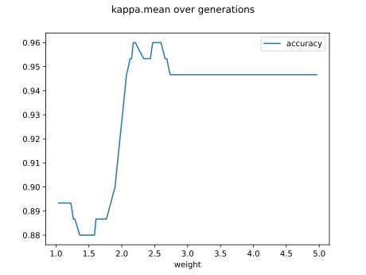

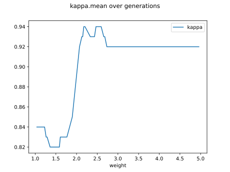

#### Network

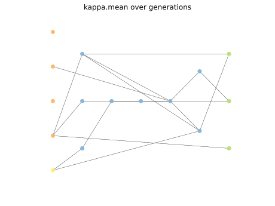

### Individual 13690

| key                    |      value |
|:-----------------------|-----------:|
| mean log_loss:         |   0.247302 |
| mean accuracy:         |   0.936333 |
| mean kappa:            |   0.9045   |
| number of edges        |  37        |
| number of hidden nodes |   8        |
| number of layers       |   5        |
| birth                  | 153        |

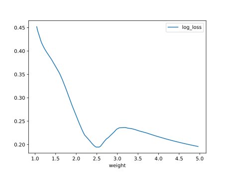

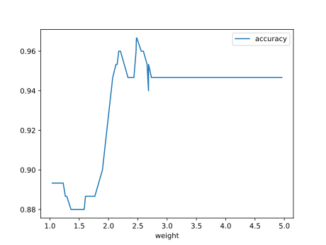

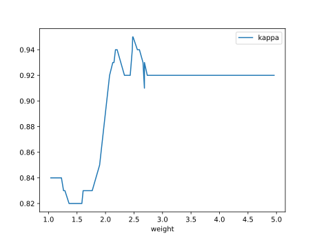

#### Network

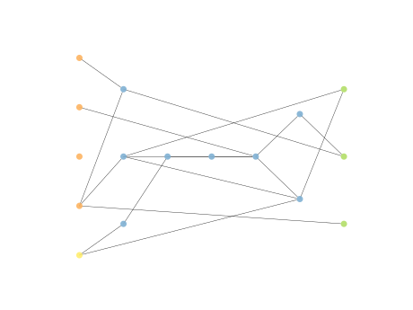

### Individual 14255

| key                    |      value |
|:-----------------------|-----------:|
| mean log_loss:         |   0.249528 |
| mean accuracy:         |   0.901133 |
| mean kappa:            |   0.8517   |
| number of edges        |  39        |
| number of hidden nodes |   9        |
| number of layers       |   7        |
| birth                  | 159        |

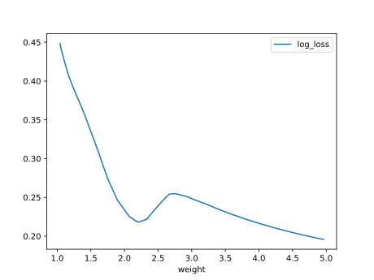

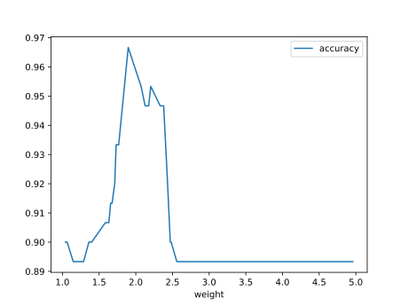

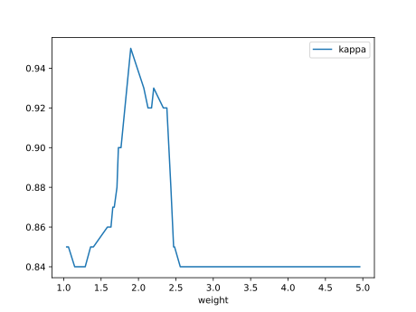

#### Network

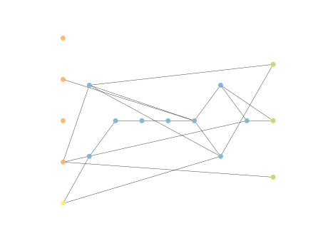

### Individual 13738

| key                    |      value |
|:-----------------------|-----------:|
| mean log_loss:         |   0.250778 |
| mean accuracy:         |   0.901933 |
| mean kappa:            |   0.8529   |
| number of edges        |  36        |
| number of hidden nodes |   8        |
| number of layers       |   5        |
| birth                  | 153        |

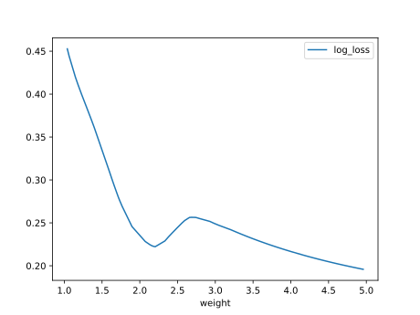

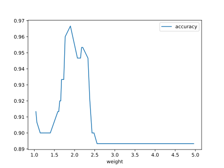

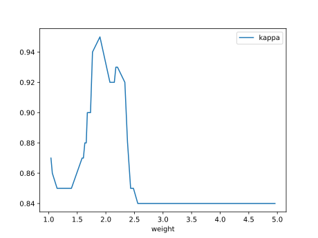

#### Network

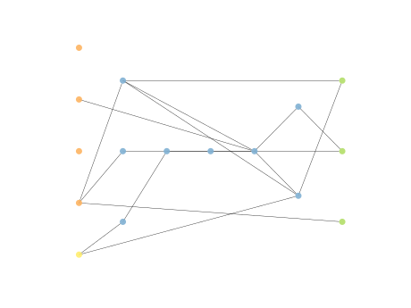

### Individual 14670

| key                    |      value |
|:-----------------------|-----------:|
| mean log_loss:         |   0.248444 |
| mean accuracy:         |   0.903333 |
| mean kappa:            |   0.855    |
| number of edges        |  39        |
| number of hidden nodes |   9        |
| number of layers       |   7        |
| birth                  | 164        |

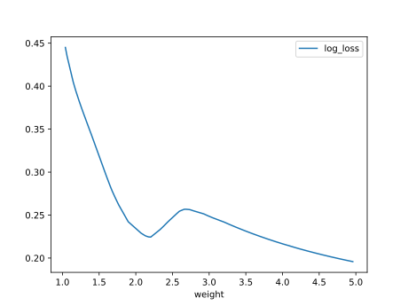

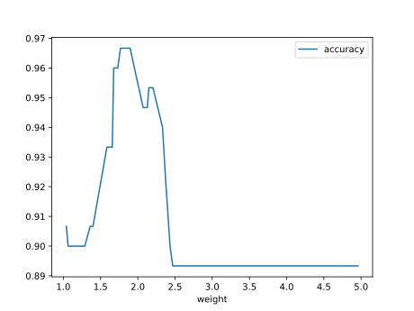

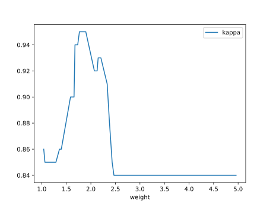

#### Network

### Individual 14339

| key                    |      value |
|:-----------------------|-----------:|
| mean log_loss:         |   0.246832 |
| mean accuracy:         |   0.902533 |
| mean kappa:            |   0.8538   |
| number of edges        |  37        |
| number of hidden nodes |   8        |
| number of layers       |   6        |
| birth                  | 160        |

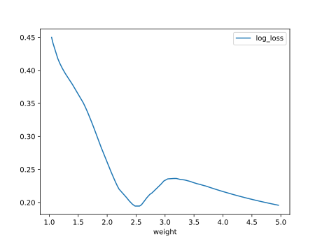

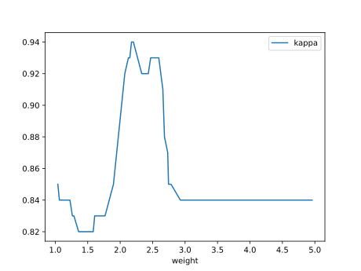

#### Network

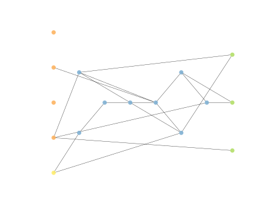

### Individual 14331

| key                    |      value |
|:-----------------------|-----------:|
| mean log_loss:         |   0.247388 |
| mean accuracy:         |   0.902467 |
| mean kappa:            |   0.8537   |
| number of edges        |  38        |
| number of hidden nodes |   8        |
| number of layers       |   6        |
| birth                  | 160        |

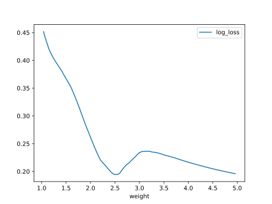

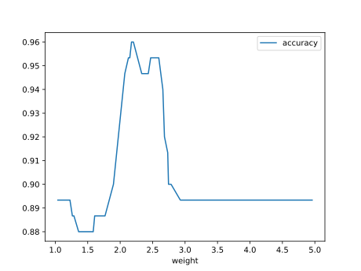

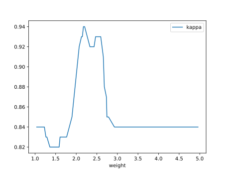

#### Network

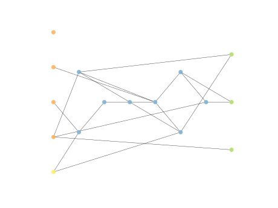

### Individual 14155

| key                    |      value |
|:-----------------------|-----------:|
| mean log_loss:         |   0.248206 |
| mean accuracy:         |   0.903333 |
| mean kappa:            |   0.855    |
| number of edges        |  38        |
| number of hidden nodes |   8        |
| number of layers       |   7        |
| birth                  | 158        |

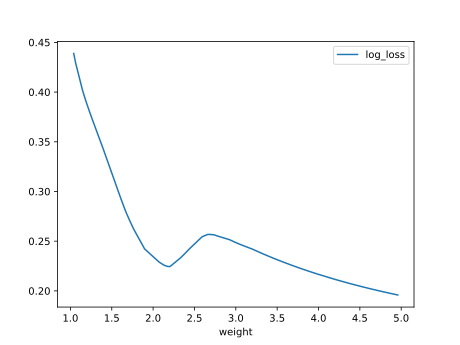

#### Network

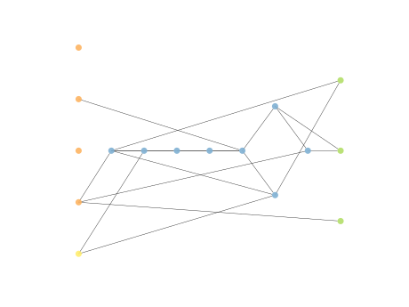

### Individual 13650

| key                    |      value |
|:-----------------------|-----------:|
| mean log_loss:         |   0.248919 |
| mean accuracy:         |   0.9022   |
| mean kappa:            |   0.8533   |
| number of edges        |  36        |
| number of hidden nodes |   8        |
| number of layers       |   5        |
| birth                  | 152        |

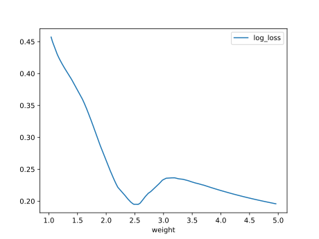

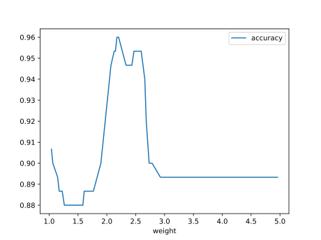

#### Network

### Individual 13862

| key                    |      value |
|:-----------------------|-----------:|
| mean log_loss:         |   0.248919 |
| mean accuracy:         |   0.9022   |
| mean kappa:            |   0.8533   |
| number of edges        |  38        |
| number of hidden nodes |   9        |
| number of layers       |   6        |
| birth                  | 155        |

#### Network

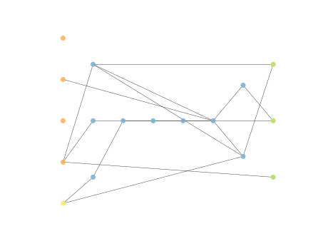

