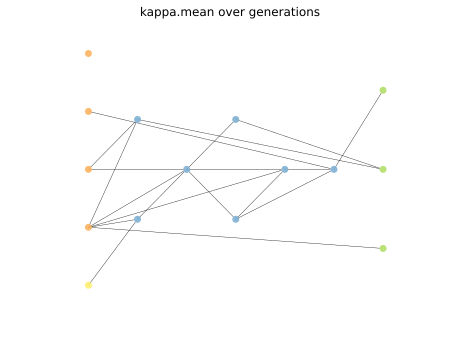
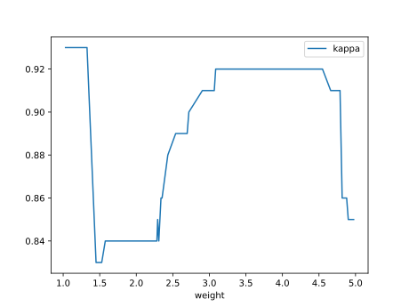

# Report Iris Uniform Distribution [1, 5] run 7

## Best results in hall of fame

| measure       |    value |   individual |
|:--------------|---------:|-------------:|
| mean accuracy | 0.934467 |        14513 |
| max accuracy  | 0.96     |        17419 |
| mean kappa    | 0.9017   |        14513 |
| max kappa     | 0.94     |        17419 |

## Individuals in hall of fame

### Individual 14513

| key                    |      value |
|:-----------------------|-----------:|
| mean log_loss:         |   0.280756 |
| mean accuracy:         |   0.934467 |
| mean kappa:            |   0.9017   |
| number of edges        |  37        |
| number of hidden nodes |   7        |
| number of layers       |   5        |
| birth                  | 162        |

#### Network

### Individual 17419

| key                    |      value |
|:-----------------------|-----------:|
| mean log_loss:         |   0.282484 |
| mean accuracy:         |   0.930933 |
| mean kappa:            |   0.8964   |
| number of edges        |  43        |
| number of hidden nodes |  10        |
| number of layers       |   6        |
| birth                  | 194        |

#### Network

### Individual 15867

| key                    |      value |
|:-----------------------|-----------:|
| mean log_loss:         |   0.282664 |
| mean accuracy:         |   0.930933 |
| mean kappa:            |   0.8964   |
| number of edges        |  40        |
| number of hidden nodes |   8        |
| number of layers       |   6        |
| birth                  | 177        |

#### Network

### Individual 14922

| key                    |      value |
|:-----------------------|-----------:|
| mean log_loss:         |   0.276455 |
| mean accuracy:         |   0.932533 |
| mean kappa:            |   0.8988   |
| number of edges        |  39        |
| number of hidden nodes |   8        |
| number of layers       |   5        |
| birth                  | 166        |

#### Network

### Individual 14115

| key                    |      value |
|:-----------------------|-----------:|
| mean log_loss:         |   0.279377 |
| mean accuracy:         |   0.9316   |
| mean kappa:            |   0.8974   |
| number of edges        |  37        |
| number of hidden nodes |   7        |
| number of layers       |   5        |
| birth                  | 157        |

#### Network

### Individual 14408

| key                    |      value |
|:-----------------------|-----------:|
| mean log_loss:         |   0.279992 |
| mean accuracy:         |   0.931533 |
| mean kappa:            |   0.8973   |
| number of edges        |  38        |
| number of hidden nodes |   7        |
| number of layers       |   5        |
| birth                  | 161        |

#### Network

### Individual 14618

| key                    |      value |
|:-----------------------|-----------:|
| mean log_loss:         |   0.292945 |
| mean accuracy:         |   0.932533 |
| mean kappa:            |   0.8988   |
| number of edges        |  37        |
| number of hidden nodes |   7        |
| number of layers       |   5        |
| birth                  | 163        |

#### Network

### Individual 14722

| key                    |      value |
|:-----------------------|-----------:|
| mean log_loss:         |   0.277233 |
| mean accuracy:         |   0.932533 |
| mean kappa:            |   0.8988   |
| number of edges        |  39        |
| number of hidden nodes |   8        |
| number of layers       |   5        |
| birth                  | 164        |

#### Network

### Individual 16480

| key                    |      value |
|:-----------------------|-----------:|
| mean log_loss:         |   0.282851 |
| mean accuracy:         |   0.930933 |
| mean kappa:            |   0.8964   |
| number of edges        |  41        |
| number of hidden nodes |   9        |
| number of layers       |   6        |
| birth                  | 184        |

#### Network

### Individual 14678

| key                    |      value |
|:-----------------------|-----------:|
| mean log_loss:         |   0.282623 |
| mean accuracy:         |   0.930933 |
| mean kappa:            |   0.8964   |
| number of edges        |  39        |
| number of hidden nodes |   8        |
| number of layers       |   6        |
| birth                  | 164        |

#### Network

