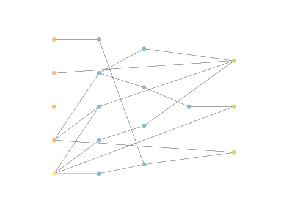
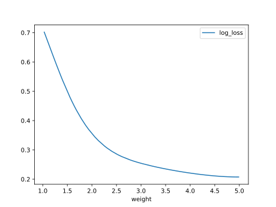

# Report Iris Uniform Distribution [1, 5] run 8

## Best results in hall of fame

| measure       |   value |   individual |
|:--------------|--------:|-------------:|
| mean accuracy |  0.9322 |        16241 |
| max accuracy  |  0.96   |        16410 |
| mean kappa    |  0.8983 |        16241 |
| max kappa     |  0.94   |        16410 |

## Individuals in hall of fame

### Individual 16410

| key                    |      value |
|:-----------------------|-----------:|
| mean log_loss:         |   0.300123 |
| mean accuracy:         |   0.932067 |
| mean kappa:            |   0.8981   |
| number of edges        |  42        |
| number of hidden nodes |  12        |
| number of layers       |   3        |
| birth                  | 183        |

#### Network

### Individual 15576

| key                    |      value |
|:-----------------------|-----------:|
| mean log_loss:         |   0.299605 |
| mean accuracy:         |   0.931867 |
| mean kappa:            |   0.8978   |
| number of edges        |  38        |
| number of hidden nodes |  10        |
| number of layers       |   3        |
| birth                  | 174        |

#### Network

### Individual 16241

| key                    |      value |
|:-----------------------|-----------:|
| mean log_loss:         |   0.299242 |
| mean accuracy:         |   0.9322   |
| mean kappa:            |   0.8983   |
| number of edges        |  40        |
| number of hidden nodes |  11        |
| number of layers       |   3        |
| birth                  | 181        |

#### Network

### Individual 15550

| key                    |      value |
|:-----------------------|-----------:|
| mean log_loss:         |   0.304385 |
| mean accuracy:         |   0.9276   |
| mean kappa:            |   0.8914   |
| number of edges        |  36        |
| number of hidden nodes |   9        |
| number of layers       |   3        |
| birth                  | 173        |

#### Network

### Individual 16479

| key                    |      value |
|:-----------------------|-----------:|
| mean log_loss:         |   0.304858 |
| mean accuracy:         |   0.918533 |
| mean kappa:            |   0.8778   |
| number of edges        |  43        |
| number of hidden nodes |  12        |
| number of layers       |   3        |
| birth                  | 184        |

#### Network

### Individual 15083

| key                    |      value |
|:-----------------------|-----------:|
| mean log_loss:         |   0.304957 |
| mean accuracy:         |   0.927533 |
| mean kappa:            |   0.8913   |
| number of edges        |  34        |
| number of hidden nodes |   8        |
| number of layers       |   3        |
| birth                  | 168        |

#### Network

### Individual 15505

| key                    |      value |
|:-----------------------|-----------:|
| mean log_loss:         |   0.314532 |
| mean accuracy:         |   0.920267 |
| mean kappa:            |   0.8804   |
| number of edges        |  34        |
| number of hidden nodes |   8        |
| number of layers       |   3        |
| birth                  | 173        |

#### Network

### Individual 16320

| key                    |      value |
|:-----------------------|-----------:|
| mean log_loss:         |   0.299242 |
| mean accuracy:         |   0.9322   |
| mean kappa:            |   0.8983   |
| number of edges        |  41        |
| number of hidden nodes |  11        |
| number of layers       |   3        |
| birth                  | 182        |

#### Network

### Individual 13900

| key                    |      value |
|:-----------------------|-----------:|
| mean log_loss:         |   0.314532 |
| mean accuracy:         |   0.920267 |
| mean kappa:            |   0.8804   |
| number of edges        |  32        |
| number of hidden nodes |   7        |
| number of layers       |   3        |
| birth                  | 155        |

#### Network

### Individual 14982

| key                    |      value |
|:-----------------------|-----------:|
| mean log_loss:         |   0.306055 |
| mean accuracy:         |   0.915133 |
| mean kappa:            |   0.8727   |
| number of edges        |  34        |
| number of hidden nodes |   8        |
| number of layers       |   3        |
| birth                  | 167        |

#### Network

