# Report Iris Uniform Distribution [1, 5] run 9

## Best results in hall of fame

| measure       |    value |   individual |
|:--------------|---------:|-------------:|
| mean accuracy | 0.943533 |        17165 |
| max accuracy  | 0.96     |        17379 |
| mean kappa    | 0.9153   |        17165 |
| max kappa     | 0.94     |        17379 |

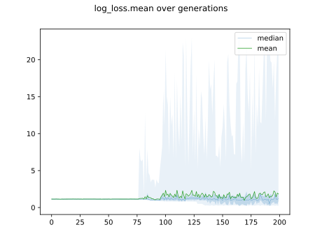

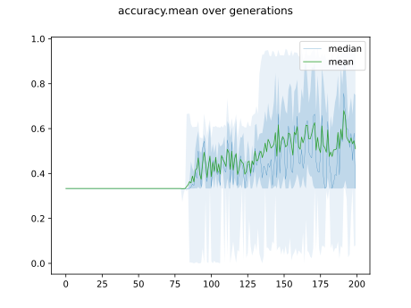

## Individuals in hall of fame

### Individual 17379

| key                    |      value |
|:-----------------------|-----------:|
| mean log_loss:         |   0.288953 |
| mean accuracy:         |   0.941133 |
| mean kappa:            |   0.9117   |
| number of edges        |  67        |
| number of hidden nodes |  23        |
| number of layers       |  19        |
| birth                  | 194        |

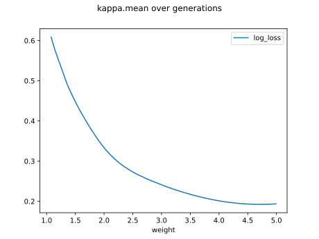

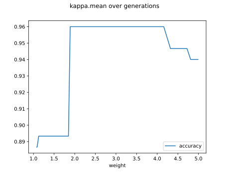

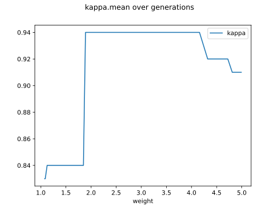

#### Network

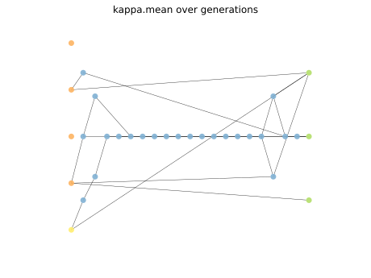

### Individual 17564

| key                    |      value |
|:-----------------------|-----------:|
| mean log_loss:         |   0.290382 |
| mean accuracy:         |   0.940067 |
| mean kappa:            |   0.9101   |
| number of edges        |  69        |
| number of hidden nodes |  24        |
| number of layers       |  20        |
| birth                  | 196        |

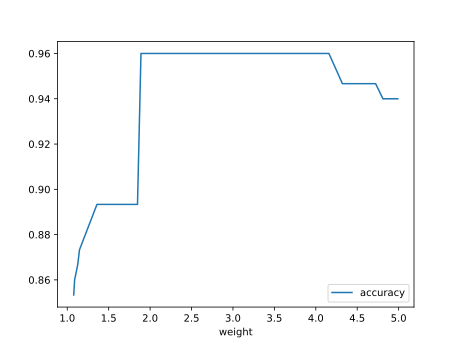

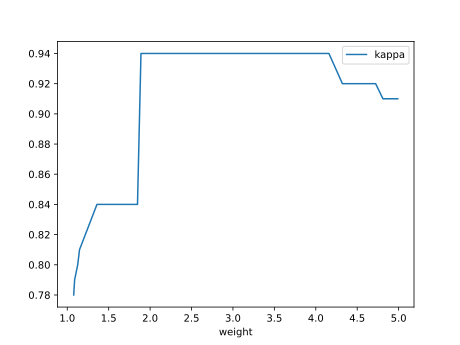

#### Network

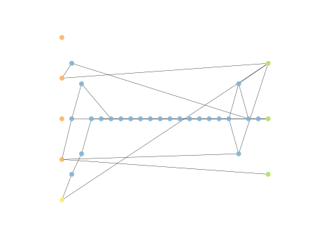

### Individual 17448

| key                    |      value |
|:-----------------------|-----------:|
| mean log_loss:         |   0.297157 |
| mean accuracy:         |   0.9434   |
| mean kappa:            |   0.9151   |
| number of edges        |  68        |
| number of hidden nodes |  24        |
| number of layers       |  19        |
| birth                  | 194        |

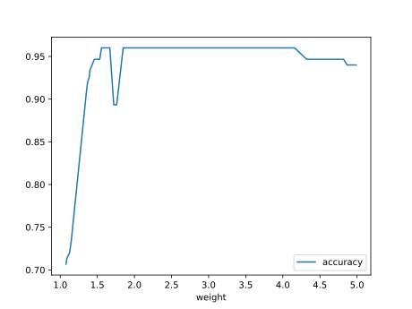

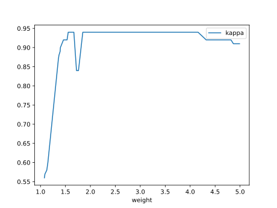

#### Network

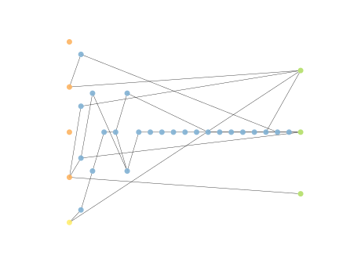

### Individual 17165

| key                    |      value |
|:-----------------------|-----------:|
| mean log_loss:         |   0.294605 |
| mean accuracy:         |   0.943533 |
| mean kappa:            |   0.9153   |
| number of edges        |  64        |
| number of hidden nodes |  22        |
| number of layers       |  17        |
| birth                  | 191        |

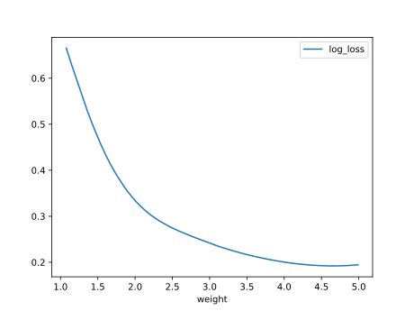

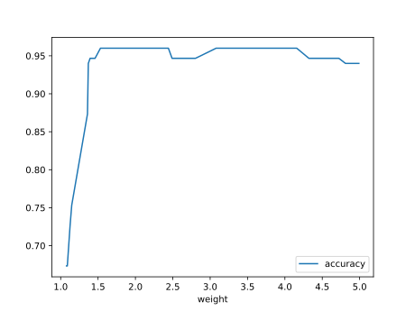

#### Network

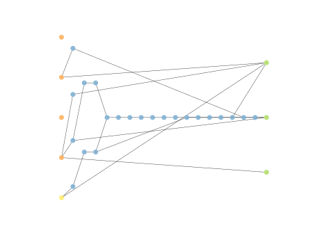

### Individual 17223

| key                    |      value |
|:-----------------------|-----------:|
| mean log_loss:         |   0.294274 |
| mean accuracy:         |   0.943333 |
| mean kappa:            |   0.915    |
| number of edges        |  64        |
| number of hidden nodes |  22        |
| number of layers       |  17        |
| birth                  | 192        |

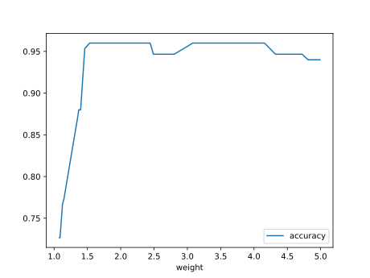

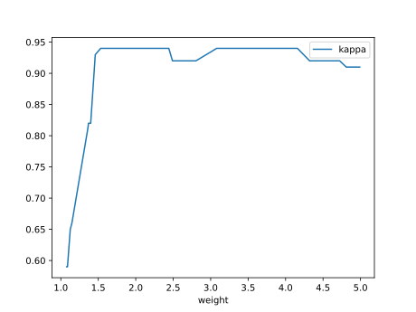

#### Network

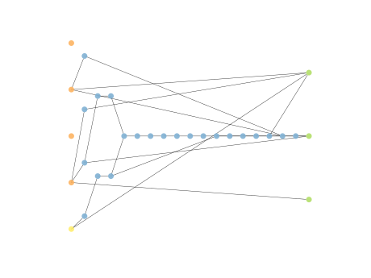

### Individual 17177

| key                    |      value |
|:-----------------------|-----------:|
| mean log_loss:         |   0.29693  |
| mean accuracy:         |   0.942267 |
| mean kappa:            |   0.9134   |
| number of edges        |  64        |
| number of hidden nodes |  22        |
| number of layers       |  18        |
| birth                  | 191        |

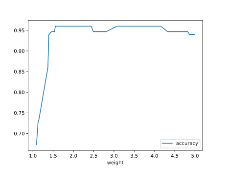

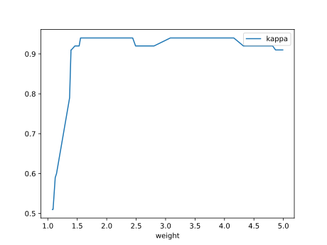

#### Network

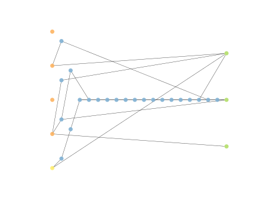

### Individual 17354

| key                    |      value |
|:-----------------------|-----------:|
| mean log_loss:         |   0.297479 |
| mean accuracy:         |   0.931133 |
| mean kappa:            |   0.8967   |
| number of edges        |  66        |
| number of hidden nodes |  23        |
| number of layers       |  19        |
| birth                  | 193        |

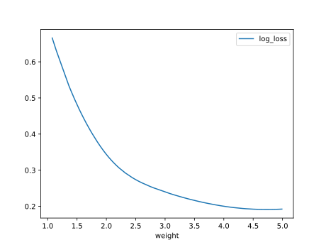

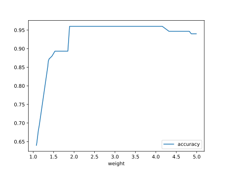

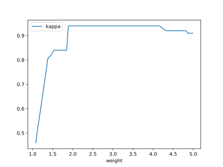

#### Network

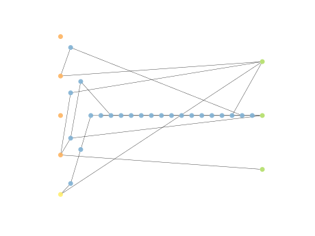

### Individual 17873

| key                    |      value |
|:-----------------------|-----------:|
| mean log_loss:         |   0.291978 |
| mean accuracy:         |   0.929733 |
| mean kappa:            |   0.8946   |
| number of edges        |  68        |
| number of hidden nodes |  23        |
| number of layers       |  19        |
| birth                  | 199        |

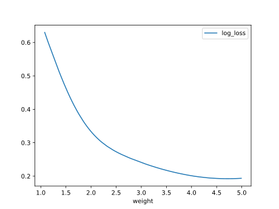

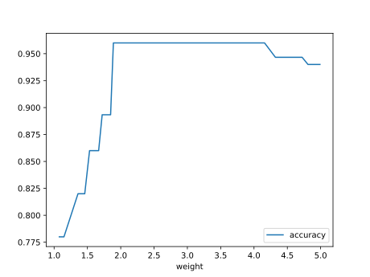

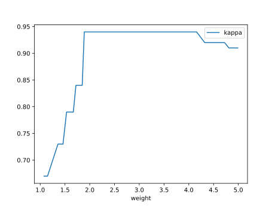

#### Network

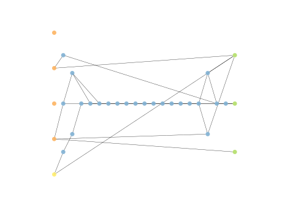

### Individual 17686

| key                    |      value |
|:-----------------------|-----------:|
| mean log_loss:         |   0.292026 |
| mean accuracy:         |   0.929733 |
| mean kappa:            |   0.8946   |
| number of edges        |  68        |
| number of hidden nodes |  23        |
| number of layers       |  19        |
| birth                  | 197        |

#### Network

### Individual 12285

| key                    |      value |
|:-----------------------|-----------:|
| mean log_loss:         |   0.309058 |
| mean accuracy:         |   0.933933 |
| mean kappa:            |   0.9009   |
| number of edges        |  29        |
| number of hidden nodes |   6        |
| number of layers       |   4        |
| birth                  | 137        |

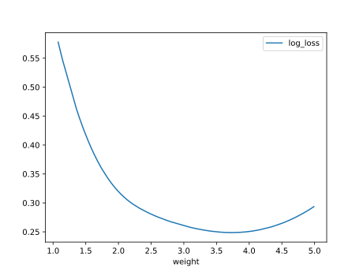

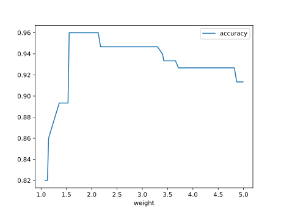

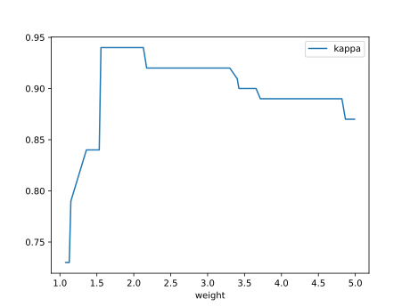

#### Network

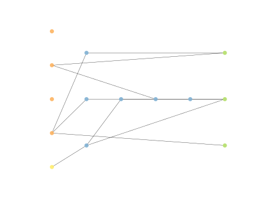

