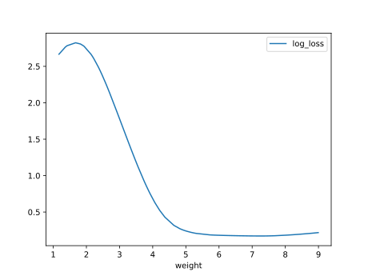

# Report Iris Uniform Distribution [1, 9] run 0

## Best results in hall of fame

| measure       |    value |   individual |
|:--------------|---------:|-------------:|
| mean accuracy | 0.817667 |        17585 |
| max accuracy  | 0.96     |        17884 |
| mean kappa    | 0.7265   |        17585 |
| max kappa     | 0.94     |        17884 |

## Individuals in hall of fame

### Individual 17097

| key                    |      value |
|:-----------------------|-----------:|
| mean log_loss:         |   0.489399 |
| mean accuracy:         |   0.81     |
| mean kappa:            |   0.715    |
| number of edges        |  35        |
| number of hidden nodes |   9        |
| number of layers       |   6        |
| birth                  | 190        |

#### Network

### Individual 17585

| key                    |      value |
|:-----------------------|-----------:|
| mean log_loss:         |   0.436486 |
| mean accuracy:         |   0.817667 |
| mean kappa:            |   0.7265   |
| number of edges        |  40        |
| number of hidden nodes |  11        |
| number of layers       |   6        |
| birth                  | 196        |

#### Network

### Individual 17884

| key                    |      value |
|:-----------------------|-----------:|
| mean log_loss:         |   0.370762 |
| mean accuracy:         |   0.813667 |
| mean kappa:            |   0.7205   |
| number of edges        |  41        |
| number of hidden nodes |  11        |
| number of layers       |   6        |
| birth                  | 199        |

#### Network

### Individual 17139

| key                    |      value |
|:-----------------------|-----------:|
| mean log_loss:         |   0.85824  |
| mean accuracy:         |   0.740267 |
| mean kappa:            |   0.6104   |
| number of edges        |  35        |
| number of hidden nodes |   9        |
| number of layers       |   6        |
| birth                  | 191        |

#### Network

### Individual 17407

| key                    |      value |
|:-----------------------|-----------:|
| mean log_loss:         |   0.460661 |
| mean accuracy:         |   0.813867 |
| mean kappa:            |   0.7208   |
| number of edges        |  39        |
| number of hidden nodes |  11        |
| number of layers       |   6        |
| birth                  | 194        |

#### Network

### Individual 17544

| key                    |      value |
|:-----------------------|-----------:|
| mean log_loss:         |   1.04217  |
| mean accuracy:         |   0.732133 |
| mean kappa:            |   0.5982   |
| number of edges        |  38        |
| number of hidden nodes |  10        |
| number of layers       |   7        |
| birth                  | 195        |

#### Network

### Individual 17660

| key                    |      value |
|:-----------------------|-----------:|
| mean log_loss:         |   0.404599 |
| mean accuracy:         |   0.798933 |
| mean kappa:            |   0.6984   |
| number of edges        |  41        |
| number of hidden nodes |  11        |
| number of layers       |   6        |
| birth                  | 197        |

#### Network

### Individual 17895

| key                    |      value |
|:-----------------------|-----------:|
| mean log_loss:         |   0.446825 |
| mean accuracy:         |   0.780867 |
| mean kappa:            |   0.6713   |
| number of edges        |  41        |
| number of hidden nodes |  11        |
| number of layers       |   6        |
| birth                  | 199        |

#### Network

### Individual 17633

| key                    |      value |
|:-----------------------|-----------:|
| mean log_loss:         |   1.01066  |
| mean accuracy:         |   0.733067 |
| mean kappa:            |   0.5996   |
| number of edges        |  39        |
| number of hidden nodes |  10        |
| number of layers       |   7        |
| birth                  | 196        |

#### Network

### Individual 17281

| key                    |      value |
|:-----------------------|-----------:|
| mean log_loss:         |   0.782141 |
| mean accuracy:         |   0.744933 |
| mean kappa:            |   0.6174   |
| number of edges        |  37        |
| number of hidden nodes |  10        |
| number of layers       |   6        |
| birth                  | 193        |

#### Network

