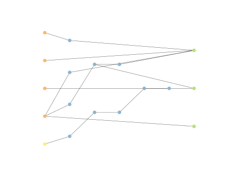

# Report Iris Uniform Distribution [1, 9] run 1

## Best results in hall of fame

| measure       |    value |   individual |
|:--------------|---------:|-------------:|
| mean accuracy | 0.935267 |        17727 |
| max accuracy  | 0.96     |        15616 |
| mean kappa    | 0.9029   |        17727 |
| max kappa     | 0.94     |        15616 |

## Individuals in hall of fame

### Individual 17727

| key                    |      value |
|:-----------------------|-----------:|
| mean log_loss:         |   0.234415 |
| mean accuracy:         |   0.935267 |
| mean kappa:            |   0.9029   |
| number of edges        |  35        |
| number of hidden nodes |   9        |
| number of layers       |   4        |
| birth                  | 197        |

#### Network

### Individual 17295

| key                    |      value |
|:-----------------------|-----------:|
| mean log_loss:         |   0.234431 |
| mean accuracy:         |   0.935267 |
| mean kappa:            |   0.9029   |
| number of edges        |  33        |
| number of hidden nodes |   8        |
| number of layers       |   3        |
| birth                  | 193        |

#### Network

### Individual 16863

| key                    |     value |
|:-----------------------|----------:|
| mean log_loss:         |   0.30313 |
| mean accuracy:         |   0.923   |
| mean kappa:            |   0.8845  |
| number of edges        |  31       |
| number of hidden nodes |   7       |
| number of layers       |   3       |
| birth                  | 188       |

#### Network

### Individual 17988

| key                    |      value |
|:-----------------------|-----------:|
| mean log_loss:         |   0.234668 |
| mean accuracy:         |   0.9342   |
| mean kappa:            |   0.9013   |
| number of edges        |  37        |
| number of hidden nodes |  10        |
| number of layers       |   4        |
| birth                  | 200        |

#### Network

### Individual 16982

| key                    |      value |
|:-----------------------|-----------:|
| mean log_loss:         |   0.234431 |
| mean accuracy:         |   0.935267 |
| mean kappa:            |   0.9029   |
| number of edges        |  31        |
| number of hidden nodes |   7        |
| number of layers       |   3        |
| birth                  | 189        |

#### Network

### Individual 17574

| key                    |      value |
|:-----------------------|-----------:|
| mean log_loss:         |   0.234431 |
| mean accuracy:         |   0.935267 |
| mean kappa:            |   0.9029   |
| number of edges        |  37        |
| number of hidden nodes |  10        |
| number of layers       |   5        |
| birth                  | 196        |

#### Network

### Individual 17393

| key                    |      value |
|:-----------------------|-----------:|
| mean log_loss:         |   0.234431 |
| mean accuracy:         |   0.935267 |
| mean kappa:            |   0.9029   |
| number of edges        |  35        |
| number of hidden nodes |   9        |
| number of layers       |   4        |
| birth                  | 194        |

#### Network

### Individual 15616

| key                    |      value |
|:-----------------------|-----------:|
| mean log_loss:         |   0.245447 |
| mean accuracy:         |   0.903733 |
| mean kappa:            |   0.8556   |
| number of edges        |  42        |
| number of hidden nodes |  13        |
| number of layers       |   5        |
| birth                  | 174        |

#### Network

### Individual 16861

| key                    |      value |
|:-----------------------|-----------:|
| mean log_loss:         |   0.282096 |
| mean accuracy:         |   0.902    |
| mean kappa:            |   0.853    |
| number of edges        |  33        |
| number of hidden nodes |   8        |
| number of layers       |   4        |
| birth                  | 188        |

#### Network

### Individual 16580

| key                    |      value |
|:-----------------------|-----------:|
| mean log_loss:         |   0.286432 |
| mean accuracy:         |   0.910333 |
| mean kappa:            |   0.8655   |
| number of edges        |  27        |
| number of hidden nodes |   5        |
| number of layers       |   2        |
| birth                  | 185        |

#### Network

