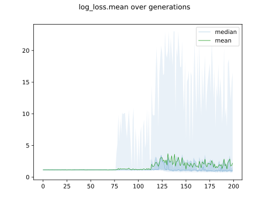
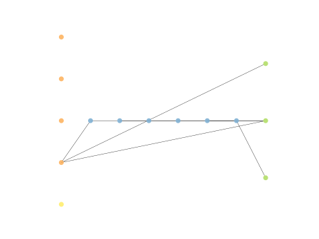
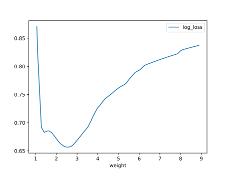
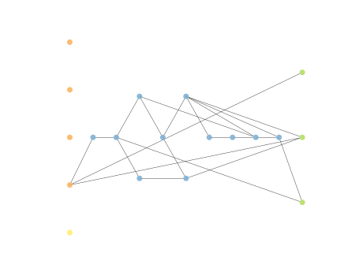
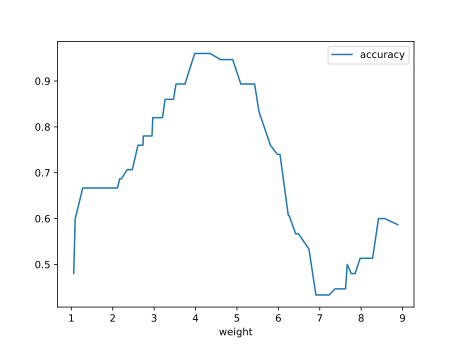
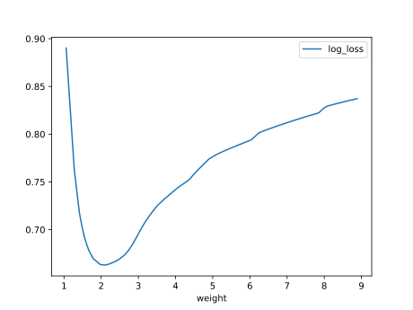
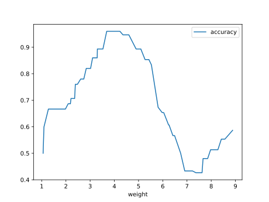

# Report Iris Uniform Distribution [1, 9] run 2

## Best results in hall of fame

| measure       |   value |   individual |
|:--------------|--------:|-------------:|
| mean accuracy |  0.7658 |        12532 |
| max accuracy  |  0.96   |        15946 |
| mean kappa    |  0.6487 |        12532 |
| max kappa     |  0.94   |        15946 |

## Individuals in hall of fame

### Individual 15946

| key                    |      value |
|:-----------------------|-----------:|
| mean log_loss:         |   0.76065  |
| mean accuracy:         |   0.753333 |
| mean kappa:            |   0.63     |
| number of edges        |  46        |
| number of hidden nodes |  14        |
| number of layers       |  10        |
| birth                  | 178        |

#### Network

### Individual 16021

| key                    |      value |
|:-----------------------|-----------:|
| mean log_loss:         |   0.760007 |
| mean accuracy:         |   0.752467 |
| mean kappa:            |   0.6287   |
| number of edges        |  44        |
| number of hidden nodes |  13        |
| number of layers       |  10        |
| birth                  | 179        |

#### Network

### Individual 12532

| key                    |      value |
|:-----------------------|-----------:|
| mean log_loss:         |   0.772086 |
| mean accuracy:         |   0.7658   |
| mean kappa:            |   0.6487   |
| number of edges        |  29        |
| number of hidden nodes |   6        |
| number of layers       |   6        |
| birth                  | 140        |

#### Network

### Individual 12507

| key                    |      value |
|:-----------------------|-----------:|
| mean log_loss:         |   0.780555 |
| mean accuracy:         |   0.7534   |
| mean kappa:            |   0.6301   |
| number of edges        |  27        |
| number of hidden nodes |   5        |
| number of layers       |   5        |
| birth                  | 139        |

#### Network

### Individual 16219

| key                    |      value |
|:-----------------------|-----------:|
| mean log_loss:         |   0.742688 |
| mean accuracy:         |   0.6932   |
| mean kappa:            |   0.5398   |
| number of edges        |  42        |
| number of hidden nodes |  11        |
| number of layers       |   9        |
| birth                  | 181        |

#### Network

### Individual 15337

| key                    |      value |
|:-----------------------|-----------:|
| mean log_loss:         |   0.743701 |
| mean accuracy:         |   0.6922   |
| mean kappa:            |   0.5383   |
| number of edges        |  42        |
| number of hidden nodes |  12        |
| number of layers       |  10        |
| birth                  | 171        |

#### Network

### Individual 14717

| key                    |      value |
|:-----------------------|-----------:|
| mean log_loss:         |   0.743346 |
| mean accuracy:         |   0.693467 |
| mean kappa:            |   0.5402   |
| number of edges        |  42        |
| number of hidden nodes |  12        |
| number of layers       |  10        |
| birth                  | 164        |

#### Network

### Individual 12289

| key                    |      value |
|:-----------------------|-----------:|
| mean log_loss:         |   0.774641 |
| mean accuracy:         |   0.7482   |
| mean kappa:            |   0.6223   |
| number of edges        |  25        |
| number of hidden nodes |   4        |
| number of layers       |   4        |
| birth                  | 137        |

#### Network

### Individual 13484

| key                    |      value |
|:-----------------------|-----------:|
| mean log_loss:         |   0.753603 |
| mean accuracy:         |   0.7012   |
| mean kappa:            |   0.5518   |
| number of edges        |  34        |
| number of hidden nodes |   8        |
| number of layers       |   7        |
| birth                  | 150        |

#### Network

### Individual 17019

| key                    |      value |
|:-----------------------|-----------:|
| mean log_loss:         |   0.740336 |
| mean accuracy:         |   0.6932   |
| mean kappa:            |   0.5398   |
| number of edges        |  43        |
| number of hidden nodes |  12        |
| number of layers       |   9        |
| birth                  | 190        |

#### Network

