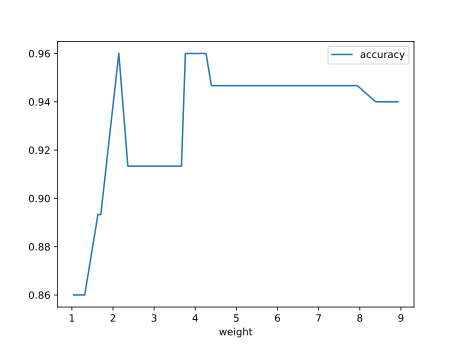

# Report Iris Uniform Distribution [1, 9] run 3

## Best results in hall of fame

| measure       |    value |   individual |
|:--------------|---------:|-------------:|
| mean accuracy | 0.938933 |        13836 |
| max accuracy  | 0.96     |        17912 |
| mean kappa    | 0.9084   |        13836 |
| max kappa     | 0.94     |        17912 |

## Individuals in hall of fame

### Individual 13836

| key                    |      value |
|:-----------------------|-----------:|
| mean log_loss:         |   0.245707 |
| mean accuracy:         |   0.938933 |
| mean kappa:            |   0.9084   |
| number of edges        |  50        |
| number of hidden nodes |  16        |
| number of layers       |   8        |
| birth                  | 154        |

#### Network

### Individual 13719

| key                    |      value |
|:-----------------------|-----------:|
| mean log_loss:         |   0.245707 |
| mean accuracy:         |   0.938933 |
| mean kappa:            |   0.9084   |
| number of edges        |  48        |
| number of hidden nodes |  15        |
| number of layers       |   8        |
| birth                  | 153        |

#### Network

### Individual 12117

| key                    |      value |
|:-----------------------|-----------:|
| mean log_loss:         |   0.262621 |
| mean accuracy:         |   0.938667 |
| mean kappa:            |   0.908    |
| number of edges        |  37        |
| number of hidden nodes |  10        |
| number of layers       |   5        |
| birth                  | 135        |

#### Network

### Individual 17912

| key                    |      value |
|:-----------------------|-----------:|
| mean log_loss:         |   0.21355  |
| mean accuracy:         |   0.938667 |
| mean kappa:            |   0.908    |
| number of edges        |  64        |
| number of hidden nodes |  21        |
| number of layers       |  13        |
| birth                  | 200        |

#### Network

### Individual 17123

| key                    |      value |
|:-----------------------|-----------:|
| mean log_loss:         |   0.214303 |
| mean accuracy:         |   0.938667 |
| mean kappa:            |   0.908    |
| number of edges        |  63        |
| number of hidden nodes |  21        |
| number of layers       |  13        |
| birth                  | 191        |

#### Network

### Individual 16837

| key                    |      value |
|:-----------------------|-----------:|
| mean log_loss:         |   0.220715 |
| mean accuracy:         |   0.9366   |
| mean kappa:            |   0.9049   |
| number of edges        |  62        |
| number of hidden nodes |  21        |
| number of layers       |  13        |
| birth                  | 188        |

#### Network

### Individual 17767

| key                    |      value |
|:-----------------------|-----------:|
| mean log_loss:         |   0.21355  |
| mean accuracy:         |   0.938667 |
| mean kappa:            |   0.908    |
| number of edges        |  64        |
| number of hidden nodes |  21        |
| number of layers       |  13        |
| birth                  | 198        |

#### Network

### Individual 15195

| key                    |      value |
|:-----------------------|-----------:|
| mean log_loss:         |   0.246118 |
| mean accuracy:         |   0.937867 |
| mean kappa:            |   0.9068   |
| number of edges        |  54        |
| number of hidden nodes |  17        |
| number of layers       |   9        |
| birth                  | 169        |

#### Network

### Individual 17886

| key                    |      value |
|:-----------------------|-----------:|
| mean log_loss:         |   0.21355  |
| mean accuracy:         |   0.938667 |
| mean kappa:            |   0.908    |
| number of edges        |  64        |
| number of hidden nodes |  21        |
| number of layers       |  13        |
| birth                  | 199        |

#### Network

### Individual 15289

| key                    |      value |
|:-----------------------|-----------:|
| mean log_loss:         |   0.245652 |
| mean accuracy:         |   0.937333 |
| mean kappa:            |   0.906    |
| number of edges        |  55        |
| number of hidden nodes |  17        |
| number of layers       |   9        |
| birth                  | 170        |

#### Network

