# Report Iris Uniform Distribution [1, 9] run 4

## Best results in hall of fame

| measure       |    value |   individual |
|:--------------|---------:|-------------:|
| mean accuracy | 0.6998   |        17450 |
| max accuracy  | 0.946667 |        17450 |
| mean kappa    | 0.5497   |        17450 |
| max kappa     | 0.92     |        17450 |

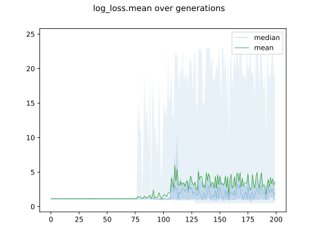

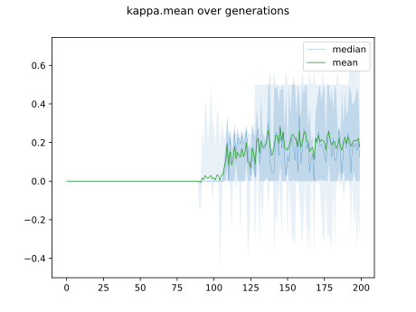

## Individuals in hall of fame

### Individual 17450

| key                    |     value |
|:-----------------------|----------:|
| mean log_loss:         |   1.38187 |
| mean accuracy:         |   0.6998  |
| mean kappa:            |   0.5497  |
| number of edges        |  27       |
| number of hidden nodes |   4       |
| number of layers       |   3       |
| birth                  | 194       |

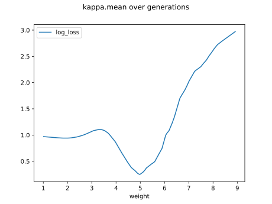

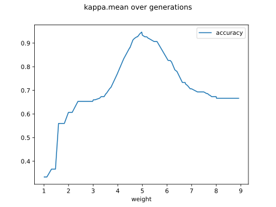

#### Network

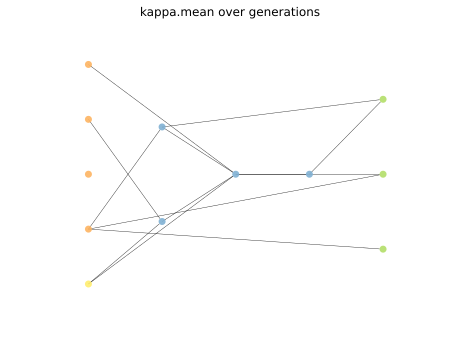

### Individual 17511

| key                    |      value |
|:-----------------------|-----------:|
| mean log_loss:         |   0.621375 |
| mean accuracy:         |   0.666667 |
| mean kappa:            |   0.5      |
| number of edges        |  30        |
| number of hidden nodes |   5        |
| number of layers       |   3        |
| birth                  | 195        |

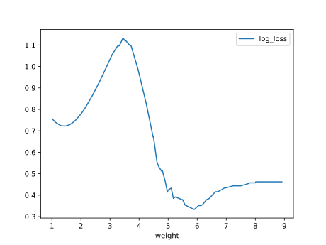

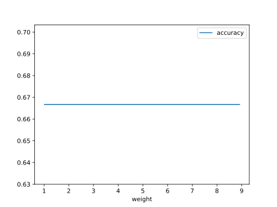

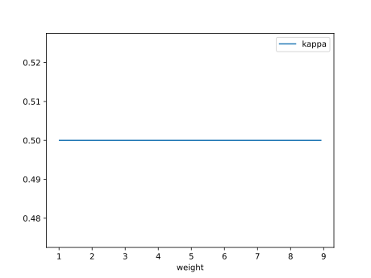

#### Network

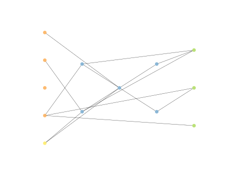

### Individual 11834

| key                    |      value |
|:-----------------------|-----------:|
| mean log_loss:         |   0.497207 |
| mean accuracy:         |   0.666667 |
| mean kappa:            |   0.5      |
| number of edges        |  21        |
| number of hidden nodes |   3        |
| number of layers       |   2        |
| birth                  | 132        |

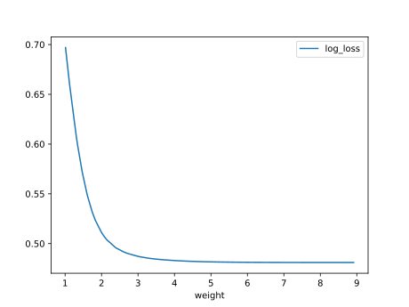

#### Network

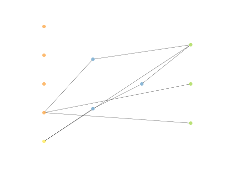

### Individual 14413

| key                    |      value |
|:-----------------------|-----------:|
| mean log_loss:         |   0.493263 |
| mean accuracy:         |   0.6662   |
| mean kappa:            |   0.4993   |
| number of edges        |  23        |
| number of hidden nodes |   3        |
| number of layers       |   2        |
| birth                  | 161        |

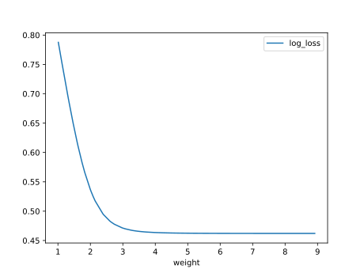

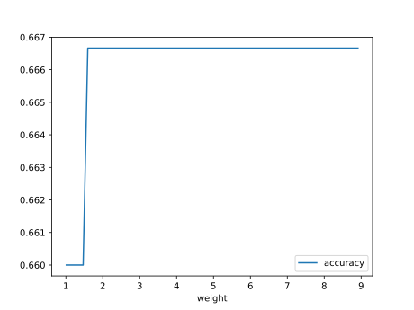

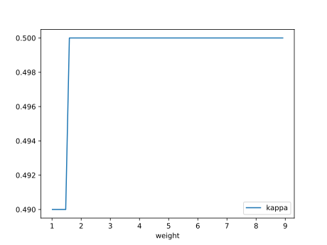

#### Network

### Individual 14488

| key                    |      value |
|:-----------------------|-----------:|
| mean log_loss:         |   0.493263 |
| mean accuracy:         |   0.6662   |
| mean kappa:            |   0.4993   |
| number of edges        |  23        |
| number of hidden nodes |   3        |
| number of layers       |   2        |
| birth                  | 161        |

#### Network

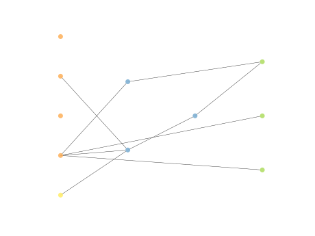

### Individual 14896

| key                    |      value |
|:-----------------------|-----------:|
| mean log_loss:         |   0.493263 |
| mean accuracy:         |   0.6662   |
| mean kappa:            |   0.4993   |
| number of edges        |  22        |
| number of hidden nodes |   3        |
| number of layers       |   2        |
| birth                  | 166        |

#### Network

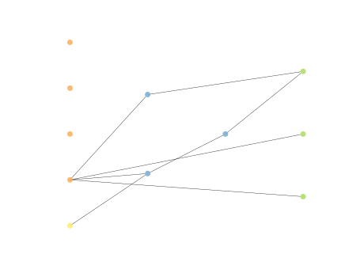

### Individual 16008

| key                    |      value |
|:-----------------------|-----------:|
| mean log_loss:         |   0.493263 |
| mean accuracy:         |   0.6662   |
| mean kappa:            |   0.4993   |
| number of edges        |  25        |
| number of hidden nodes |   4        |
| number of layers       |   3        |
| birth                  | 178        |

#### Network

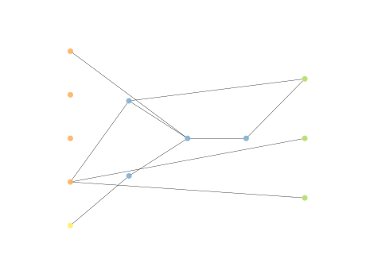

### Individual 15947

| key                    |      value |
|:-----------------------|-----------:|
| mean log_loss:         |   0.493263 |
| mean accuracy:         |   0.6662   |
| mean kappa:            |   0.4993   |
| number of edges        |  25        |
| number of hidden nodes |   4        |
| number of layers       |   3        |
| birth                  | 178        |

#### Network

### Individual 13448

| key                    |      value |
|:-----------------------|-----------:|
| mean log_loss:         |   0.493263 |
| mean accuracy:         |   0.6662   |
| mean kappa:            |   0.4993   |
| number of edges        |  23        |
| number of hidden nodes |   3        |
| number of layers       |   2        |
| birth                  | 150        |

#### Network

### Individual 15769

| key                    |      value |
|:-----------------------|-----------:|
| mean log_loss:         |   0.493263 |
| mean accuracy:         |   0.6662   |
| mean kappa:            |   0.4993   |
| number of edges        |  26        |
| number of hidden nodes |   5        |
| number of layers       |   3        |
| birth                  | 176        |

#### Network

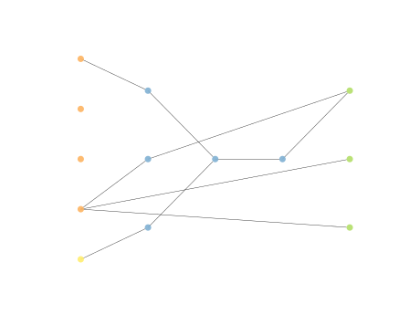

