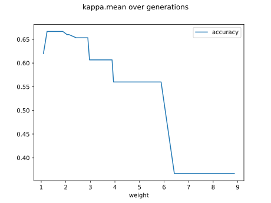

# Report Iris Uniform Distribution [1, 9] run 5

## Best results in hall of fame

| measure       |    value |   individual |
|:--------------|---------:|-------------:|
| mean accuracy | 0.5076   |        14423 |
| max accuracy  | 0.666667 |        14423 |
| mean kappa    | 0.2614   |        14423 |
| max kappa     | 0.5      |        14423 |

## Individuals in hall of fame

### Individual 14423

| key                    |     value |
|:-----------------------|----------:|
| mean log_loss:         |   1.02069 |
| mean accuracy:         |   0.5076  |
| mean kappa:            |   0.2614  |
| number of edges        |  15       |
| number of hidden nodes |   0       |
| number of layers       |   0       |
| birth                  | 161       |

#### Network

### Individual 15937

| key                    |      value |
|:-----------------------|-----------:|
| mean log_loss:         |   2.48259  |
| mean accuracy:         |   0.479333 |
| mean kappa:            |   0.219    |
| number of edges        |  15        |
| number of hidden nodes |   0        |
| number of layers       |   0        |
| birth                  | 178        |

#### Network

### Individual 17173

| key                    |      value |
|:-----------------------|-----------:|
| mean log_loss:         |   2.48259  |
| mean accuracy:         |   0.479333 |
| mean kappa:            |   0.219    |
| number of edges        |  19        |
| number of hidden nodes |   2        |
| number of layers       |   2        |
| birth                  | 191        |

#### Network

### Individual 16090

| key                    |      value |
|:-----------------------|-----------:|
| mean log_loss:         |   2.48259  |
| mean accuracy:         |   0.479333 |
| mean kappa:            |   0.219    |
| number of edges        |  15        |
| number of hidden nodes |   0        |
| number of layers       |   0        |
| birth                  | 179        |

#### Network

### Individual 16837

| key                    |      value |
|:-----------------------|-----------:|
| mean log_loss:         |   1.02377  |
| mean accuracy:         |   0.442667 |
| mean kappa:            |   0.164    |
| number of edges        |  15        |
| number of hidden nodes |   0        |
| number of layers       |   0        |
| birth                  | 188        |

#### Network

### Individual 15964

| key                    |      value |
|:-----------------------|-----------:|
| mean log_loss:         |   2.71736  |
| mean accuracy:         |   0.427333 |
| mean kappa:            |   0.141    |
| number of edges        |  15        |
| number of hidden nodes |   0        |
| number of layers       |   0        |
| birth                  | 178        |

#### Network

### Individual 15674

| key                    |      value |
|:-----------------------|-----------:|
| mean log_loss:         |   2.8473   |
| mean accuracy:         |   0.427333 |
| mean kappa:            |   0.141    |
| number of edges        |  15        |
| number of hidden nodes |   0        |
| number of layers       |   0        |
| birth                  | 175        |

#### Network

### Individual 16131

| key                    |      value |
|:-----------------------|-----------:|
| mean log_loss:         |   2.71736  |
| mean accuracy:         |   0.427333 |
| mean kappa:            |   0.141    |
| number of edges        |  15        |
| number of hidden nodes |   0        |
| number of layers       |   0        |
| birth                  | 180        |

#### Network

### Individual 14151

| key                    |      value |
|:-----------------------|-----------:|
| mean log_loss:         |   1.14152  |
| mean accuracy:         |   0.387733 |
| mean kappa:            |   0.0816   |
| number of edges        |  15        |
| number of hidden nodes |   0        |
| number of layers       |   0        |
| birth                  | 158        |

#### Network

### Individual 14215

| key                    |      value |
|:-----------------------|-----------:|
| mean log_loss:         |   1.14152  |
| mean accuracy:         |   0.387733 |
| mean kappa:            |   0.0816   |
| number of edges        |  15        |
| number of hidden nodes |   0        |
| number of layers       |   0        |
| birth                  | 158        |

#### Network

