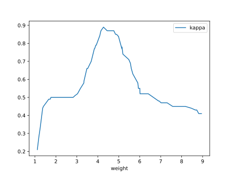

# Report Iris Uniform Distribution [1, 9] run 6

## Best results in hall of fame

| measure       |    value |   individual |
|:--------------|---------:|-------------:|
| mean accuracy | 0.729733 |        15317 |
| max accuracy  | 0.946667 |        15692 |
| mean kappa    | 0.5946   |        15317 |
| max kappa     | 0.92     |        15692 |

## Individuals in hall of fame

### Individual 15692

| key                    |      value |
|:-----------------------|-----------:|
| mean log_loss:         |   0.724797 |
| mean accuracy:         |   0.726067 |
| mean kappa:            |   0.5891   |
| number of edges        |  35        |
| number of hidden nodes |   8        |
| number of layers       |   7        |
| birth                  | 175        |

#### Network

### Individual 14136

| key                    |      value |
|:-----------------------|-----------:|
| mean log_loss:         |   1.35983  |
| mean accuracy:         |   0.724667 |
| mean kappa:            |   0.587    |
| number of edges        |  29        |
| number of hidden nodes |   6        |
| number of layers       |   5        |
| birth                  | 158        |

#### Network

### Individual 15228

| key                    |      value |
|:-----------------------|-----------:|
| mean log_loss:         |   0.574701 |
| mean accuracy:         |   0.725933 |
| mean kappa:            |   0.5889   |
| number of edges        |  34        |
| number of hidden nodes |   8        |
| number of layers       |   7        |
| birth                  | 170        |

#### Network

### Individual 16093

| key                    |      value |
|:-----------------------|-----------:|
| mean log_loss:         |   0.777251 |
| mean accuracy:         |   0.714467 |
| mean kappa:            |   0.5717   |
| number of edges        |  35        |
| number of hidden nodes |   8        |
| number of layers       |   7        |
| birth                  | 179        |

#### Network

### Individual 14802

| key                    |      value |
|:-----------------------|-----------:|
| mean log_loss:         |   0.866325 |
| mean accuracy:         |   0.727333 |
| mean kappa:            |   0.591    |
| number of edges        |  31        |
| number of hidden nodes |   6        |
| number of layers       |   5        |
| birth                  | 165        |

#### Network

### Individual 15317

| key                    |      value |
|:-----------------------|-----------:|
| mean log_loss:         |   0.562147 |
| mean accuracy:         |   0.729733 |
| mean kappa:            |   0.5946   |
| number of edges        |  33        |
| number of hidden nodes |   7        |
| number of layers       |   6        |
| birth                  | 171        |

#### Network

### Individual 15314

| key                    |      value |
|:-----------------------|-----------:|
| mean log_loss:         |   0.815416 |
| mean accuracy:         |   0.723467 |
| mean kappa:            |   0.5852   |
| number of edges        |  33        |
| number of hidden nodes |   7        |
| number of layers       |   6        |
| birth                  | 171        |

#### Network

### Individual 15608

| key                    |      value |
|:-----------------------|-----------:|
| mean log_loss:         |   0.54066  |
| mean accuracy:         |   0.728733 |
| mean kappa:            |   0.5931   |
| number of edges        |  33        |
| number of hidden nodes |   7        |
| number of layers       |   6        |
| birth                  | 174        |

#### Network

### Individual 15638

| key                    |      value |
|:-----------------------|-----------:|
| mean log_loss:         |   0.54066  |
| mean accuracy:         |   0.728733 |
| mean kappa:            |   0.5931   |
| number of edges        |  33        |
| number of hidden nodes |   7        |
| number of layers       |   6        |
| birth                  | 174        |

#### Network

### Individual 14761

| key                    |      value |
|:-----------------------|-----------:|
| mean log_loss:         |   0.578813 |
| mean accuracy:         |   0.7216   |
| mean kappa:            |   0.5824   |
| number of edges        |  32        |
| number of hidden nodes |   7        |
| number of layers       |   6        |
| birth                  | 165        |

#### Network

