# Report Iris Uniform Distribution [1, 9] run 7

## Best results in hall of fame

| measure       |    value |   individual |
|:--------------|---------:|-------------:|
| mean accuracy | 0.779    |        15438 |
| max accuracy  | 0.966667 |        14998 |
| mean kappa    | 0.6685   |        15438 |
| max kappa     | 0.95     |        14998 |

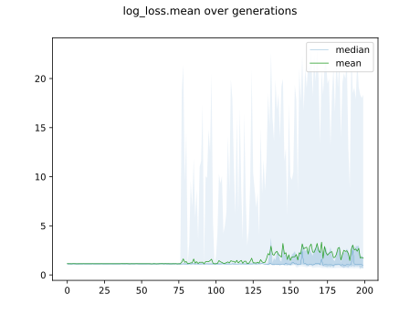

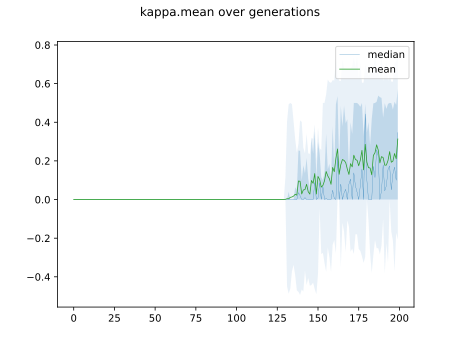

## Individuals in hall of fame

### Individual 15438

| key                    |    value |
|:-----------------------|---------:|
| mean log_loss:         |   0.7776 |
| mean accuracy:         |   0.779  |
| mean kappa:            |   0.6685 |
| number of edges        |  37      |
| number of hidden nodes |   9      |
| number of layers       |   7      |
| birth                  | 172      |

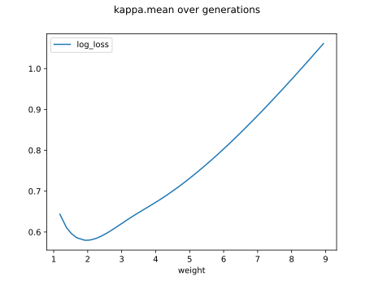

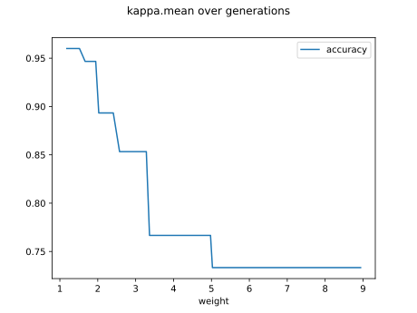

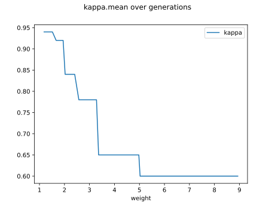

#### Network

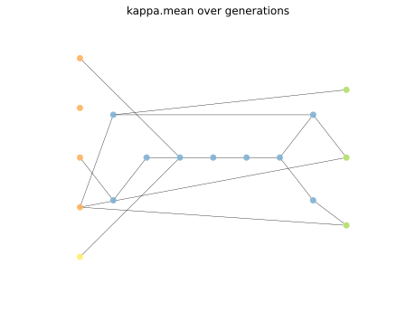

### Individual 15506

| key                    |    value |
|:-----------------------|---------:|
| mean log_loss:         |   0.7776 |
| mean accuracy:         |   0.779  |
| mean kappa:            |   0.6685 |
| number of edges        |  37      |
| number of hidden nodes |   9      |
| number of layers       |   7      |
| birth                  | 173      |

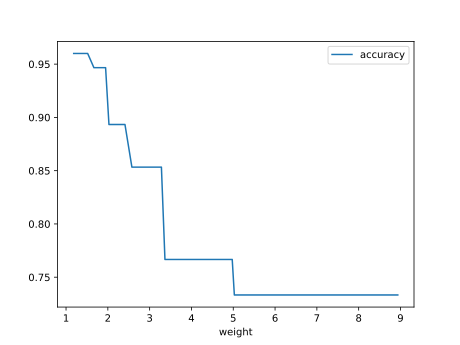

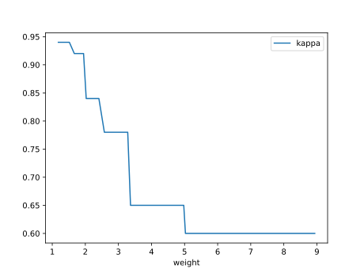

#### Network

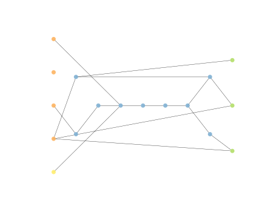

### Individual 16692

| key                    |      value |
|:-----------------------|-----------:|
| mean log_loss:         |   0.777404 |
| mean accuracy:         |   0.778467 |
| mean kappa:            |   0.6677   |
| number of edges        |  43        |
| number of hidden nodes |  11        |
| number of layers       |   8        |
| birth                  | 186        |

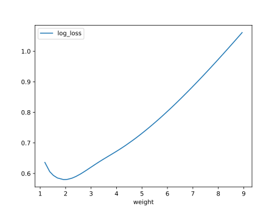

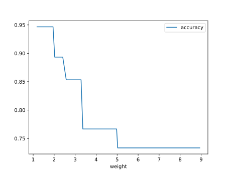

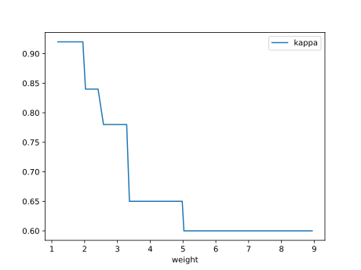

#### Network

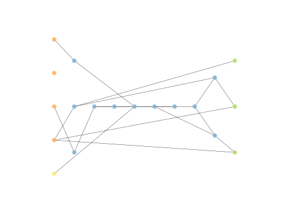

### Individual 15353

| key                    |     value |
|:-----------------------|----------:|
| mean log_loss:         |   0.77767 |
| mean accuracy:         |   0.779   |
| mean kappa:            |   0.6685  |
| number of edges        |  35       |
| number of hidden nodes |   8       |
| number of layers       |   6       |
| birth                  | 171       |

#### Network

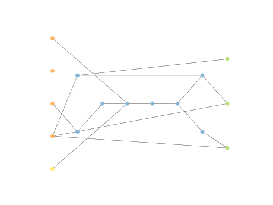

### Individual 14998

| key                    |      value |
|:-----------------------|-----------:|
| mean log_loss:         |   0.783262 |
| mean accuracy:         |   0.767    |
| mean kappa:            |   0.6505   |
| number of edges        |  33        |
| number of hidden nodes |   7        |
| number of layers       |   5        |
| birth                  | 167        |

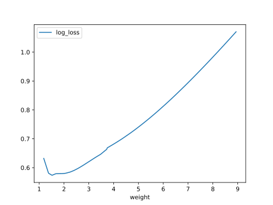

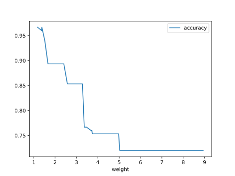

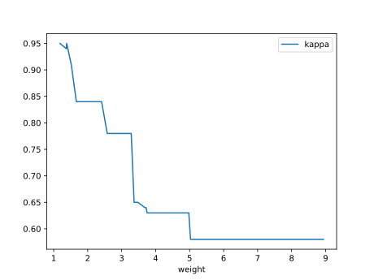

#### Network

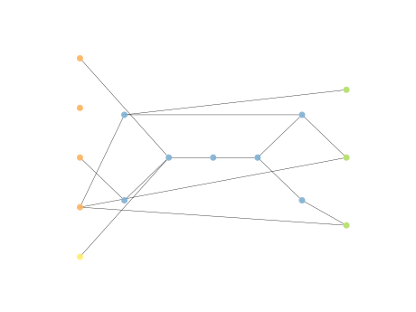

### Individual 16570

| key                    |      value |
|:-----------------------|-----------:|
| mean log_loss:         |   0.777764 |
| mean accuracy:         |   0.768333 |
| mean kappa:            |   0.6525   |
| number of edges        |  43        |
| number of hidden nodes |  11        |
| number of layers       |   8        |
| birth                  | 185        |

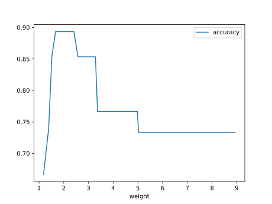

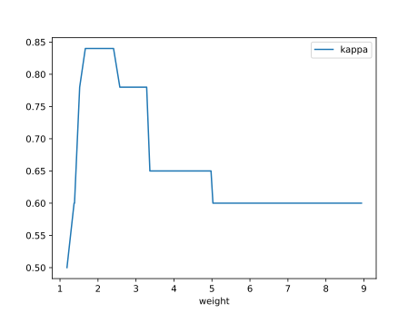

#### Network

### Individual 16468

| key                    |      value |
|:-----------------------|-----------:|
| mean log_loss:         |   0.777797 |
| mean accuracy:         |   0.768333 |
| mean kappa:            |   0.6525   |
| number of edges        |  41        |
| number of hidden nodes |  10        |
| number of layers       |   8        |
| birth                  | 183        |

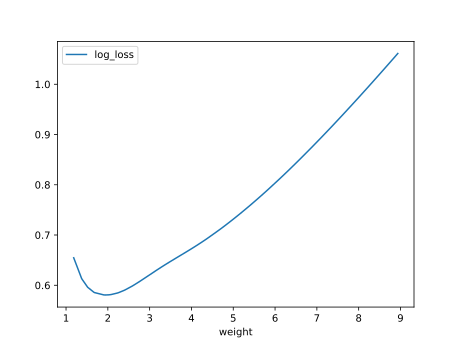

#### Network

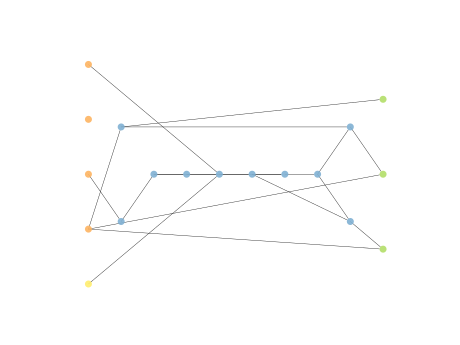

### Individual 15059

| key                    |      value |
|:-----------------------|-----------:|
| mean log_loss:         |   0.74771  |
| mean accuracy:         |   0.766533 |
| mean kappa:            |   0.6498   |
| number of edges        |  34        |
| number of hidden nodes |   7        |
| number of layers       |   5        |
| birth                  | 168        |

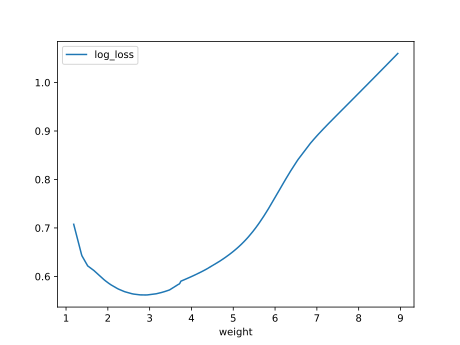

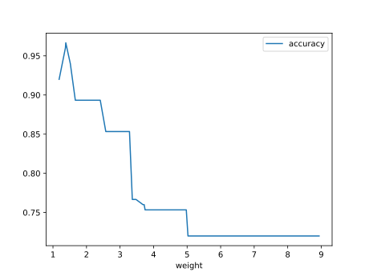

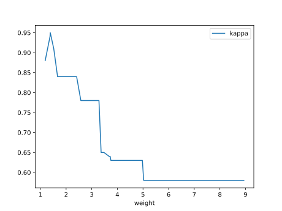

#### Network

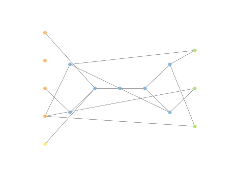

### Individual 16267

| key                    |      value |
|:-----------------------|-----------:|
| mean log_loss:         |   0.780405 |
| mean accuracy:         |   0.760933 |
| mean kappa:            |   0.6414   |
| number of edges        |  40        |
| number of hidden nodes |  10        |
| number of layers       |   8        |
| birth                  | 181        |

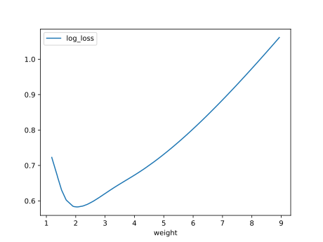

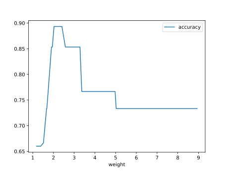

#### Network

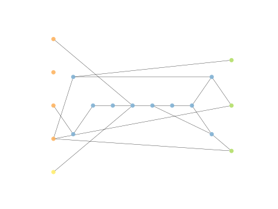

### Individual 14559

| key                    |      value |
|:-----------------------|-----------:|
| mean log_loss:         |   0.873038 |
| mean accuracy:         |   0.7334   |
| mean kappa:            |   0.6001   |
| number of edges        |  34        |
| number of hidden nodes |   7        |
| number of layers       |   5        |
| birth                  | 162        |

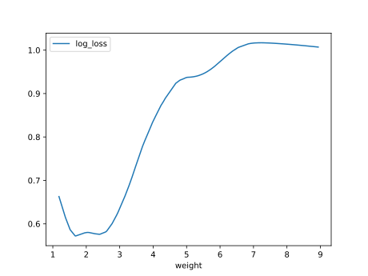

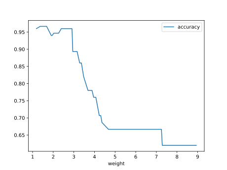

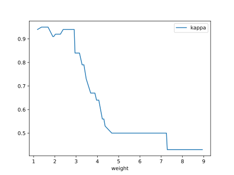

#### Network

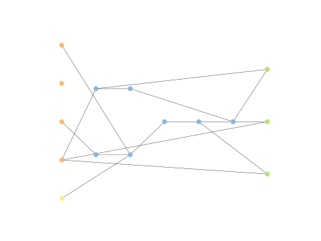

