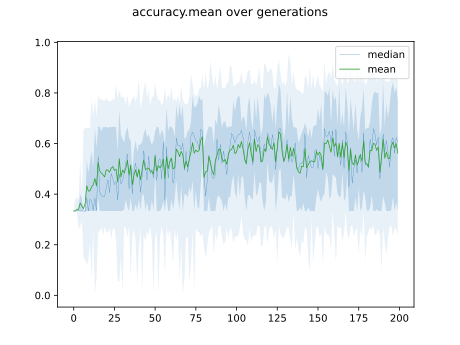

# Report Iris Uniform Distribution [1, 9] run 8

## Best results in hall of fame

| measure       |   value |   individual |
|:--------------|--------:|-------------:|
| mean accuracy |  0.8638 |        14298 |
| max accuracy  |  0.96   |        14298 |
| mean kappa    |  0.7957 |        14298 |
| max kappa     |  0.94   |        14298 |

## Individuals in hall of fame

### Individual 14298

| key                    |      value |
|:-----------------------|-----------:|
| mean log_loss:         |   0.626326 |
| mean accuracy:         |   0.8638   |
| mean kappa:            |   0.7957   |
| number of edges        |  39        |
| number of hidden nodes |   9        |
| number of layers       |   3        |
| birth                  | 159        |

#### Network

### Individual 15528

| key                    |      value |
|:-----------------------|-----------:|
| mean log_loss:         |   0.70413  |
| mean accuracy:         |   0.846933 |
| mean kappa:            |   0.7704   |
| number of edges        |  40        |
| number of hidden nodes |   9        |
| number of layers       |   5        |
| birth                  | 173        |

#### Network

### Individual 15504

| key                    |      value |
|:-----------------------|-----------:|
| mean log_loss:         |   0.70503  |
| mean accuracy:         |   0.845267 |
| mean kappa:            |   0.7679   |
| number of edges        |  40        |
| number of hidden nodes |   9        |
| number of layers       |   5        |
| birth                  | 173        |

#### Network

### Individual 16229

| key                    |      value |
|:-----------------------|-----------:|
| mean log_loss:         |   0.646793 |
| mean accuracy:         |   0.841867 |
| mean kappa:            |   0.7628   |
| number of edges        |  44        |
| number of hidden nodes |  11        |
| number of layers       |   3        |
| birth                  | 181        |

#### Network

### Individual 16861

| key                    |      value |
|:-----------------------|-----------:|
| mean log_loss:         |   0.666825 |
| mean accuracy:         |   0.855067 |
| mean kappa:            |   0.7826   |
| number of edges        |  46        |
| number of hidden nodes |  12        |
| number of layers       |   3        |
| birth                  | 188        |

#### Network

### Individual 15525

| key                    |      value |
|:-----------------------|-----------:|
| mean log_loss:         |   0.704134 |
| mean accuracy:         |   0.846933 |
| mean kappa:            |   0.7704   |
| number of edges        |  39        |
| number of hidden nodes |   8        |
| number of layers       |   4        |
| birth                  | 173        |

#### Network

### Individual 16669

| key                    |      value |
|:-----------------------|-----------:|
| mean log_loss:         |   0.666825 |
| mean accuracy:         |   0.855067 |
| mean kappa:            |   0.7826   |
| number of edges        |  44        |
| number of hidden nodes |  11        |
| number of layers       |   3        |
| birth                  | 186        |

#### Network

### Individual 15717

| key                    |      value |
|:-----------------------|-----------:|
| mean log_loss:         |   0.693955 |
| mean accuracy:         |   0.8444   |
| mean kappa:            |   0.7666   |
| number of edges        |  39        |
| number of hidden nodes |   9        |
| number of layers       |   2        |
| birth                  | 175        |

#### Network

### Individual 14954

| key                    |      value |
|:-----------------------|-----------:|
| mean log_loss:         |   0.687989 |
| mean accuracy:         |   0.850067 |
| mean kappa:            |   0.7751   |
| number of edges        |  39        |
| number of hidden nodes |   9        |
| number of layers       |   3        |
| birth                  | 167        |

#### Network

### Individual 11404

| key                    |      value |
|:-----------------------|-----------:|
| mean log_loss:         |   0.764042 |
| mean accuracy:         |   0.816733 |
| mean kappa:            |   0.7251   |
| number of edges        |  32        |
| number of hidden nodes |   6        |
| number of layers       |   3        |
| birth                  | 127        |

#### Network

