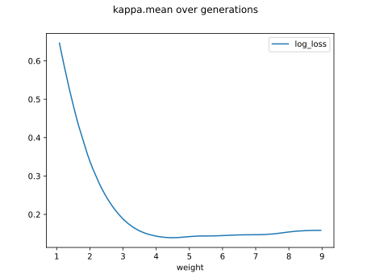

# Report Iris Uniform Distribution [1, 9] run 9

## Best results in hall of fame

| measure       |   value |   individual |
|:--------------|--------:|-------------:|
| mean accuracy |  0.9412 |        17986 |
| max accuracy  |  0.96   |        16174 |
| mean kappa    |  0.9118 |        17986 |
| max kappa     |  0.94   |        16174 |

## Individuals in hall of fame

### Individual 16174

| key                    |      value |
|:-----------------------|-----------:|
| mean log_loss:         |   0.195764 |
| mean accuracy:         |   0.940067 |
| mean kappa:            |   0.9101   |
| number of edges        |  41        |
| number of hidden nodes |  10        |
| number of layers       |   6        |
| birth                  | 180        |

#### Network

### Individual 17986

| key                    |      value |
|:-----------------------|-----------:|
| mean log_loss:         |   0.191213 |
| mean accuracy:         |   0.9412   |
| mean kappa:            |   0.9118   |
| number of edges        |  50        |
| number of hidden nodes |  14        |
| number of layers       |   8        |
| birth                  | 200        |

#### Network

### Individual 17734

| key                    |      value |
|:-----------------------|-----------:|
| mean log_loss:         |   0.191524 |
| mean accuracy:         |   0.9412   |
| mean kappa:            |   0.9118   |
| number of edges        |  50        |
| number of hidden nodes |  14        |
| number of layers       |   8        |
| birth                  | 198        |

#### Network

### Individual 17923

| key                    |      value |
|:-----------------------|-----------:|
| mean log_loss:         |   0.191484 |
| mean accuracy:         |   0.9412   |
| mean kappa:            |   0.9118   |
| number of edges        |  51        |
| number of hidden nodes |  14        |
| number of layers       |   8        |
| birth                  | 200        |

#### Network

### Individual 17525

| key                    |      value |
|:-----------------------|-----------:|
| mean log_loss:         |   0.195008 |
| mean accuracy:         |   0.937467 |
| mean kappa:            |   0.9062   |
| number of edges        |  50        |
| number of hidden nodes |  14        |
| number of layers       |   8        |
| birth                  | 195        |

#### Network

### Individual 16760

| key                    |      value |
|:-----------------------|-----------:|
| mean log_loss:         |   0.195489 |
| mean accuracy:         |   0.94     |
| mean kappa:            |   0.91     |
| number of edges        |  46        |
| number of hidden nodes |  12        |
| number of layers       |   7        |
| birth                  | 187        |

#### Network

### Individual 17654

| key                    |      value |
|:-----------------------|-----------:|
| mean log_loss:         |   0.195008 |
| mean accuracy:         |   0.937467 |
| mean kappa:            |   0.9062   |
| number of edges        |  50        |
| number of hidden nodes |  14        |
| number of layers       |   8        |
| birth                  | 197        |

#### Network

### Individual 17801

| key                    |      value |
|:-----------------------|-----------:|
| mean log_loss:         |   0.199636 |
| mean accuracy:         |   0.9376   |
| mean kappa:            |   0.9064   |
| number of edges        |  50        |
| number of hidden nodes |  14        |
| number of layers       |   8        |
| birth                  | 198        |

#### Network

### Individual 16454

| key                    |      value |
|:-----------------------|-----------:|
| mean log_loss:         |   0.195655 |
| mean accuracy:         |   0.940133 |
| mean kappa:            |   0.9102   |
| number of edges        |  42        |
| number of hidden nodes |  10        |
| number of layers       |   6        |
| birth                  | 183        |

#### Network

### Individual 17260

| key                    |      value |
|:-----------------------|-----------:|
| mean log_loss:         |   0.19483  |
| mean accuracy:         |   0.938067 |
| mean kappa:            |   0.9071   |
| number of edges        |  48        |
| number of hidden nodes |  13        |
| number of layers       |   7        |
| birth                  | 192        |

#### Network

